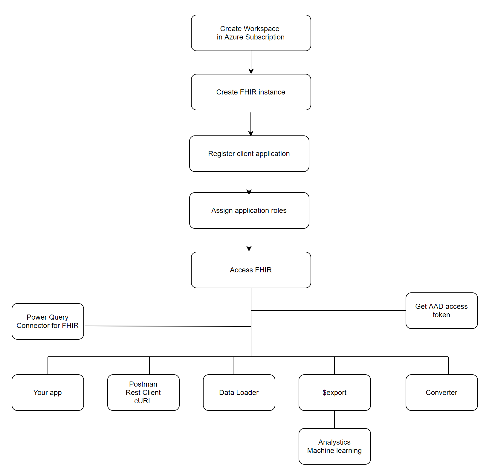

# Get started with the FHIR service

This article outlines the basic steps to get started with the FHIR&reg; service in [Azure Health Data Services](../healthcare-apis-overview.md).

As a prerequisite, you need an Azure subscription and permissions to create Azure resource groups and deploy Azure resources. You can follow all the steps, or skip some if you have an existing environment. Also, you can combine all the steps and complete them in PowerShell, Azure CLI, and REST API scripts.

## Create a workspace in your Azure subscription

You can create a workspace from the [Azure portal](../healthcare-apis-quickstart.md), or using PowerShell, Azure CLI, and REST API. You can find scripts from the [Azure Health Data Services samples](https://github.com/microsoft/healthcare-apis-samples/tree/main/src/scripts).

> [!NOTE]
> There are limits to the number of workspaces and the number of FHIR service instances you can create in each Azure subscription.

## Create a FHIR service in the workspace

You can create a FHIR service instance from the [Azure portal](../fhir/fhir-portal-quickstart.md), or using PowerShell, Azure CLI, and REST API. You can find scripts from the [Azure Health Data Services samples](https://github.com/microsoft/healthcare-apis-samples/tree/main/src/scripts).

Optionally, you can create a [DICOM service](../dicom/deploy-dicom-services-in-azure.md) and [MedTech service](../iot/deploy-iot-connector-in-azure.md) in the workspace.

## Access the FHIR service

The FHIR service is secured by Microsoft Entra ID that can't be disabled. To access the service API, you must create a client application also referred to as a service principal in Microsoft Entra ID and grant it with the right permissions.

### Register a client application

You can create or register a client application from the [Azure portal](../register-application.md), or using PowerShell and Azure CLI scripts. This client application can be used for one or more FHIR service instances. It can also be used for other services in Azure Health Data Services.

If the client application is created with a certificate or client secret, ensure that you renew the certificate or client secret before expiration and replace the client credentials in your applications.

You can delete a client application. Before you delete a client application, ensure it isn't used in production, dev, test, or quality assurance (QA) environments.

### Grant access permissions

You can grant access permissions or assign roles in the [Azure portal](../configure-azure-rbac.md), or by using PowerShell and Azure CLI scripts.

### Perform create, read, update, and delete (CRUD) transactions

You can perform Create, Read (search), Update, and Delete (CRUD) transactions against the FHIR service in your applications or by using tools such as Postman, REST Client, and cURL. Because the FHIR service is secured by default, you need to obtain an access token and include it in your transaction request.

#### Get an access token

You can obtain a Microsoft Entra access token by using PowerShell, Azure CLI, REST CCI, or .NET SDK. For more information, see [Get an access token](../get-access-token.md).

#### Access using existing tools

- [Postman](../fhir/use-postman.md)
- [REST Client](../fhir/using-rest-client.md)
- [cURL](../fhir/using-curl.md)

#### Load data

You can load data directly by using the POST or PUT method against the FHIR service. To bulk load data, you can use $import operation. For information, visit [import operation](import-data.md).

### CMS, search, profile validation, and reindex

You can find more details on interoperability and patient access, search, profile validation, and reindex in the [FHIR service](overview.md) documentation.

### Export data

Optionally, you can export ($export) data to [Azure Storage](../data-transformation/export-data.md) and use it in your analytics or machine-learning projects. You can export the data "as-is" or [deID](../data-transformation/de-identified-export.md) in `ndjson` format. 

### Convert data

Optionally, you can convert [HL7 v2](convert-data-overview.md) data and other formats to FHIR.

### Using FHIR data in Power BI dashboard

Optionally, you can create Power BI dashboard reports with FHIR data.

- [Power Query connector for FHIR](/power-query/connectors/fhir/fhir)
- [MedTech service and Microsoft Power BI](../iot/iot-connector-power-bi.md)

## Next steps

[Deploy a FHIR service in Azure Health Data Services](fhir-portal-quickstart.md)

[!INCLUDE [FHIR trademark statement](../includes/healthcare-apis-fhir-trademark.md)]
