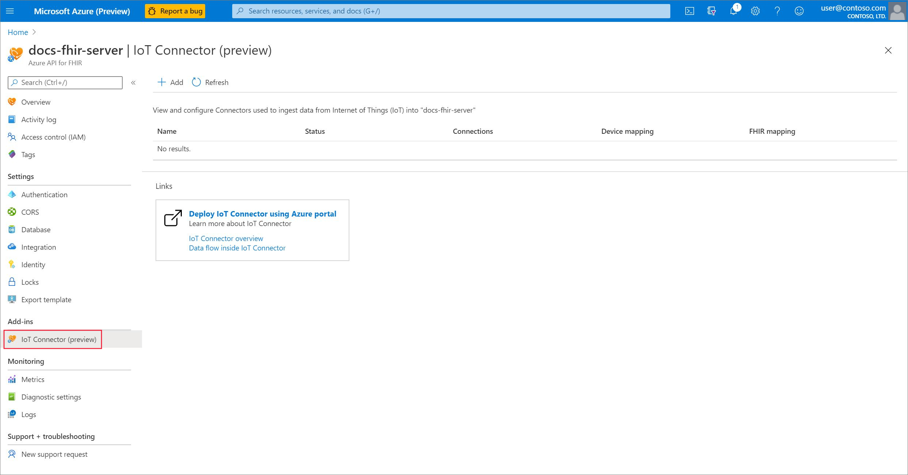
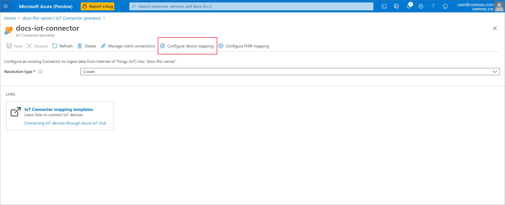
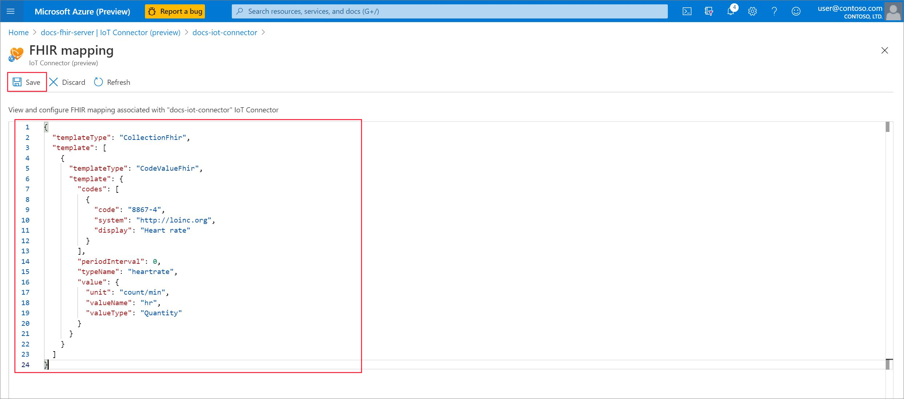

# Quickstart: Deploy Azure IoT Connector for FHIR (preview) using Azure portal

Azure IoT Connector for Fast Healthcare Interoperability Resources (FHIR&#174;)* is an optional feature of Azure API for FHIR that provides the capability to ingest data from Internet of Medical Things (IoMT) devices. During the preview phase, Azure IoT Connector for FHIR feature is being available for free. In this quickstart, you'll learn how to:
- Deploy and configure Azure IoT Connector for FHIR using the Azure portal
- Use a simulated device to send data to Azure IoT Connector for FHIR
- View resources created by Azure IoT Connector for FHIR on Azure API for FHIR

## Prerequisites

- An active Azure subscription - [Create one for free](https://azure.microsoft.com/free/?WT.mc_id=A261C142F)
- Azure API for FHIR resource - [Deploy Azure API for FHIR using Azure portal](fhir-paas-portal-quickstart.md)

## Go to Azure API for FHIR resource

Open the [Azure portal](https://portal.azure.com) and go to the **Azure API for FHIR** resource for which you'd like to create the Azure IoT Connector for FHIR feature.

[](media/quickstart-iot-fhir-portal/portal-azure-api-fhir.jpg#lightbox)

On the left-hand navigation menu, click on **IoT Connector (preview)** under the **Add-ins** section to open the **IoT Connectors** page.

[](media/quickstart-iot-fhir-portal/portal-iot-connectors.jpg#lightbox)

## Create new Azure IoT Connector for FHIR (preview)

Click on the **Add** button to open the **Create IoT Connector** page.

[](media/quickstart-iot-fhir-portal/portal-iot-connectors-add.jpg#lightbox)

Enter settings for the new Azure IoT Connector for FHIR. Click on **Create** button and await Azure IoT Connector for FHIR deployment.

> [!NOTE]
> Must select **Create** as the value for the **Resolution type** drop down for this installation. 

[](media/quickstart-iot-fhir-portal/portal-iot-connector-create.jpg#lightbox)

|Setting|Value|Description |
|---|---|---|
|Connector name|A unique name|Enter a name to identify your Azure IoT Connector for FHIR This name should be unique within an Azure API for FHIR resource. The name can only contain lowercase letters, numbers, and the hyphen (-) character. It must start and end with a letter or a number, and must be between 3-24 characters in length.|
|Resolution type|Lookup or Create|Select **Lookup** if you have an out-of-band process to create [Device](https://www.hl7.org/fhir/device.html) and [Patient](https://www.hl7.org/fhir/patient.html) FHIR resources in your Azure API for FHIR. Azure IoT Connector for FHIR will use reference to these resources when creating an [Observation](https://www.hl7.org/fhir/observation.html) FHIR resource to represent the device data. Select **Create** when you want Azure IoT Connector for FHIR to create bare-bones Device and Patient resources in your Azure API for FHIR using respective identifier values present in the device data.|

Once installation is complete, the newly created Azure IoT Connector for FHIR will show up on the **IoT Connectors** page.

[](media/quickstart-iot-fhir-portal/portal-iot-connector-created.jpg#lightbox)

## Configure Azure IoT Connector for FHIR (preview)

Azure IoT Connector for FHIR needs two mapping templates to transform device messages into FHIR-based Observation resource(s): **device mapping** and **FHIR mapping**. Your Azure IoT Connector for FHIR isn't fully operational until these mappings are uploaded.

[](media/quickstart-iot-fhir-portal/portal-iot-connector-missing-mappings.jpg#lightbox)

To upload mapping templates, click on the newly deployed Azure IoT Connector for FHIR to go to the **IoT Connector** page.

[](media/quickstart-iot-fhir-portal/portal-iot-connector-click.jpg#lightbox)

#### Device mapping

Device mapping template transforms device data into a normalized schema. On the **IoT Connector** page, click on **Configure device mapping** button to go to the **Device mapping** page. 

[](media/quickstart-iot-fhir-portal/portal-iot-connector-click-device-mapping.jpg#lightbox)

On the **Device mapping** page, add the following script to the JSON editor and click **Save**.

```json
{
  "templateType": "CollectionContent",
  "template": [
    {
      "templateType": "IotJsonPathContent",
      "template": {
        "typeName": "heartrate",
        "typeMatchExpression": "$..[?(@Body.HeartRate)]",
        "patientIdExpression": "$.SystemProperties.iothub-connection-device-id",
        "values": [
          {
            "required": "true",
            "valueExpression": "$.Body.HeartRate",
            "valueName": "hr"
          }
        ]
      }
    }
  ]
}
```

[](media/quickstart-iot-fhir-portal/portal-iot-device-mapping.jpg#lightbox)

#### FHIR mapping

FHIR mapping template transforms a normalized message to a FHIR-based Observation resource. On the **IoT Connector** page, click on **Configure FHIR mapping** button to go to the **FHIR mapping** page.  

[](media/quickstart-iot-fhir-portal/portal-iot-connector-click-fhir-mapping.jpg#lightbox)

On the **FHIR mapping** page, add the following script to the JSON editor and click **Save**.

```json
{
  "templateType": "CollectionFhir",
  "template": [
    {
      "templateType": "CodeValueFhir",
      "template": {
        "codes": [
          {
            "code": "8867-4",
            "system": "http://loinc.org",
            "display": "Heart rate"
          }
        ],
        "periodInterval": 0,
        "typeName": "heartrate",
        "value": {
          "unit": "count/min",
          "valueName": "hr",
          "valueType": "Quantity"
        }
      }
    }
  ]
}
```

[](media/quickstart-iot-fhir-portal/portal-iot-fhir-mapping.jpg#lightbox)

## Generate a connection string

IoMT device needs a connection string to connect and send messages to Azure IoT Connector for FHIR. On the **IoT Connector** page for the newly deployed Azure IoT Connector for FHIR, select **Manage client connections** button. 

[](media/quickstart-iot-fhir-portal/portal-iot-connector-click-client-connections.jpg#lightbox)

Once on **Connections** page, click on **Add** button to create a new connection. 

[](media/quickstart-iot-fhir-portal/portal-iot-connections.jpg#lightbox)

Provide a friendly name for this connection on the overlay window and select the **Create** button.

[](media/quickstart-iot-fhir-portal/portal-iot-new-connection.jpg#lightbox)

Select the newly created connection from the **Connections** page and copy the value of **Primary connection string** field from the overlay window on the right.

[](media/quickstart-iot-fhir-portal/portal-iot-connection-string.jpg#lightbox)

Preserve this connection string to be used at a later step. 

## Connect your devices to IoT

Azure offers an extensive suite of IoT products to connect and manage your IoT devices. You can build your own solution based on PaaS using Azure IoT Hub, or start with a manage IoT apps platform with Azure IoT Central. For this tutorial, we'll leverage Azure IoT Central, which has industry-focused solution templates to help you get started.

Deploy the [Continuous patient monitoring application template](../../iot-central/healthcare/tutorial-continuous-patient-monitoring.md#create-an-application-template). This template includes two simulated devices producing real-time data to help you get started: **Smart Vitals Patch** and **Smart Knee Brace**.

> [!NOTE]
> Whenever your real devices are ready, you can use same IoT Central application to [onboard your devices](../../iot-central/core/howto-set-up-template.md) and replace device simulators. Your device data will automatically start flowing to FHIR as well. 

## Connect your IoT data with the Azure IoT Connector for FHIR (preview)
> [!WARNING]
> The Device mapping template provided in this guide is designed to work with Data Export (legacy) within IoT Central.

Once you've deployed your IoT Central application, your two out-of-the-box simulated devices will start generating telemetry. For this tutorial, we'll ingest the telemetry from *Smart Vitals Patch* simulator into FHIR via the Azure IoT Connector for FHIR. To export your IoT data to the Azure IoT Connector for FHIR, we'll want to [set up a continuous data export within IoT Central](../../iot-central/core/howto-export-data-legacy.md). On the continuous data export page:
- Pick *Azure Event Hubs* as the export destination.
- Select *Use a connection string* value for **Event Hubs namespace** field.
- Provide Azure IoT Connector for FHIR's connection string obtained in a previous step for the **Connection String** field.
- Keep **Telemetry** option *On* for **Data to Export** field.

## View device data in Azure API for FHIR

You can view the FHIR-based Observation resource(s) created by Azure IoT Connector for FHIR on Azure API for FHIR using Postman. Set up your [Postman to access Azure API for FHIR](access-fhir-postman-tutorial.md) and make a `GET` request to `https://your-fhir-server-url/Observation?code=http://loinc.org|8867-4` to view Observation FHIR resources with heart rate value. 

> [!TIP]
> Ensure that your user has appropriate access to Azure API for FHIR data plane. Use [Azure role-based access control (Azure RBAC)](configure-azure-rbac.md) to assign required data plane roles.

## Clean up resources

When no longer needed, you can delete an instance of Azure IoT Connector for FHIR by removing the associated resource group, or the associated Azure API for FHIR service, or the Azure IoT Connector for FHIR instance itself. 

To directly remove an Azure IoT Connector for FHIR instance, select the instance from **IoT Connectors** page to go to **IoT Connector** page and click on **Delete** button. Select **Yes** when asked for confirmation. 

[](media/quickstart-iot-fhir-portal/portal-iot-connector-delete.jpg#lightbox)

## Next steps

In this quickstart guide, you've deployed Azure IoT Connector for FHIR feature in your Azure API for FHIR resource. Select from below next steps to learn more about Azure IoT Connector for FHIR:

Understand different stages of data flow within Azure IoT Connector for FHIR.

>[!div class="nextstepaction"]
>[Azure IoT Connector for FHIR data flow](iot-data-flow.md)

Learn how to configure IoT Connector using device and FHIR mapping templates.

>[!div class="nextstepaction"]
>[Azure IoT Connector for FHIR mapping templates](iot-mapping-templates.md)

*In the Azure portal, Azure IoT Connector for FHIR is referred to as IoT Connector (preview). FHIR is a registered trademark of HL7 and is used with the permission of HL7.