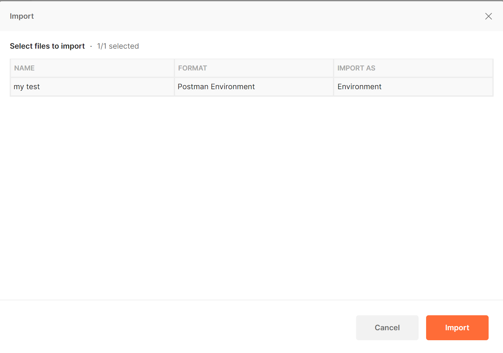
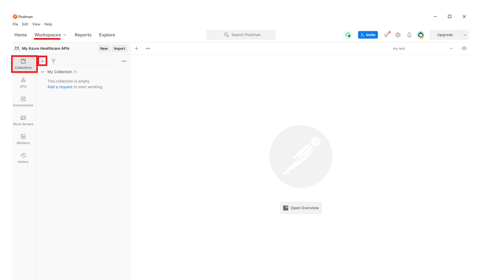
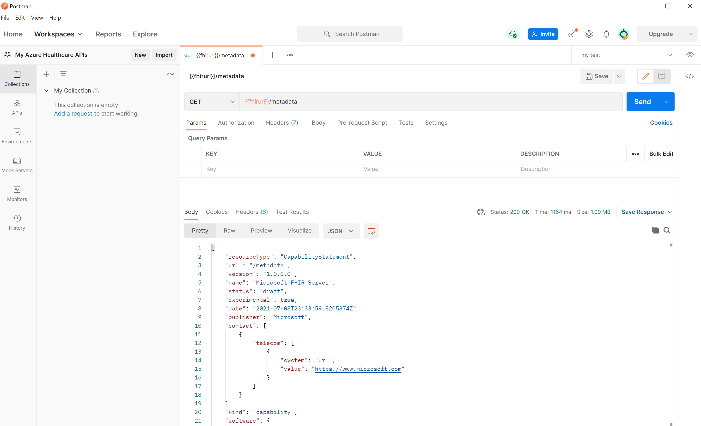
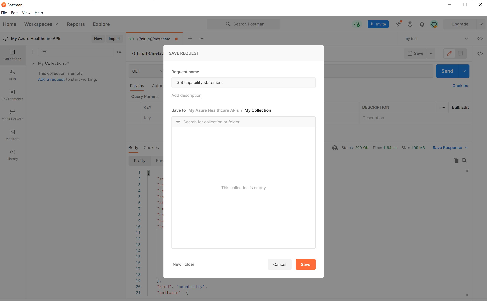
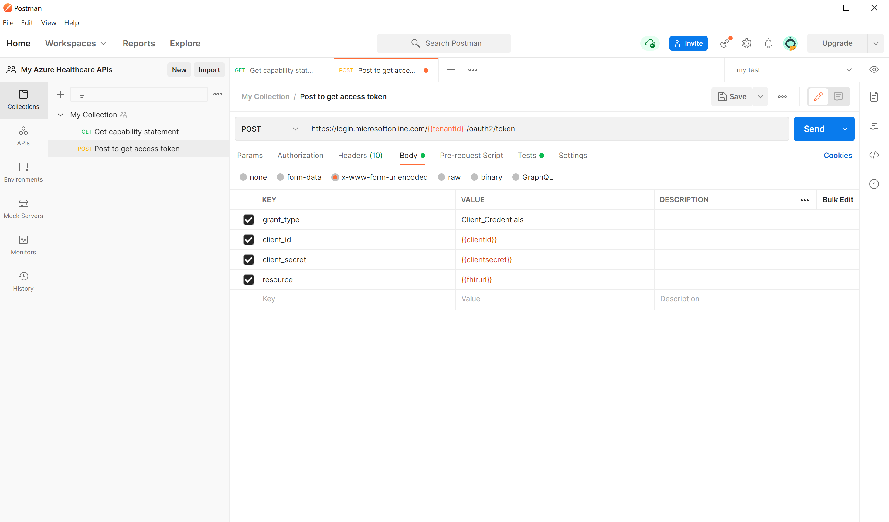
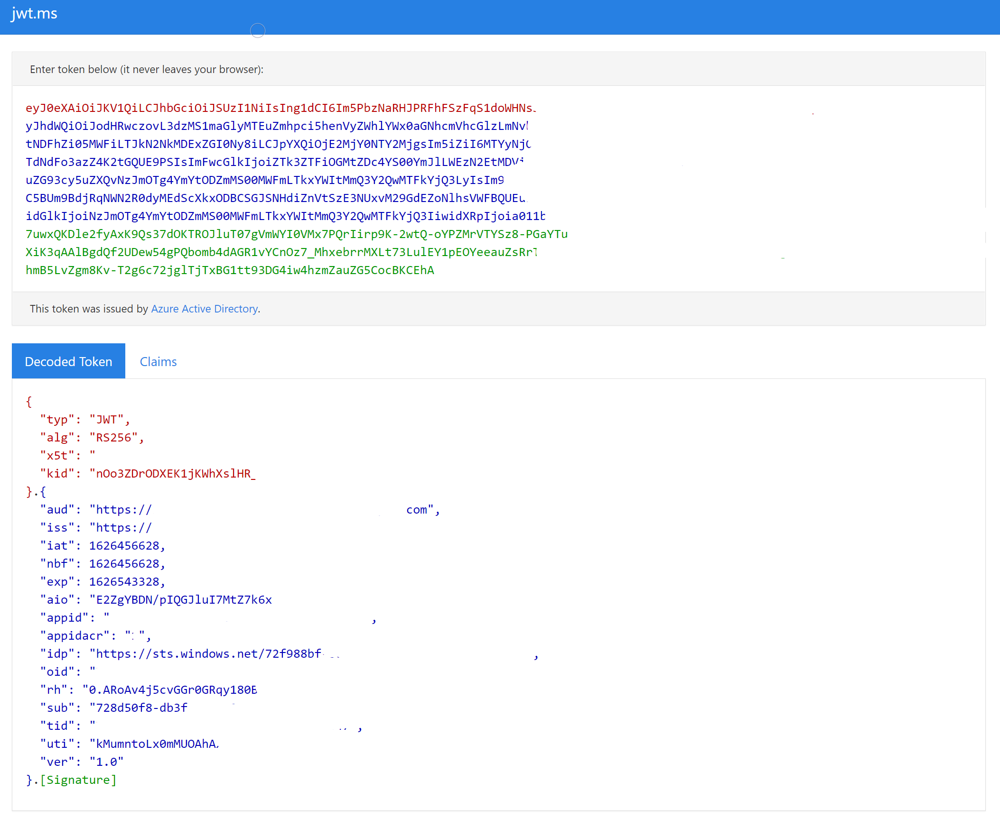
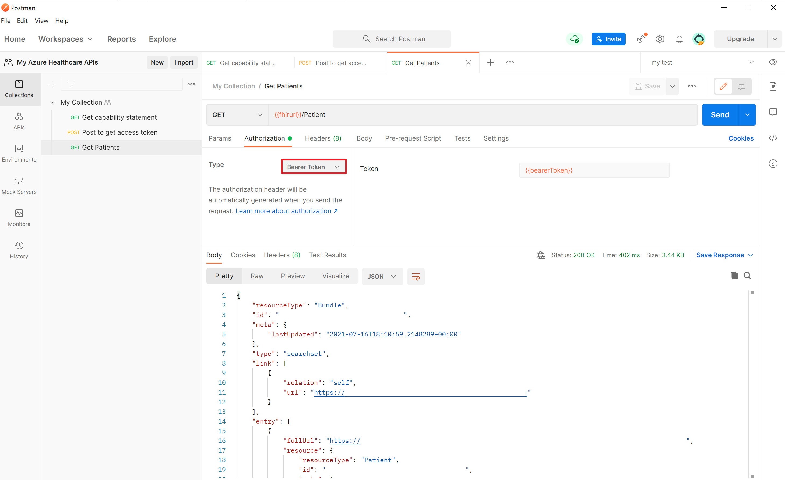
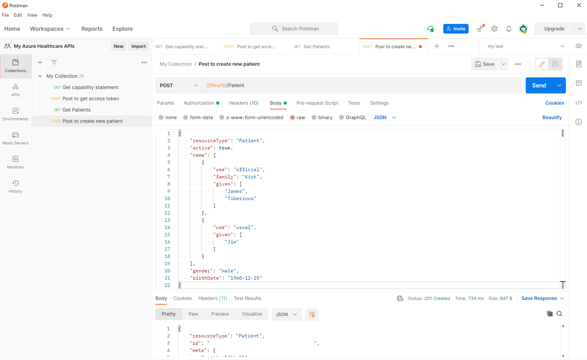
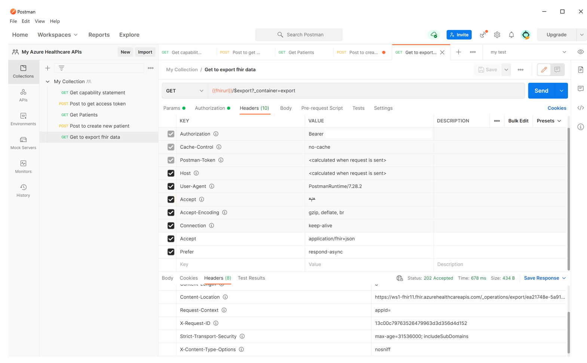

# Access using Postman

In this article, we'll walk through the steps of accessing the Azure Health Data Services (hereafter called FHIR service) with [Postman](https://www.getpostman.com/).

## Prerequisites

* FHIR service deployed in Azure. For information about how to deploy the FHIR service, see [Deploy a FHIR service](fhir-portal-quickstart.md).
* A registered client application to access the FHIR service. For information about how to register a client application, see [Register a service client application in Microsoft Entra ID](./../register-application.md). 
* Permissions granted to the client application and your user account, for example, "FHIR Data Contributor", to access the FHIR service. 
* Postman installed locally. For more information about Postman, see [Get Started with Postman](https://www.getpostman.com/).

## Using Postman: create workspace, collection, and environment

If you're new to Postman, follow the steps below. Otherwise, you can skip this step.
 
Postman introduces the workspace concept to enable you and your team to share APIs, collections, environments, and other components. You can use the default “My workspace” or “Team workspace” or create a new workspace for you or your team.
 
[  ](media/postman/postman-create-new-workspace.png#lightbox)

Next, create a new collection where you can group all related REST API requests. In the workspace, select **Create Collections**. You can keep the default name **New collection** or rename it. The change is saved automatically.

[  ](media/postman/postman-create-a-new-collection.png#lightbox)

You can also import and export Postman collections. For more information, see [the Postman documentation](https://learning.postman.com/docs/getting-started/importing-and-exporting-data/).

[  ](media/postman/postman-import-data.png#lightbox)

## Create or update environment variables

While you can use the full URL in the request, it's recommended that you store the URL and other data in variables and use them.

To access the FHIR service, we'll need to create or update the following variables.

* **tenantid** – Azure tenant where the FHIR service is deployed in. It's located from the **Application registration overview** menu option.
* **subid** – Azure subscription where the FHIR service is deployed in. It's located from the **FHIR service overview** menu option.
* **clientid** – Application client registration ID.
* **clientsecret** – Application client registration secret.
* **fhirurl** – The FHIR service full URL. For example, `https://xxx.azurehealthcareapis.com`. It's located from the **FHIR service overview** menu option.
* **bearerToken** – The variable to store the Microsoft Entra access token in the script. Leave it blank.

> [!NOTE]
> Ensure that you've configured the redirect URL, `https://www.getpostman.com/oauth2/callback`, in the client application registration.

[  ](media/postman/postman-environments-variable.png#lightbox)

## Connect to the FHIR server

Open Postman, select the **workspace**, **collection**, and **environment** you want to use. Select the `+` icon to create a new request. 

[  ](media/postman/postman-create-new-request.png#lightbox)

To perform health check on FHIR service, enter `{{fhirurl}}/health/check` in the GET request, and select 'Send'. You should be able to see Status of FHIR service - HTTP Status code response with 200 and OverallStatus as "Healthy" in response, means your health check is succesful.

## Get capability statement

Enter `{{fhirurl}}/metadata` in the `GET`request, and select `Send`. You should see the capability statement of the FHIR service.

[  ](media/postman/postman-capability-statement.png#lightbox)

[  ](media/postman/postman-save-request.png#lightbox)

<a name='get-azure-ad-access-token'></a>

## Get Microsoft Entra access token

The FHIR service is secured by Microsoft Entra ID. The default authentication can't be disabled. To access the FHIR service, you must get a Microsoft Entra access token first. For more information, see [Microsoft identity platform access tokens](../../active-directory/develop/access-tokens.md).

Create a new `POST` request:

1. Enter in the request header:
   `https://login.microsoftonline.com/{{tenantid}}/oauth2/token`

2. Select the **Body** tab and select **x-www-form-urlencoded**. Enter the following values in the key and value section:
    - **grant_type**: `Client_Credentials`
    - **client_id**: `{{clientid}}`
    - **client_secret**: `{{clientsecret}}`
    - **resource**: `{{fhirurl}}`
    
> [!NOTE] 
> In the scenarios where the FHIR service audience parameter is not mapped to the FHIR service endpoint url. The resource parameter value should be mapped to Audience value under FHIR Service Authentication blade.
      
3. Select the **Test** tab and enter in the text section: `pm.environment.set("bearerToken", pm.response.json().access_token);` To make the value available to the collection, use the pm.collectionVariables.set method. For more information on the set method and its scope level, see [Using variables in scripts](https://learning.postman.com/docs/sending-requests/variables/#defining-variables-in-scripts).
4. Select **Save** to save the settings.
5. Select **Send**. You should see a response with the Microsoft Entra access token, which is saved to the variable `bearerToken` automatically. You can then use it in all FHIR service API requests.

  [  ](media/postman/postman-send-button.png#lightbox)

You can examine the access token using online tools such as [https://jwt.ms](https://jwt.ms). Select the **Claims** tab to see detailed descriptions for each claim in the token.

[  ](media/postman/postman-access-token-claims.png#lightbox)

## Get FHIR resource

After you've obtained a Microsoft Entra access token, you can access the FHIR data. In a new `GET` request, enter `{{fhirurl}}/Patient`.

Select **Bearer Token** as authorization type.  Enter `{{bearerToken}}` in the **Token** section. Select **Send**. As a response, you should see a list of patients in your FHIR resource.

[  ](media/postman/postman-select-bearer-token.png#lightbox)

## Create or update your FHIR resource

After you've obtained a Microsoft Entra access token, you can create or update the FHIR data. For example, you can create a new patient or update an existing patient.
 
Create a new request, change the method to “Post”, and enter the value in the request section.

`{{fhirurl}}/Patient`

Select **Bearer Token** as the authorization type.  Enter `{{bearerToken}}` in the **Token** section. Select the **Body** tab. Select the **raw** option and **JSON** as body text format. Copy and paste the text to the body section. 


```
{
    "resourceType": "Patient",
    "active": true,
    "name": [
        {
            "use": "official",
            "family": "Kirk",
            "given": [
                "James",
                "Tiberious"
            ]
        },
        {
            "use": "usual",
            "given": [
                "Jim"
            ]
        }
    ],
    "gender": "male",
    "birthDate": "1960-12-25"
}
```
Select **Send**. You should see a new patient in the JSON response.

[  ](media/postman/postman-send-create-new-patient.png#lightbox)

## Export FHIR data

After you've obtained a Microsoft Entra access token, you can export FHIR data to an Azure storage account.

Create a new `GET` request: `{{fhirurl}}/$export?_container=export`

Select **Bearer Token** as authorization type.  Enter `{{bearerToken}}` in the **Token** section. Select **Headers** to add two new headers:

- **Accept**: `application/fhir+json`
- **Prefer**:  `respond-async`

Select **Send**. You should notice a `202 Accepted` response. Select the **Headers** tab of the response and make a note of the value in the **Content-Location**. You can use the value to query the export job status.

[  ](media/postman/postman-202-accepted-response.png#lightbox)

## Next steps

In this article, you learned how to access the FHIR service in Azure Health Data Services with Postman. For information about FHIR service in Azure Health Data Services, see

>[!div class="nextstepaction"]
>[What is FHIR service?](overview.md)


For a starter collection of sample Postman queries, please see our [samples repo](https://github.com/Azure-Samples/azure-health-data-services-samples/tree/main/samples/sample-postman-queries) on GitHub.  
FHIR&#174; is a registered trademark of [HL7](https://hl7.org/fhir/) and is used with the permission of HL7.
