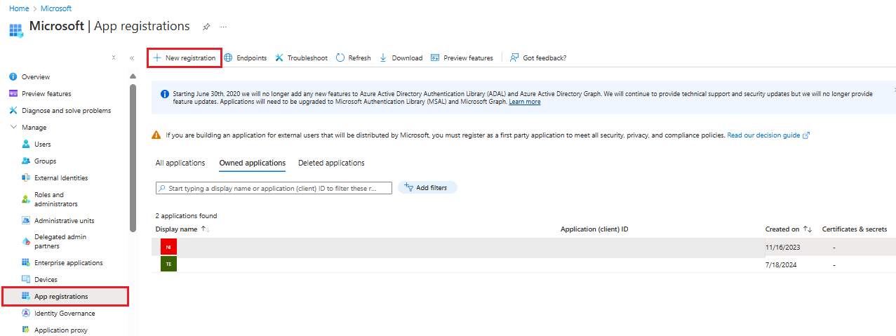
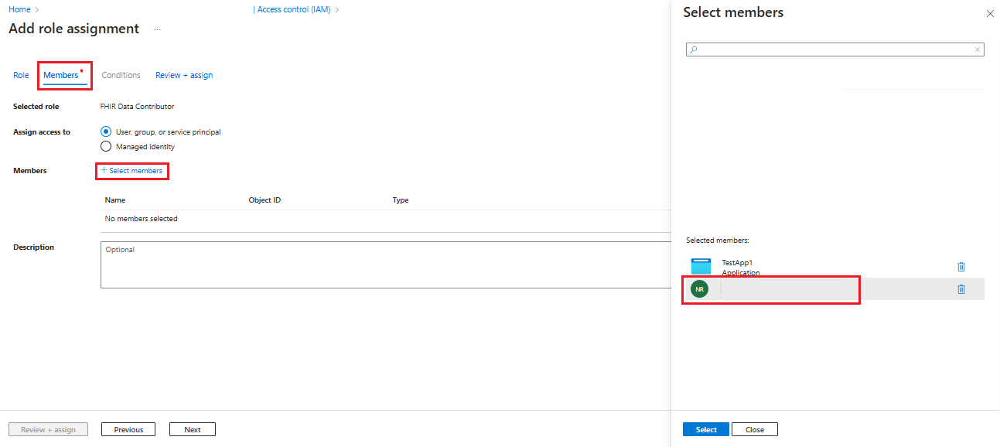

# Access the FHIR service by using Postman

This article shows the steps to access the FHIR&reg; service in Azure Health Data Services with [Postman](https://www.getpostman.com/).

## Prerequisites

- **FHIR service deployed in Azure**. For more information, see [Deploy a FHIR service](fhir-portal-quickstart.md). 
- **Postman installed locally**. For more information, see [Get Started with Postman](https://www.getpostman.com/).
- **User Access Administrator** role for role assignments on FHIR service.

## Setup steps

To access **FHIR service** from **Postman** application, review the steps:

1. Register a client application(App Registration) in Microsoft Entra ID.

2. Assign **FHIR Data Contributor** role under the **FHIR service**.

3. Setup Postman - Create Workspace, collection and environment


## Register a client application in Microsoft Entra ID
1. In the [Azure portal](https://ms.portal.azure.com), select **Microsoft Entra ID** tile.
[](media/postman/microsoft-entra-id.png#lightbox)

2. Select **App registrations** under **Manage** section.
[](media/postman/app-registration.png#lightbox)
3. Select **+ New registrations**.

4. Enter a name for app registration.  Under Supported account types, select **Accounts in this organization directory only**. select **Register**.

[](media/postman/app-registration-configuration.png#lightbox)

### Application ID (client ID)

After registering a new application, you can find the Application (client) ID and Directory (tenant) ID in the Overview section. **Make a note of these values for later use, as you will need them when configuring your Postman environment**.
[](media/postman/app-registration-overview.png#lightbox)

### Authentication setting: confidential vs. public
* Select Authentication to review the settings. The default value for Allow public client flows is "No".

* If you keep this default value, the application registration is a confidential client application and a certificate or secret is required.
[](media/postman/authentication-settings.png#lightbox)

* If you change the default value to "Yes" for the "Allow public client flows" option in the advanced setting, the application registration is a public client application and a certificate or secret isn't required.<br> 
* The "Yes" value is useful when you want to use the client application in your mobile app or a JavaScript app where you don't want to store any secrets.

* For tools that require a redirect URL, select Add a platform to configure the platform.
[](media/postman/add-platform.png#lightbox)

* For Postman, select Mobile and desktop applications. Enter "https://www.getpostman.com/oauth2/callback" in the Custom redirect URIs section. Select the Configure button to save the setting.
[](media/postman/add-platform-mobile-desktop-applications.png#lightbox)

### Certificates & secrets

1. Click on **Certificates and secrets**. Click **+New client secret**.

[](media/postman/create-client-secret.png#lightbox)

2. Under **Add a client secret**, enter a name for the secret in the **Description** field. The guidance is to set 6 months for secret expiration. Click **Add**.

[](media/postman/add-secret-description.png#lightbox)

3. It is important that you save the **secret value**, not the secret ID.

[](media/postman/client-secret-value.png#lightbox)
>[!NOTE]
>Use  grant_type of client_credentials when trying to obtain an access token for the FHIR service using tools such as Postman or REST Client. 

## Assign FHIR Data Contributor role in **FHIR service**
This section shows the steps to assign **FHIR Data Contributor** role to a registered application for the FHIR® service in Azure Health Data Services.

1. In the Azure portal, navigate to your FHIR service. 
2. In the left-hand menu, select the **Access Control (IAM)** blade.Click on + Add and then select Add role assignment. If the option for adding a role assignment is unavailable, ask your Azure administrator to assign you permission to perform this step.
[](media/postman/fhir-service-access-control.png#lightbox)
3. In **Add** role assignment under the **Role** tab, scroll down in the list and select **FHIR Data Contributor**. Then click **Next**.
[](media/postman/add-role-assignment.png#lightbox)

4. Under the **Members** tab, click on **+Select members**. Type in the name of your Postman service client app in the **Select** field on the right. Select the app.
[](media/postman/select-members-client-app.png#lightbox)

5. In same way, Type in the name of your username in the **Select**. Select your user so it is added to list along with app registration and click **Select**. Then click **Next**.
[](media/postman/select-members-user.png#lightbox)

6. Under the **Review + assign** tab, click **Review + assign**.
[](media/postman/review-assign-role.png#lightbox)

## Setup Postman - Create Workspace, collection and environment.


If you're new to Postman, follow these steps to create a workspace, collection, and environment. 
 
Postman introduces the workspace concept to enable you and your team to share APIs, collections, environments, and other components. You can use the default **My workspace** or **Team workspace** or create a new workspace for you or your team.
[](media/postman/postman-create-new-workspace.png#lightbox)

Next, create a new collection where you can group all related REST API requests. In the workspace, select **Create Collections**. You can keep the default name **New collection** or rename it. The change is saved automatically.
[](media/postman/postman-create-a-new-collection.png#lightbox)

You can also import and export Postman collections. For more information, see [the Postman documentation](https://learning.postman.com/docs/getting-started/importing-and-exporting-data/).

[](media/postman/postman-import-data.png#lightbox)

## Create or update environment variables

Although you can use the full URL in the request, we recommend that you store the URL and other data in variables.

To access the FHIR service, you need to create or update these variables:


| **Variable** | **Description** | **Notes** |
|--------------|-----------------|----------|
| **tenantid** | Azure tenant where the FHIR service is deployed | Located on the Application registration overview |
| **subid** | Azure subscription where the FHIR service is deployed | Located on the FHIR service overview |
| **clientid** | Application client registration ID | |
| **clientsecret** | Application client registration secret | |
| **fhirurl** | The FHIR service full URL (for example, `https://xxx.azurehealthcareapis.com`) | Located on the FHIR service overview |
| **bearerToken** | Stores the Microsoft Entra access token in the script | Leave blank |

> [!NOTE]
> Ensure that you configured the redirect URL `https://www.getpostman.com/oauth2/callback` in the client application registration.

[](media/postman/postman-environments-variable.png#lightbox)

## Get the capability statement

Enter `{{fhirurl}}/metadata` in the `GET` request, then choose `Send`. You should see the capability statement of the FHIR service.
[](media/postman/postman-capability-statement.png#lightbox)

[](media/postman/postman-save-request.png#lightbox)

<a name='get-azure-ad-access-token'></a>

## Get a Microsoft Entra access token

Get a Microsoft Entra access token by choosing either a service principal, or a Microsoft Entra user account.

### Use a service principal with a client credential grant type

The FHIR service is secured by Microsoft Entra ID. The default authentication can't be disabled. To access the FHIR service, you need to get a Microsoft Entra access token first. For more information, see [Microsoft identity platform access tokens](../../active-directory/develop/access-tokens.md).

Create a new `POST` request:

1. Enter the request header:
   `https://login.microsoftonline.com/{{tenantid}}/oauth2/token`

2. Select the **Body** tab and select **x-www-form-urlencoded**. Enter the following values in the key and value section:
    - **grant_type**: `Client_Credentials`
    - **client_id**: `{{clientid}}`
    - **client_secret**: `{{clientsecret}}`
    - **resource**: `{{fhirurl}}`
    
> [!NOTE]
> In scenarios where the FHIR service audience parameter isn't mapped to the FHIR service endpoint URL, the resource parameter value should be mapped to the audience value on the FHIR service **Authentication** pane.

3. Select the **Test** tab and enter `pm.environment.set("bearerToken", pm.response.json().access_token);` in the text section. To make the value available to the collection, use the pm.collectionVariables.set method. For more information on the set method and its scope level, see [Using variables in scripts](https://learning.postman.com/docs/sending-requests/variables/#defining-variables-in-scripts).
4. Select **Save** to save the settings.
5. Select **Send**. You should see a response with the Microsoft Entra access token, which is automatically saved to the variable `bearerToken`. You can then use it in all FHIR service API requests.
[](media/postman/postman-send-button.png#lightbox)

You can examine the access token using online tools such as [https://jwt.ms](https://jwt.ms). Select the **Claims** tab to see detailed descriptions for each claim in the token.

[](media/postman/postman-access-token-claims.png#lightbox)

## Use a user account with the authorization code grant type

You can get the Microsoft Entra access token by using your Microsoft Entra account credentials and following the listed steps.

1. Verify that you're a member of Microsoft Entra tenant with the required access permissions.

2. Ensure that you configured the redirect URL `https://oauth.pstmn.io/v1/callback` for the web platform in the client application registration. 
[](media/postman/callback-url.png#lightbox)

3. In the client application registration under **API Permissions**, add the **User_Impersonation** delegated permission for **Azure Healthcare APIS** from **APIs my organization uses**.
[](media/postman/app-registration-permissions.png#lightbox)

[](media/postman/app-registration-permissions-2.png#lightbox)

4. In Postman, select the **Authorization** tab of either a collection or a specific REST Call, select **Type** as OAuth 2.0 and under **Configure New Token** section, set these values: 
    - **Callback URL**: `https://oauth.pstmn.io/v1/callback`
    
    - **Auth URL**: `https://login.microsoftonline.com/{{tenantid}}/oauth2/v2.0/authorize`
    
    - **Access Token URL**: `https://login.microsoftonline.com/{{tenantid}}/oauth2/v2.0/token`
    
    - **Client ID**: Application client registration ID  
    
    - **Client Secret**: Application client registration secret 
    
    - **Scope**: `{{fhirurl}}/.default`
    
    - **Client Authentication**: Send client credentials in body
    
[](media/postman/postman-configuration.png#lightbox)

5. Choose **Get New Access Token** at the bottom of the page.

6. Provide User credentials for sign-in.

7. Once you receive the token, choose **Use Token.**

8. Ensure the token is in the **Authorization Header** of the REST call.

Examine the access token using online tools such as [https://jwt.ms](https://jwt.ms). Select the **Claims** tab to see detailed descriptions for each claim in the token.

## Connect to the FHIR server

Open Postman, select the **workspace**, **collection**, and **environment** you want to use. Select the `+` icon to create a new request. 
[](media/postman/postman-create-new-request.png#lightbox)

To perform a health check on the FHIR service, enter `{{fhirurl}}/health/check` in the GET request, and then choose **Send**. You should be able to see the `Status of FHIR service - HTTP Status` code response with 200 and OverallStatus as **Healthy** in response, which means your health check is successful.

## Get the FHIR resource

After you obtain a Microsoft Entra access token, you can access the FHIR data. In a new `GET` request, enter `{{fhirurl}}/Patient`.

Select **Bearer Token** as authorization type. Enter `{{bearerToken}}` in the **Token** section. Select **Send**. As a response, you should see a list of patients in your FHIR resource.
[](media/postman/postman-select-bearer-token.png#lightbox)

## Create or update the FHIR resource

After you obtain a Microsoft Entra access token, you can create or update the FHIR data. For example, you can create a new patient or update an existing patient.
 
Create a new request, change the method to **Post**, and enter the value in the request section.

`{{fhirurl}}/Patient`

Select **Bearer Token** as the authorization type. Enter `{{bearerToken}}` in the **Token** section. Select the **Body** tab. Select the **raw** option and **JSON** as body text format. Copy and paste the following text to the body section. 


```
{
    "resourceType": "Patient",
    "active": true,
    "name": [
        {
            "use": "official",
            "family": "Kirk",
            "given": [
                "James",
                "Tiberious"
            ]
        },
        {
            "use": "usual",
            "given": [
                "Jim"
            ]
        }
    ],
    "gender": "male",
    "birthDate": "1960-12-25"
}
```
Select **Send**. You should see a new patient in the JSON response.
[](media/postman/postman-send-create-new-patient.png#lightbox)


## Export FHIR data

After you obtain a Microsoft Entra access token, you can export FHIR data to an Azure storage account.

To configure export settings and create a Data Lake Storage Gen2 account, refer to [Configure settings for export](./configure-export-data.md).

Create a new `GET` request: `{{fhirurl}}/$export?_container=export`

Select **Bearer Token** as authorization type. Enter `{{bearerToken}}` in the **Token** section. Select **Headers** to add two new headers:

- **Accept**: `application/fhir+json`

- **Prefer**:  `respond-async`

Select **Send**. You should notice a `202 Accepted` response. Select the **Headers** tab of the response and make a note of the value in the **Content-Location**. You can use this value to query the export job status.
[](media/postman/postman-202-accepted-response.png#lightbox)
## Next steps

[Starter collection of Postman sample queries](https://github.com/Azure-Samples/azure-health-data-services-samples/tree/main/samples/sample-postman-queries)  

[!INCLUDE [FHIR trademark statement](../includes/healthcare-apis-fhir-trademark.md)]