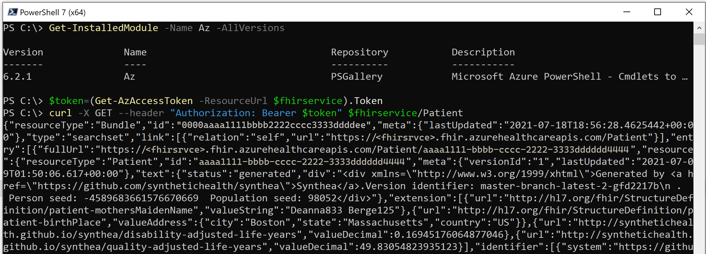

# Access the Azure Health Data Services with cURL

In this article, you'll learn how to access Azure Health Data Services with cURL.

## Prerequisites

### PowerShell

* An Azure account with an active subscription. [Create one for free](https://azure.microsoft.com/free/).
* If you want to run the code locally, install [PowerShell](/powershell/module/powershellget/) and [Azure Az PowerShell](/powershell/azure/install-azure-powershell).
* Optionally, you can run the scripts in Visual Studio Code with the REST Client extension. For more information, see [Make a link to the REST Client doc](using-rest-client.md).
* Download and install [cURL](https://curl.se/download.html).

### CLI

* An Azure account with an active subscription. [Create one for free](https://azure.microsoft.com/free/).
* If you want to run the code locally, install [Azure CLI](/cli/azure/install-azure-cli). 
* Optionally, install a Bash shell, such as Git Bash, which it's included in [Git for Windows](https://gitforwindows.org/).
* Optionally, run the scripts in Visual Studio Code with the REST Client extension. For more information, see [Make a link to the REST Client doc](using-rest-client.md).
* Download and install [cURL](https://curl.se/download.html).

## Obtain Azure Access Token

Before accessing the Azure Health Data Services, you must grant the user or client app with proper permissions. For more information on how to grant permissions, see [Azure Health Data Services authorization](../authentication-authorization.md).

There are several different ways to obtain an Azure access token for the Azure Health Data Services. 

> [!NOTE]
> Make sure that you have logged into Azure and that you are in the Azure subscription and tenant where you have deployed the Azure Health Data Services instance.

# [PowerShell](#tab/PowerShell)

```powershell-interactive
### check Azure environment and PowerShell versions
Get-AzContext 
Set-AzContext -Subscription <subscriptionid>
$PSVersionTable.PSVersion
Get-InstalledModule -Name Az -AllVersions
curl --version

### get access token for the FHIR service
$fhirservice="https://<fhirservice>.fhir.azurehealthcareapis.com"
$token=(Get-AzAccessToken -ResourceUrl $fhirservice).Token

### Get access token for the DICOM service
$dicomtokenurl= "https://dicom.healthcareapis.azure.com/"
$token=$( Get-AzAccessToken -ResourceUrl $dicomtokenurl).Token
```

# [CLI](#tab/CLI)

```azurecli-interactive
### check Azure environment and CLI versions
az account show --output table
az account set --subscription <subscriptionid>
cli –version
curl --version

### get access token for the FHIR service
$fhirservice=https://<fhirservice>.fhir.azurehealthcareapis.com
token=$(az account get-access-token --resource=$fhirservice --query accessToken --output tsv)

### get access token for the DICOM service
dicomtokenurl= https://dicom.healthcareapis.azure.com/
token=$(az account get-access-token --resource=$dicomtokenurl --query accessToken --output tsv)
```

---
> [!NOTE] 
> In the scenarios where the FHIR service audience parameter is not mapped to the FHIR service endpoint url. The resource parameter value should be mapped to Audience value under FHIR Service Authentication blade.

## Access data in the FHIR service

# [PowerShell](#tab/PowerShell)

```powershell-interactive
$fhirservice="https://<fhirservice>.fhir.azurehealthcareapis.com"
```

# [CLI](#tab/CLI)

```azurecli-interactive
fhirservice="https://<fhirservice>.fhir.azurehealthcareapis.com"
```

---

`curl -X GET --header "Authorization: Bearer $token" $fhirservice/Patient`

[  ](media/curl-fhir.png#lightbox)

## Access data in the DICOM service

# [PowerShell](#tab/PowerShell)

```powershell-interactive
$dicomservice="https://<dicomservice>.dicom.azurehealthcareapis.com"
```
# [CLI](#tab/CLI)

```azurecli-interactive
dicomservice="https://<dicomservice>.dicom.azurehealthcareapis.com"
```
---

`curl -X GET --header "Authorization: Bearer $token" $dicomservice/changefeed?includemetadata=false`

[  ](media/curl-dicom.png#lightbox)

## Next steps

In this article, you learned how to access Azure Health Data Services data using cURL.

To learn about how to access Azure Health Data Services data using REST Client extension in Visual Studio Code, see 

>[!div class="nextstepaction"]
>[Access Azure Health Data Services using REST Client](using-rest-client.md)

FHIR&#174; is a registered trademark of [HL7](https://hl7.org/fhir/) and is used with the permission of HL7.
