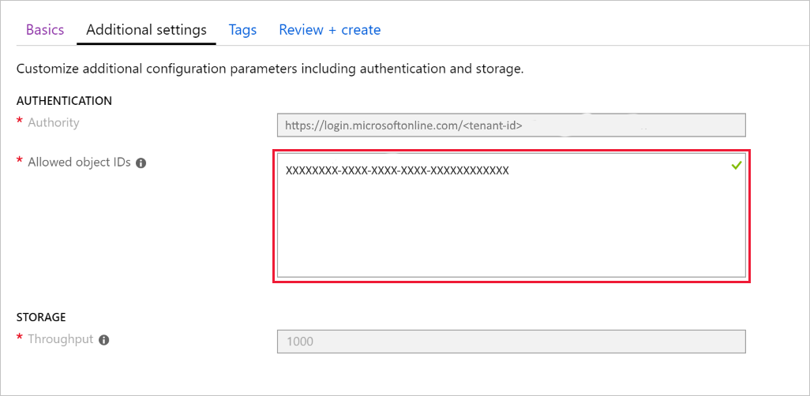

# Find identity object IDs for authentication configuration

In this article, you'll learn how to find identity object IDs needed to configure the list of allowed identity object IDs for the Azure API for FHIR.

The fully managed Azure API for FHIR&reg; service is configured to allow access for only a pre-defined list of identity object IDs. When an application or user is trying to access the FHIR API, a bearer token must be presented. This bearer token will have certain claims (fields). In order to grant access to the FHIR API, the token must contain the right issuer (`iss`), audience (`aud`), and an object ID (`oid`) from a list of allowed object IDs. An identity object ID is either the object ID of a user or a service principal in Azure Active Directory.

## Configure list of allowed object IDs

When you create a new Azure API for FHIR instance, you can configure a list of allowed object IDs:



These object IDs can either be IDs for specific users or service principals in your Azure Active Directory.

## Find user object ID using PowerShell

If you have a user with user name `myuser@consoso.com`, you can locate the users `ObjectId` using the following PowerShell command:

```azurepowershell-interactive
$(Get-AzureADUser -Filter "UserPrincipalName eq 'myuser@consoso.com'").ObjectId
```

or you can use the Azure CLI:

```azurecli-interactive
az ad user show --upn-or-object-id myuser@consoso.com | jq -r .objectId
```

## Find service principal object ID using PowerShell

Suppose you have registered a [service client app](register-service-azure-ad-client-app.md) and you would like to allow this service client to access the Azure API for FHIR, you can find the object ID for the client service principal with the following PowerShell command:

```azurepowershell-interactive
$(Get-AzureADServicePrincipal -Filter "AppId eq 'XXXXXXXX-XXXX-XXXX-XXXX-XXXXXXXXXXXX'").ObjectId
```

where `XXXXXXXX-XXXX-XXXX-XXXX-XXXXXXXXXXXX` is the service client application ID. Alternatively, you can use the `DisplayName` of the service client:

```azurepowershell-interactive
$(Get-AzureADServicePrincipal -Filter "DisplayName eq 'testapp'").ObjectId
```

If you are using the Azure CLI, you can use:

```azurecli-interactive
az ad sp show --id XXXXXXXX-XXXX-XXXX-XXXX-XXXXXXXXXXXX | jq -r .objectId
```

## Next steps

In this article, you've learned how to find identity object IDs needed to configure the identities that are allowed to access an Azure API for FHIR instance. Next deploy a fully managed Azure API for FHIR:
 
>[!div class="nextstepaction"]
>[Deploy Open Source FHIR server](fhir-paas-portal-quickstart.md)