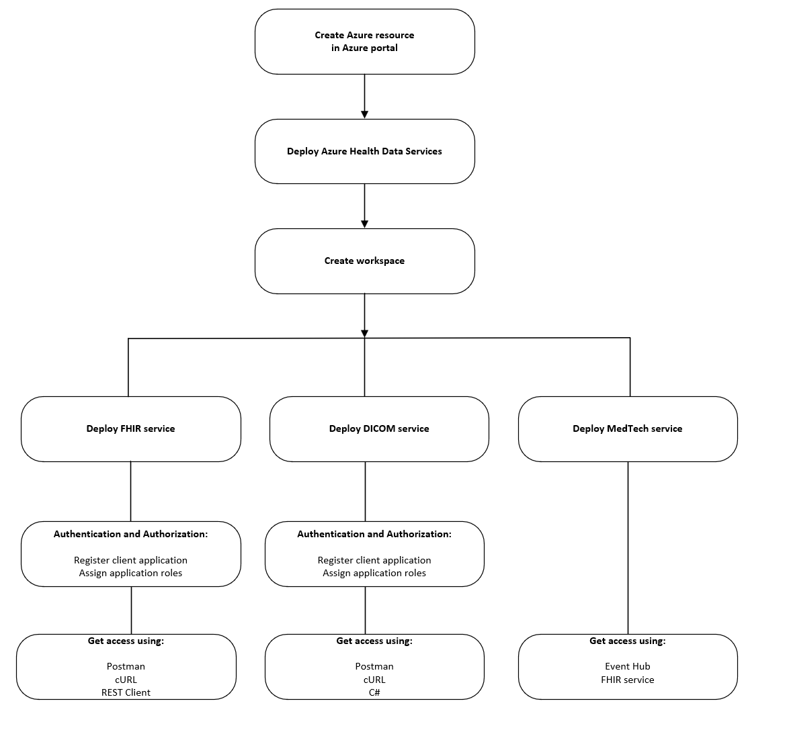
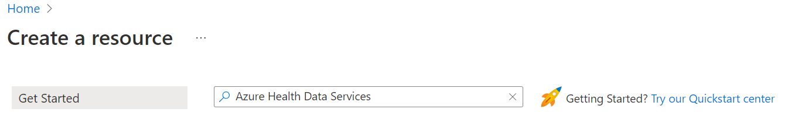
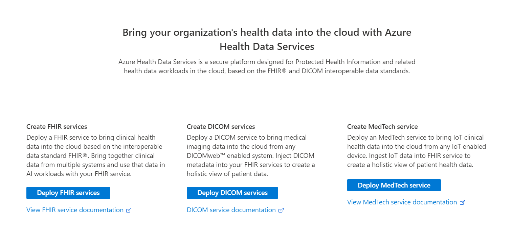

# Get started with Azure Health Data Services

This article outlines the basic steps to get started with Azure Health Data Services. Azure Health Data Services is a set of managed API services based on open standards and frameworks that enable workflows to improve healthcare and offer scalable and secure healthcare solutions. 

To get started with Azure Health Data Services, you'll need to create a workspace in the Azure portal. 

The workspace is a logical container for all your healthcare service instances such as Fast Healthcare Interoperability Resources (FHIR®) service, Digital Imaging and Communications in Medicine (DICOM®) service, and MedTech service. The workspace also creates a compliance boundary (HIPAA, HITRUST) within which protected health information can travel.

Before you can create a workspace in the Azure portal, you must have an Azure account subscription. If you don’t have an Azure subscription, see [Create your free Azure account today](https://azure.microsoft.com/free/search/?OCID=AID2100131_SEM_c4b0772dc7df1f075552174a854fd4bc:G:s&ef_id=c4b0772dc7df1f075552174a854fd4bc:G:s&msclkid=c4b0772dc7df1f075552174a854fd4bc). 

## Deploy Azure Health Data Services 

To get started with Azure Health Data Services, you must [create a resource](https://portal.azure.com/#create/hub) in the Azure portal. Enter *Azure Health Data Services* in the **Search services and marketplace** box.

After you've located the Azure Health Data Services resource, select **Create**.

## Create workspace

After the Azure Health Data Services resource group is deployed, you can enter the workspace subscription and instance details. 

To be guided through these steps, see [Deploy Azure Health Data Services workspace using Azure portal](healthcare-apis-quickstart.md).

> [!NOTE] 
> You can provision multiple data services within a workspace, and by design, they work seamlessly with one another. With the workspace, you can organize all your Azure Health Data Services instances and manage certain configuration settings that are shared among all the underlying datasets and services where it's applicable. 

## User access and permissions

Azure Health Data Services is a collection of secured managed services using Microsoft Entra ID. For Azure Health Data Services to access Azure resources, such as storage accounts and event hubs, you must enable the system managed identity, and grant proper permissions to the managed identity. Client applications are registered in the Microsoft Entra ID and can be used to access the Azure Health Data Services. User data access controls are done in the applications or services that implement business logic.

Authenticated users and client applications of the Azure Health Data Services must be granted with proper [application roles](./../healthcare-apis/authentication-authorization.md#application-roles). After being granted with proper application roles, the [authenticated users and client applications](./../healthcare-apis/authentication-authorization.md#authorization) can access Azure Health Data Services by obtaining a valid [access token](./../healthcare-apis/authentication-authorization.md#access-token) issued by Microsoft Entra ID, and perform specific operations defined by the application roles. For more information, see [Authentication and Authorization for Azure Health Data Services](authentication-authorization.md).

Furthermore, to access Azure Health Data Services, you [register a client application](register-application.md) in the Microsoft Entra ID. It's with these steps that you can find the [application (client) ID](./../healthcare-apis/register-application.md#application-id-client-id), and you can configure the [authentication setting](./../healthcare-apis/register-application.md#authentication-setting-confidential-vs-public) to allow public client flows or to a confidential client application.

As a requirement for the DICOM service (optional for the FHIR service), you configure the user access [API permissions](./../healthcare-apis/register-application.md#api-permissions) or role assignments for Azure Health Data Services that's managed through [Azure role-based access control (Azure RBAC)](configure-azure-rbac.md).  

## FHIR service

FHIR service in Azure Health Data Services enables rapid exchange of data through FHIR APIs that's backed by a managed Platform-as-a Service (PaaS) offering in the cloud. It makes it easier for anyone working with health data to ingest, manage, and persist Protected Health Information (PHI) in the cloud.  

The FHIR service is secured by Microsoft Entra ID that can't be disabled. To access the service API, you must create a client application that's also referred to as a service principal in Microsoft Entra ID and grant it with the right permissions. You can create or register a client application from the [Azure portal](register-application.md), or using PowerShell and Azure CLI scripts. This client application can be used for one or more FHIR service instances. It can also be used for other services in Azure Health Data Services.

You can also do the following:
- Grant access permissions
- Perform create, read (search), update, and delete (CRUD) transactions against the FHIR service in your applications
- Obtain an access token for the FHIR service 
- Access the FHIR service using tools such as cURL, Postman, and REST Client
- Load data directly using the POST or PUT method against the FHIR service 
- Export ($export) data to Azure Storage
- Convert data: convert [HL7 v2](./../healthcare-apis/fhir/convert-data.md) and other format data to FHIR
- Create Power BI dashboard reports with FHIR data 

For more information, see [Get started with FHIR service](./../healthcare-apis/fhir/get-started-with-fhir.md).

## DICOM service

DICOM service is a managed service within Azure Health Data Services that ingests and persists DICOM objects at multiple thousands of images per second. It facilitates communication and transmission of imaging data with any DICOMweb™ enabled systems or applications via DICOMweb Standard APIs like [Store (STOW-RS)](./../healthcare-apis/dicom/dicom-services-conformance-statement.md#store-stow-rs), [Search (QIDO-RS)](./../healthcare-apis/dicom/dicom-services-conformance-statement.md#search-qido-rs), [Retrieve (WADO-RS)](./../healthcare-apis/dicom/dicom-services-conformance-statement.md#retrieve-wado-rs). 

DICOM service is secured by Microsoft Entra ID that can't be disabled. To access the service API, you must create a client application that's also referred to as a service principal in Microsoft Entra ID and grant it with the right permissions. You can create or register a client application from the [Azure portal](register-application.md), or using PowerShell and Azure CLI scripts. This client application can be used for one or more DICOM service instances. It can also be used for other services in Azure Health Data Services.

You can also do the following:
- Grant access permissions or assign roles from the [Azure portal](./../healthcare-apis/configure-azure-rbac.md), or using PowerShell and Azure CLI scripts.
- Perform create, read (search), update, and delete (CRUD) transactions against the DICOM service in your applications or by using tools such as Postman, REST Client, cURL, and Python
- Obtain a Microsoft Entra access token using PowerShell, Azure CLI, REST CLI, or .NET SDK
- Access the DICOM service using tools such as .NET C#, cURL, Python, Postman, and REST Client

For more information, see [Get started with the DICOM service](./../healthcare-apis/dicom/get-started-with-dicom.md).

## MedTech service

The MedTech service transforms device data into FHIR-based observation resources and then persists the transformed messages into Azure Health Data Services FHIR service. This allows for a unified approach to health data access, standardization, and trend capture enabling the discovery of operational and clinical insights, connecting new device applications, and enabling new research projects. 

To ensure that your MedTech service works properly, it must have granted access permissions to the Azure Event Hubs and FHIR service. The Azure Event Hubs Data Receiver role allows the MedTech service that's being assigned this role to receive data from this event hub. For more information about application roles, see [Authentication & Authorization for Azure Health Data Services](./../healthcare-apis/authentication-authorization.md)

You can also do the following:
- Create a new FHIR service or use an existing one in the same or different workspace 
- Create a new event hub or use an existing one 
- Assign roles to allow the MedTech service to access [Event Hubs](./../healthcare-apis/iot/deploy-iot-connector-in-azure.md#granting-access-to-the-device-message-event-hub) and [FHIR service](./../healthcare-apis/iot/deploy-iot-connector-in-azure.md#granting-access-to-the-fhir-service)
- Send data to the event hub, which is associated with the MedTech service 

For more information, see [Get started with the MedTech service](./../healthcare-apis/iot/get-started.md).

## Next steps

This article described the basic steps to get started using Azure Health Data Services. For more information about Azure Health Data Services, see

> [!div class="nextstepaction"]
> [Authentication and Authorization for Azure Health Data Services](authentication-authorization.md).

> [!div class="nextstepaction"]
> [What is Azure Health Data Services?](healthcare-apis-overview.md)

> [!div class="nextstepaction"]
> [Frequently asked questions about Azure Health Data Services](healthcare-apis-faqs.md).

FHIR&#174; is a registered trademark of [HL7](https://hl7.org/fhir/) and is used with the permission of HL7.
