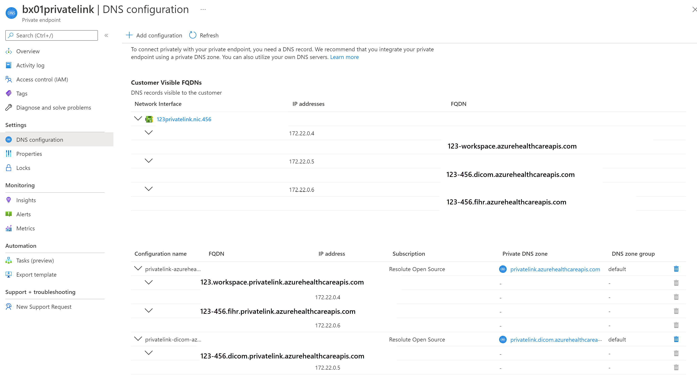

# Configure Private Link for Azure Health Data Services

Private Link enables you to access Azure Health Data Services over a private endpoint. Private Link is a network interface that connects you privately and securely using a private IP address from your virtual network. With Private Link, you can access our services securely from your VNet as a first party service without having to go through a public Domain Name System (DNS). This article describes how to create, test, and manage your Private Endpoint for Azure Health Data Services.

>[!Note]
> Neither Private Link nor Azure Health Data Services can be moved from one resource group or subscription to another once Private Link is enabled. To make a move, delete the Private Link first, and then move Azure Health Data Services. Create a new Private Link after the move is complete. Next, assess potential security ramifications before deleting the Private Link.
>
>If you're exporting audit logs and metrics that are enabled, update the export setting through **Diagnostic Settings** from the portal.

## Prerequisites

Before you create a private endpoint, the following Azure resources must be created first:

- **Resource Group** – The Azure resource group that will contain the virtual network and private endpoint.
- **Workspace** – This is a logical container for FHIR and DICOM service instances.
- **Virtual Network** – The VNet to which your client services and private endpoint will be connected.

For more information, see [Private Link Documentation](./../private-link/index.yml).

## Create private endpoint

To create a private endpoint, a user with Role-based access control (RBAC) permissions on the workspace or the resource group where the workspace is located can use the Azure portal. Using the Azure portal is recommended as it automates the creation and configuration of the Private DNS Zone. For more information, see [Private Link Quick Start Guides](./../private-link/create-private-endpoint-portal.md).

Private link is configured at the workspace level, and is automatically configured for all FHIR and DICOM services within the workspace.

There are two ways to create a private endpoint. Auto Approval flow allows a user that has RBAC permissions on the workspace to create a private endpoint without a need for approval. Manual Approval flow allows a user without permissions on the workspace to request a private endpoint to be approved by owners of the workspace or resource group.

> [!NOTE]
> When an approved private endpoint is created for Azure Health Data Services, public traffic to it is automatically disabled. 

### Auto approval

Ensure the region for the new private endpoint is the same as the region for your virtual network. The region for the workspace can be different.

For the resource type, search and select **Microsoft.HealthcareApis/workspaces** from the drop-down list. For the resource, select the workspace in the resource group. The target subresource, **healthcareworkspace**, is automatically populated.

### Manual approval

For manual approval, select the second option under Resource, **Connect to an Azure resource by resource ID or alias**. For the resource ID, enter **subscriptions/{subcriptionid}/resourceGroups/{resourcegroupname}/providers/Microsoft.HealthcareApis/workspaces/{workspacename}**. For the Target subresource, enter **healthcareworkspace** as in Auto Approval.

### Private Link DNS configuration

After the deployment is complete, select the Private Link resource in the resource group. Open **DNS configuration** from the settings menu. You can find the DNS records and private IP addresses for the workspace, and FHIR and DICOM services.

### Private Link Mapping

After the deployment is complete, browse to the new resource group that is created as part of the deployment. You'll see two private DNS zone records and one for each service. If you have more FHIR and DICOM services in the workspace, additional DNS zone records will be created for them.

Select **Virtual network links** from the **Settings**. You'll notice the FHIR service is linked to the virtual network.

Similarly, you can see the private link mapping for the DICOM service.

Also, you can see the DICOM service is linked to the virtual network.

## Test private endpoint

To verify that your service isn’t receiving public traffic after disabling public network access, select the `/metadata` endpoint for your FHIR service, or the /health/check endpoint of the DICOM service, and you'll receive the message 403 Forbidden. 

> [!NOTE]
> It can take up to 5 minutes after updating the public network access flag before public traffic is blocked.

> [!IMPORTANT]
> Every time a new service gets added into the Private Link enabled workspace, wait for the provisioning to complete. Refresh the private endpoint if DNS A records are not getting updated for the newly added service(s) in the workspace. If DNS A records are not updated in your private DNS zone, requests to a newly added service(s) will not go over Private Link. 

To ensure your Private Endpoint can send traffic to your server:

1. Create a virtual machine (VM) that is connected to the virtual network and subnet your Private Endpoint is configured on. To ensure your traffic from the VM is only using the private network, disable the outbound internet traffic using the network security group (NSG) rule.
2. Remote Desktop Protocols (RDP) into the VM.
3. Access your FHIR server’s `/metadata` endpoint from the VM. You should receive the capability statement as a response.

## Next steps

In this article, you've learned how to configure Private Link for Azure Health Data Services. Private Link is configured at the workspace level and all subresources, such as FHIR services and DICOM services with the workspace, are linked to the Private Link and the virtual network. For more information about Azure Health Data Services, see

>[!div class="nextstepaction"]
>[Overview of Azure Health Data Services](healthcare-apis-overview.md)

FHIR&#174; is a registered trademark of [HL7](https://hl7.org/fhir/) and is used with the permission of HL7.
