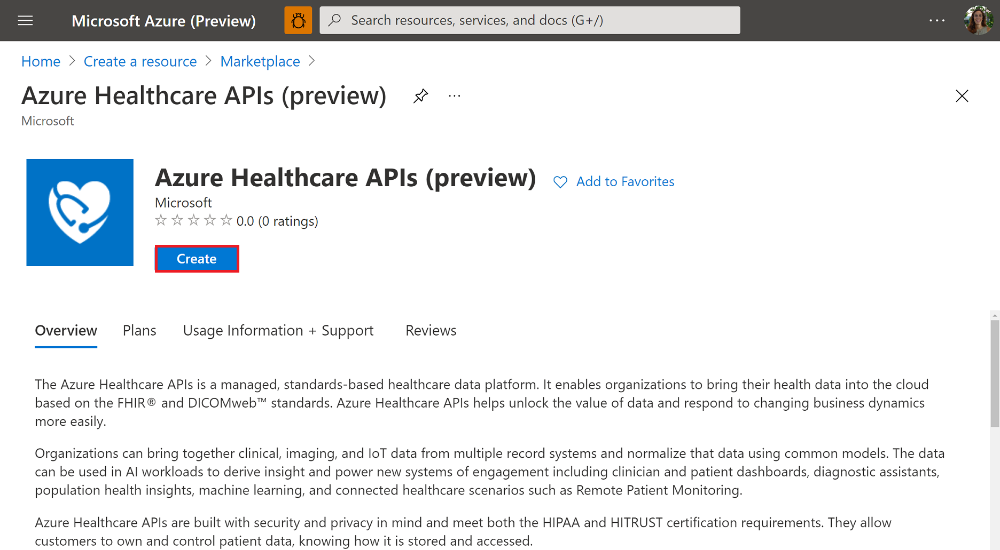
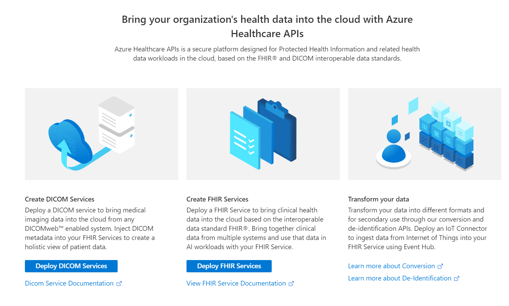

# Deploy Healthcare APIs (preview) workspace using Azure portal

> [!IMPORTANT]
> Azure Healthcare APIs is currently in PREVIEW. The [Supplemental Terms of Use for Microsoft Azure Previews](https://azure.microsoft.com/support/legal/preview-supplemental-terms/) include additional legal terms that apply to Azure features that are in beta, preview, or otherwise not yet released into general availability.

In this article, you’ll learn how to create a workspace by deploying Azure Healthcare APIs through the Azure portal. The workspace is a centralized logical container for all your healthcare APIs services such as FHIR services, DICOM® services, and IoT Connectors. It allows you to organize and manage certain configuration settings that are shared among all the underlying datasets and services where applicable.

## Prerequisite

Before you can create a workspace in the Azure portal, you must have an account subscription. If you 
don’t have an Azure subscription, see [Create your free Azure account today](https://azure.microsoft.com/free/search/?OCID=AID2100131_SEM_c4b0772dc7df1f075552174a854fd4bc:G:s&ef_id=c4b0772dc7df1f075552174a854fd4bc:G:s&msclkid=c4b0772dc7df1f075552174a854fd4bc).

## Create new Azure service

In the Azure portal, select **Create a resource**.

## Search for Azure Healthcare APIs

In the searchbox, enter **Azure Healthcare APIs**.

## Create Azure Healthcare API account

Select **Create** to create a new Azure Healthcare APIs account.

   

## Enter Subscription and instance details

1. Select a **Subscription** and **Resource group** from the drop-down lists or select **Create new**.

   

2. Enter a **Name** for the workspace, and then select a **Region**. The name must be 3 to 24 alphanumeric characters, all in lowercase. Do not use a hyphen "-" as it is an invalid character for the name. For information about regions and availability zones, see [Regions and Availability Zones in Azure](../availability-zones/az-overview.md).

3. (**Optional**) Select **Next: Tags >**. Enter a **Name** and **Value**, and then select **Next: Review + create**. 

   

   Tags are name/value pairs used for categorizing resources. For more information about tags, see [Use tags to organize your Azure resources and management hierarchy](.././azure-resource-manager/management/tag-resources.md).

4. Select **Create**.

   **Optional**: You may select **Download a template for automation** of your newly created workspace.

## Next steps

Now that the workspace is created, you can:

* Deploy FHIR services
* Deploy DICOM services
* Deploy an IoT Connector and ingest data to your FHIR service.
* Transform your data into different formats and secondary use through our conversion and de-identification APIs.

>[!div class="nextstepaction"]
>[Workspace overview](workspace-overview.md)

