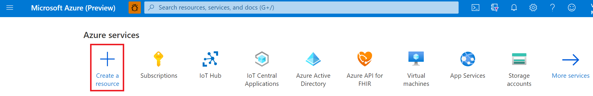
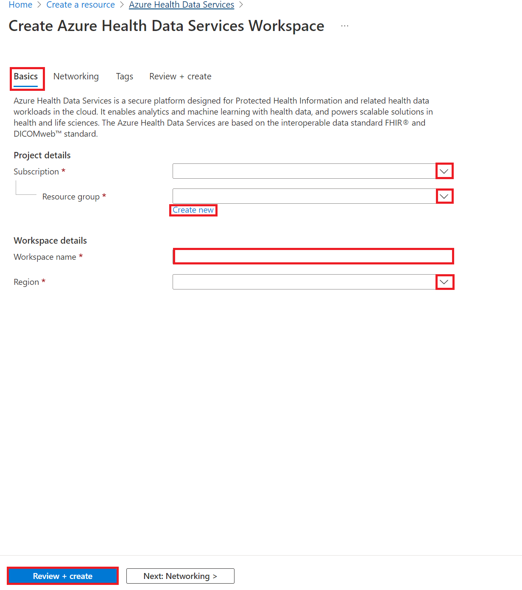
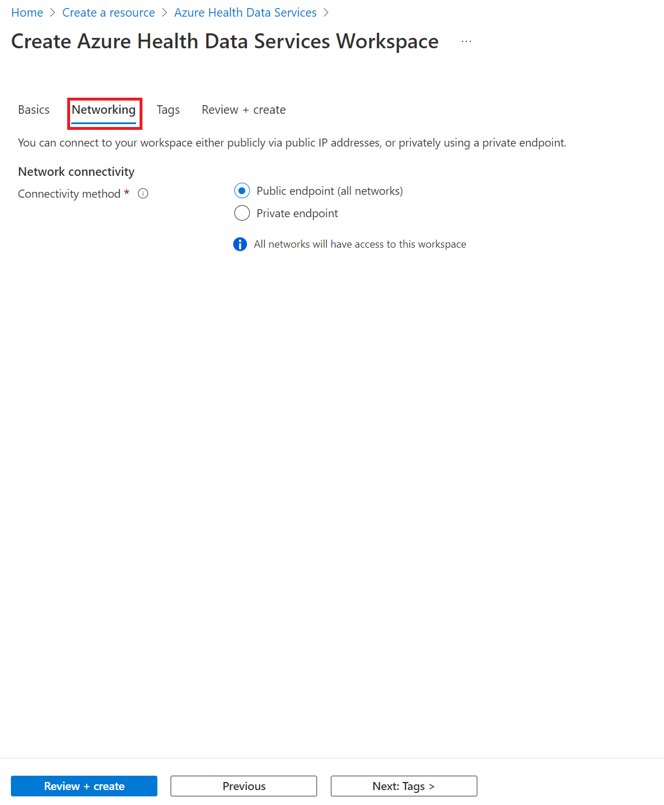
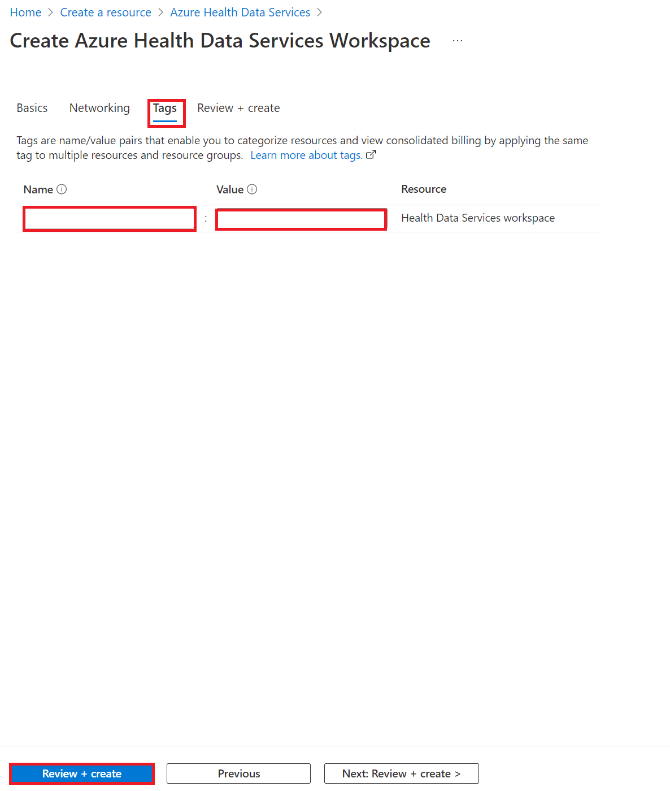
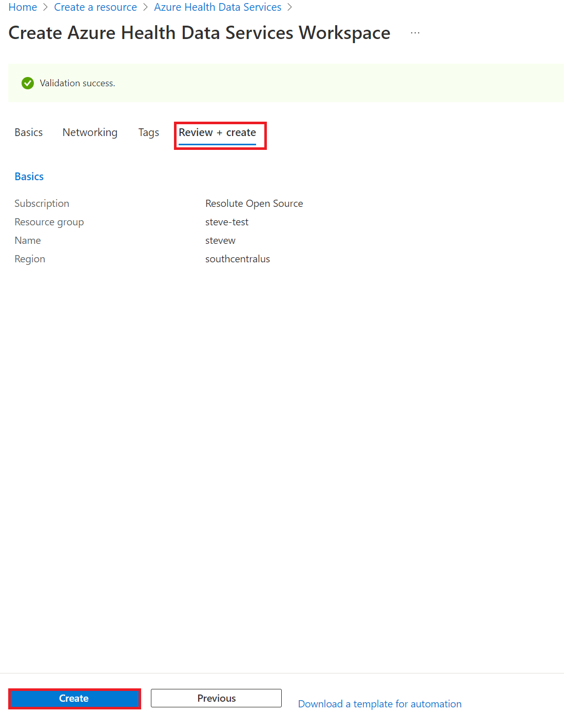
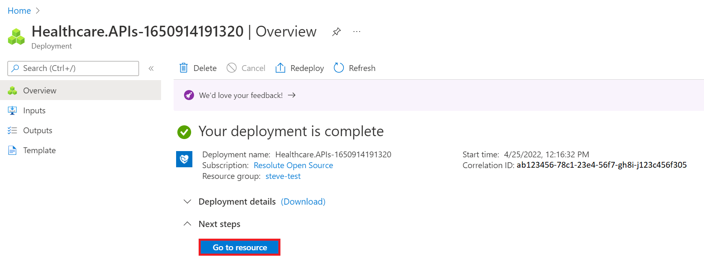
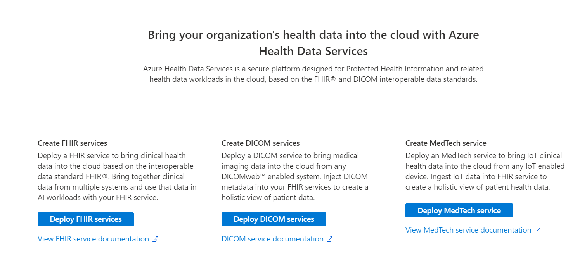

# Deploy Azure Health Data Services workspace using Azure portal

In this article, you’ll learn how to create a workspace by deploying Azure Health Data Services through the Azure portal. The workspace is a centralized logical container for all your Azure Health Data services such as FHIR services, DICOM® services, and MedTech services. It allows you to organize and manage certain configuration settings that are shared among all the underlying datasets and services where applicable.

## Prerequisite

Before you can create a workspace in the Azure portal, you must have an account subscription. If you 
don’t have an Azure subscription, see [Create your free Azure account today](https://azure.microsoft.com/free/search/?OCID=AID2100131_SEM_c4b0772dc7df1f075552174a854fd4bc:G:s&ef_id=c4b0772dc7df1f075552174a854fd4bc:G:s&msclkid=c4b0772dc7df1f075552174a854fd4bc).

## Create new Azure service

In the Azure portal, select **Create a resource**.

## Search for Azure Health Data Services

In the search box, enter **Azure Health Data Services**.

## Create Azure Health Data Services account

Select **Create** to create a new Azure Health Data Services account.

   

## Enter subscription and workspace details

1. Under the **Project details** section of the **Basics** tab, select a **Subscription** and **Resource group** from their drop-down lists.  Select **Create new** to create a new resource group.

   

2. Enter a **Name** for the workspace, and then select a **Region**. The name must be 3 to 24 alphanumeric characters, all in lowercase. Don't use a hyphen "-" as it's an invalid character for the name. For information about regions and availability zones, see [Regions and Availability Zones in Azure](../availability-zones/az-overview.md).

3. Select **Next: Networking >**.  It's here that you can connect a workspace publicly with the default **Public endpoint (all networks)** option selected. You may also connect a workspace using a private endpoint by selecting the **Private endpoint** option. For more information about accessing Azure Health Data Services over a private endpoint, see [Configure Private Link for Azure Health Data Services](healthcare-apis-configure-private-link.md).

   

4.  Select **Next: Tags >** if you want to include name and value pairs to categorize resources and view consolidated billing by applying the same tag to multiple resources and resource groups. Enter a **Name** and **Value** for the workspace, and then select **Review + create** or **Next: Review + create**.  For more information about tags, see [Use tags to organize your Azure resources and management hierarchy](.././azure-resource-manager/management/tag-resources.md).

   

5. Select **Create** if you don't need to make any changes to the workspace project and instance details.  If you must make changes to the project and instance details, select **Previous**.

   

   **Optional**: You may select **Download a template for automation** of your newly created workspace.

6. After the workspace deployment process is complete, select **Go to resource**.

   

    You now can create a FHIR service, DICOM service, and MedTech service from the newly deployed Azure Health Data Services workspace.

## Next steps

Now that the workspace is created, you can do the following:

>[!div class="nextstepaction"]
>[Deploy FHIR service](./../healthcare-apis/fhir/fhir-portal-quickstart.md)

>[!div class="nextstepaction"]
>[Deploy DICOM service](./../healthcare-apis/dicom/deploy-dicom-services-in-azure.md)

>[!div class="nextstepaction"]
>[Deploy a MedTech service and ingest data to your FHIR service](./../healthcare-apis/iot/deploy-iot-connector-in-azure.md)

>[!div class="nextstepaction"]
>[Convert your data to FHIR](./../healthcare-apis/fhir/convert-data.md)

For more information about Azure Health Data Services workspace, see

>[!div class="nextstepaction"]
>[Workspace overview](workspace-overview.md)

FHIR&#174; is a registered trademark of [HL7](https://hl7.org/fhir/) and is used with the permission of HL7.
