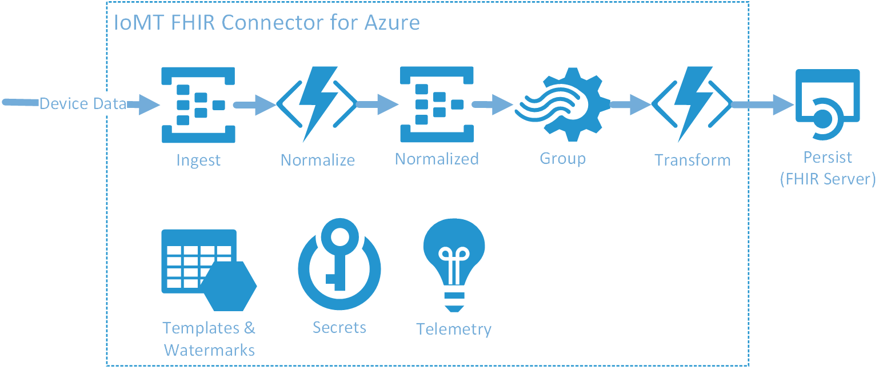

This article provides an overview of IoMT connector architecture. You'll learn about IoMT connector's internal components and data processing stages that transform device data into FHIR-based [Observation](https://www.hl7.org/fhir/observation.html) resources.

> [!div class="mx-imgBorder"]
> 

IoMT connector architecture diagram above shows different data-flow stages and associated components. 

## Ingest ##
Ingest is the first stage where device data is received into IoMT connector. The ingestion endpoint for device data is hosted on an [Azure Event Hub](https://docs.microsoft.com/azure/event-hubs/) named `devicedata`. Azure Event Hub platform supports high scale and throughput with ability to receive and process millions of messages per second. It also enables IoMT connector to consume messages asynchronously, thus removing the need for devices to wait while device data gets processed.

## Normalize ##
Normalize is the next stage where device data is retrieved from `devicedata` Azure Event Hub and processed using device mapping templates. This mapping process results in transforming device data into a normalized schema. 

The normalization process not only simplifies data processing at later stages but also provides ability to project one input message into multiple normalized messages. For instance a device sends multiple vital signs: body temperature, pulse rate, blood pressure, and respiration rate in a single message. To create four separate FHIR resources, each representing different vital sign, input message should be projected into four  different normalized messages.

Normalization logic is defined and executed through an instance of [Azure Functions](https://docs.microsoft.com/azure/azure-functions/). Once normalized, messages are written to a second Azure Event Hub called `normalizeddata`.

## Group ##
Group is the next stage where the normalized messages are read from `normalizeddata` Azure Event Hub and grouped by three different parameters: device identity, measurement type, and time period.

Device identity and measurement type grouping enables use of [SampledData](https://www.hl7.org/fhir/datatypes.html#SampledData) measurement type, a concise way to represent series of measurements from a device in FHIR. And time period controls the latency at which IoMT connector generated Observation resources are written to Azure API for FHIR.

Grouping of normalized messages is executed using an [Azure Stream Analytics](https://docs.microsoft.com/azure/stream-analytics/) job. Stream Analytics provides capability to analyze and process high volumes of fast streaming data at a real-time.

## Transform ##
In Transform stage grouped normalized messages are processed through FHIR mapping templates. Messages matching a template type get transformed into FHIR-based Observation resources as specified through the mapping.

At this point [Device](https://www.hl7.org/fhir/device.html) resource, along with its associated [Patient](https://www.hl7.org/fhir/patient.html) resource, is also retrieved from the FHIR server using the device identifier present in the message. These resources are added as a reference to the Observation resource being created.

> [!NOTE]
> All identity look ups are cached once resolved to decrease load on the FHIR server. If you plan on reusing devices with multiple patients it is advised you create a virtual device resource that is specific to the patient and send virtual device identifier in the message payload. The virtual device can be linked to the actual device resource as a parent.

If no Device resource for a given device identifier exists in the FHIR server, the outcome depends upon the value of `Resolution Type` set at the time of installation. When set to `Lookup` message processing will error out. If set to `Create` IoMT connector will create a bare-bones Device and Patient resources on the FHIR server.  

## Persist ##
Once the Observation FHIR resource is generated in the Transform stage, it is created or merged into Azure API for FHIR.

Both Transform and Persist stages are executed using an instance of [Azure Functions](https://docs.microsoft.com/azure/azure-functions/).

## Next Steps

Learn to create device mapping and FHIR mapping templates.

>[!div class="nextstepaction"]
>[IoMT connector mapping templates](to-be-filled.md)

FHIR is the registered trademark of HL7 and is used with the permission of HL7.
