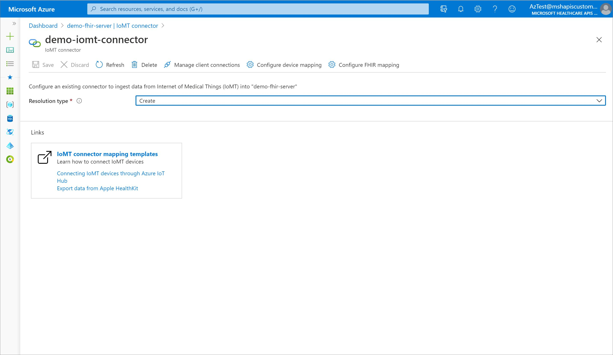

# Quickstart: Deploy IoMT connector (preview) using Azure portal

IoMT connector is an optional feature of Azure API for FHIR that provides the capability to ingest data from Internet of Medical Things (IoMT) devices. In this quickstart, you'll learn how to:
- Deploy and configure IoMT connector using the Azure portal
- Use a simulated device to send data to IoMT connector
- View resources created by  IoMT connector on Azure API for FHIR

## Prerequisites

- An active Azure subscription - [Create one for free](https://azure.microsoft.com/free/?WT.mc_id=A261C142F)
- Azure API for FHIR resource - [Deploy Azure API for FHIR using Azure portal](fhir-paas-portal-quickstart.md)

## Go to Azure API for FHIR resource

Open the [Azure portal](https://portal.azure.com) and go to the **Azure API for FHIR** resource for which you'd like to create the IoMT connector feature.

> [!div class="mx-imgBorder"]
> 

<br>

On the left-hand navigation menu, click on **IoMT connector** under **Add-ins** section to open **IoMT connectors** page.

> [!div class="mx-imgBorder"]
> 

## Create new IoMT connector (preview)

Click on the **Add** button to open **Create IoMT connector** page and enter settings for the new IoMT connector. Click on **Create** button and await IoMT connector deployment.

> [!NOTE]
> Must select **Create** as the value for the **Resolution type** drop down for this installation. 

> [!div class="mx-imgBorder"]
> 

|Setting|Value|Description |
|---|---|---|
|Connector name|A unique name|Enter a name to identify your IoMT connector. This name should be unique within an Azure API for FHIR resource.<br><br>The name can only contain lowercase letters, numbers, and the hyphen (-) character. It must start and end with a letter or a number, and must be between 3-24 characters in length.|
|Resolution type|Lookup or Create|Select **Lookup** if you have an out-of-band process to create [Device](https://www.hl7.org/fhir/device.html)and [Patient](https://www.hl7.org/fhir/patient.html) FHIR resources in your Azure API for FHIR. IoMT connector will use reference to these resources when creating an [Observation](https://www.hl7.org/fhir/observation.html) FHIR resource to represent the device data. Select **Create** when you want IoMT connector to create bare-bones Device and Patient resources in your Azure API for FHIR using respective identifier values present in the device data.|

## Configure IoMT connector (preview)

IoMT connector needs two mapping templates to transform device message into FHIR-based Observation resource(s): **device mapping** and **fhir mapping**. Select the newly deployed IoMT connector to open **IoMT connector** page.

> [!div class="mx-imgBorder"]
> 

#### Device Mapping: 

Device mapping template transforms device data into a normalized schema. Select **Configure device mapping** to open **Device mapping** page. 

> [!div class="mx-imgBorder"]
> 

<br>

Add the following script to the JSON editor on the page and select **Save**.

```json
{
  "templateType": "CollectionContent",
  "template": [
    {
      "templateType": "IotJsonPathContent",
      "template": {
        "typeName": "heartrate",
        "typeMatchExpression": "$..[?(@Body.HeartRate)]",
        "patientIdExpression": "$.SystemProperties.iothub-connection-device-id",
        "values": [
          {
            "required": "true",
            "valueExpression": "$.Body.HeartRate",
            "valueName": "hr"
          }
        ]
      }
    }
  ]
}
```

#### FHIR Mapping:

FHIR mapping template transforms a normalized message to a FHIR-based Observation resource. 
Select **Configure FHIR mapping** to open **FHIR mapping** page. 

> [!div class="mx-imgBorder"]
> 

<br>

Add the following script to the JSON editor on the page and select **Save**.

```json
{
  "templateType": "CollectionFhir",
  "template": [
    {
      "templateType": "CodeValueFhir",
      "template": {
        "codes": [
          {
            "code": "8867-4",
            "system": "http://loinc.org",
            "display": "Heart rate"
          }
        ],
        "periodInterval": 0,
        "typeName": "heartrate",
        "value": {
          "unit": "count/min",
          "valueName": "hr",
          "valueType": "Quantity"
        }
      }
    }
  ]
}
```

## Set up a device simulator

Set up a device simulator by creating a [continuous patient monitoring application](https://docs.microsoft.com/azure/iot-central/healthcare/tutorial-continuous-patient-monitoring#create-an-application-template) on Azure IoT Central. 

This application includes two device simulators: **Smart Vitals Patch** and **Smart Knee Brace**. The mapping templates configured in the previous section would transform heart rate value produced by Smart Vitals Patch to FHIR standard and save it in Azure API for FHIR. 

## Send device simulator data to IoMT connector (preview)

Connect and start sending device data to IoMT connector by [setting up data export on your device simulator](https://docs.microsoft.com/azure/iot-central/core/howto-export-data#set-up-data-export). Make sure to choose *Azure Event Hubs* as the export destination, IoMT connector name for **Event Hubs namespace**, *devicedata* for **Event Hub**, and keep **Telemetry** option *On* for **Data to Export**.

## View device data in Azure API for FHIR

You can view the FHIR-based Observation resource(s) created by IoMT connector on Azure API for FHIR using Postman. Set up your [Postman to access Azure API for FHIR](access-fhir-postman-tutorial) and make a `GET` request to `https://your-fhir-server-url/Observation?code=http://loinc.org|8867-4` to view Observation FHIR resources with heart rate value. 

> [!TIP]
> Ensure that your user has appropriate access to Azure API for FHIR data plane. Use [Azure Role Based Access Control](configure-azure-rbac.md) to assign required data plane roles.

## Clean up resources

When no longer needed you can delete an instance of IoMT connector by removing associated resource group or Azure API for FHIR, or the instance itself. 

To directly remove an IoMT connector instance, select the instance from **IoMT connectors** page and click on **Delete** button. Select **Yes** when asked for confirmation. 

> [!div class="mx-imgBorder"]
> 

## Next steps

In this quickstart guide, you've deployed IoMT connector feature in your Azure API for FHIR resource. Select from below next steps to learn more about IoMT connector:

>[!div class="nextstepaction"]
>[IoMT connector architecture](to-be-filled.md)

>[!div class="nextstepaction"]
>[IoMT connector mapping templates](to-be-filled.md)

>[!div class="nextstepaction"]
>[Export Apple HealthKit data](to-be-filled.md)

>[!div class="nextstepaction"]
>[IoMT connector FAQs](to-be-filled.md)
