# Quickstart: Deploy IoMT connector (preview) using Azure portal

IoMT connector is an optional feature of Azure API for FHIR that provides the capability to ingest data from Internet of Medical Things (IoMT) devices. And during the preview phase, IoMT connector feature is being available for free. In this quickstart, you'll learn how to:
- Deploy and configure IoMT connector using the Azure portal
- Use a simulated device to send data to IoMT connector
- View resources created by IoMT connector on Azure API for FHIR

## Prerequisites

- An active Azure subscription - [Create one for free](https://azure.microsoft.com/free/?WT.mc_id=A261C142F)
- Azure API for FHIR resource - [Deploy Azure API for FHIR using Azure portal](fhir-paas-portal-quickstart.md)

## Go to Azure API for FHIR resource

Open the [Azure portal](https://portal.azure.com) and go to the **Azure API for FHIR** resource for which you'd like to create the IoMT connector feature.

[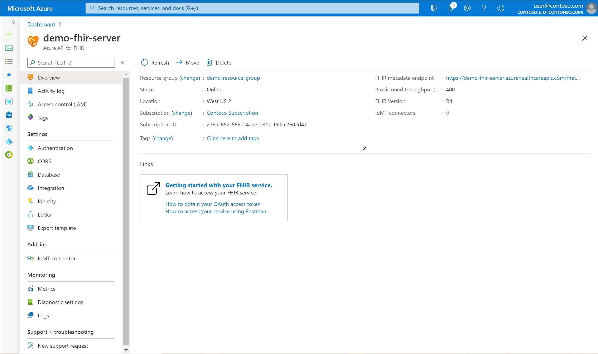](media/quickstart-iomt-fhir-portal/portal-azure-api-fhir.jpg#lightbox)

On the left-hand navigation menu, click on **IoMT connector (preview)** under the **Add-ins** section to open the **IoMT connectors** page.

[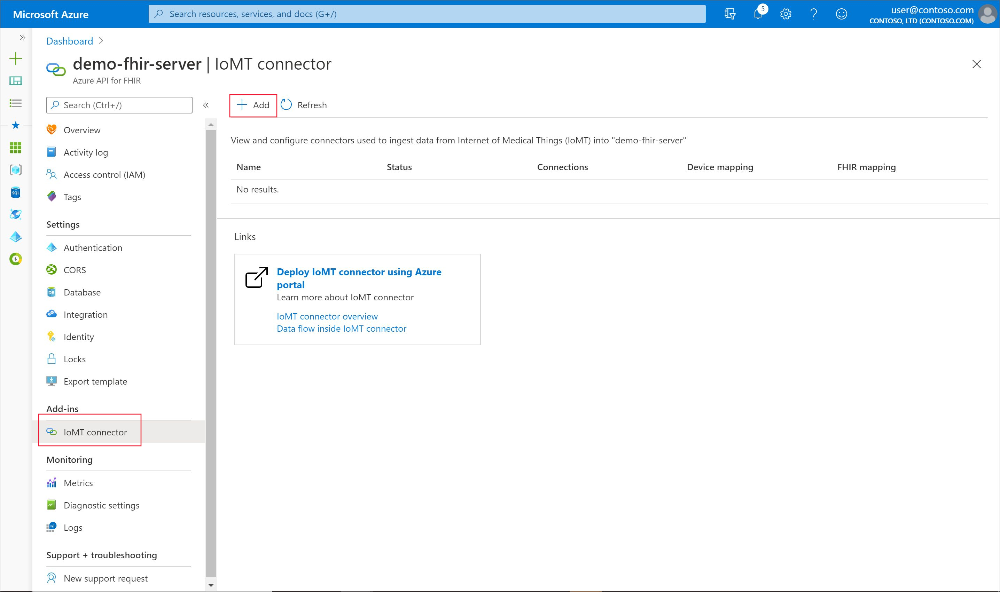](media/quickstart-iomt-fhir-portal/portal-iomt-connectors.jpg#lightbox)

## Create new IoMT connector (preview)

Click on the **Add** button to open the **Create IoMT connector** page.

[](media/quickstart-iomt-fhir-portal/portal-iomt-connectors-add.jpg#lightbox)

Enter settings for the new IoMT connector. Click on **Create** button and await IoMT connector deployment.

> [!NOTE]
> Must select **Create** as the value for the **Resolution type** drop down for this installation. 

[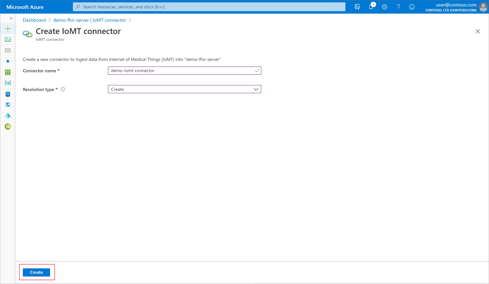](media/quickstart-iomt-fhir-portal/portal-iomt-connector-create.jpg#lightbox)

|Setting|Value|Description |
|---|---|---|
|Connector name|A unique name|Enter a name to identify your IoMT connector. This name should be unique within an Azure API for FHIR resource. The name can only contain lowercase letters, numbers, and the hyphen (-) character. It must start and end with a letter or a number, and must be between 3-24 characters in length.|
|Resolution type|Lookup or Create|Select **Lookup** if you have an out-of-band process to create [Device](https://www.hl7.org/fhir/device.html)and [Patient](https://www.hl7.org/fhir/patient.html) FHIR resources in your Azure API for FHIR. IoMT connector will use reference to these resources when creating an [Observation](https://www.hl7.org/fhir/observation.html) FHIR resource to represent the device data. Select **Create** when you want IoMT connector to create bare-bones Device and Patient resources in your Azure API for FHIR using respective identifier values present in the device data.|

Once installation is complete, the newly created IoMT connector will show up on the **IoMT connectors** page.

[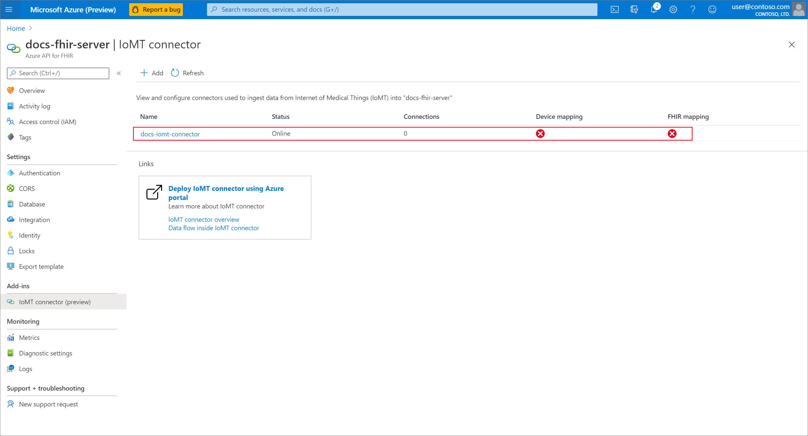](media/quickstart-iomt-fhir-portal/portal-iomt-connector-created.jpg#lightbox)

## Configure IoMT connector (preview)

IoMT connector needs two mapping templates to transform device messages into FHIR-based Observation resource(s): **device mapping** and **fhir mapping**. Your IoMT connector is not fully operational until these mappings are uploaded.

[](media/quickstart-iomt-fhir-portal/portal-iomt-connector-missing-mappings.jpg#lightbox)

To upload mapping templates, click on the newly deployed IoMT connector to go to the **IoMT connector** page.

[](media/quickstart-iomt-fhir-portal/portal-iomt-connector-click.jpg#lightbox)

#### Device mapping

Device mapping template transforms device data into a normalized schema. On the **IoMT connector** page, click on **Configure device mapping** button to go to the **Device mapping** page. 

[](media/quickstart-iomt-fhir-portal/portal-iomt-connector-click-device-mapping.jpg#lightbox)

On the **Device mapping** page, add the following script to the JSON editor and click **Save**.

```json
{
  "templateType": "CollectionContent",
  "template": [
    {
      "templateType": "IotJsonPathContent",
      "template": {
        "typeName": "heartrate",
        "typeMatchExpression": "$..[?(@Body.HeartRate)]",
        "patientIdExpression": "$.SystemProperties.iothub-connection-device-id",
        "values": [
          {
            "required": "true",
            "valueExpression": "$.Body.HeartRate",
            "valueName": "hr"
          }
        ]
      }
    }
  ]
}
```

[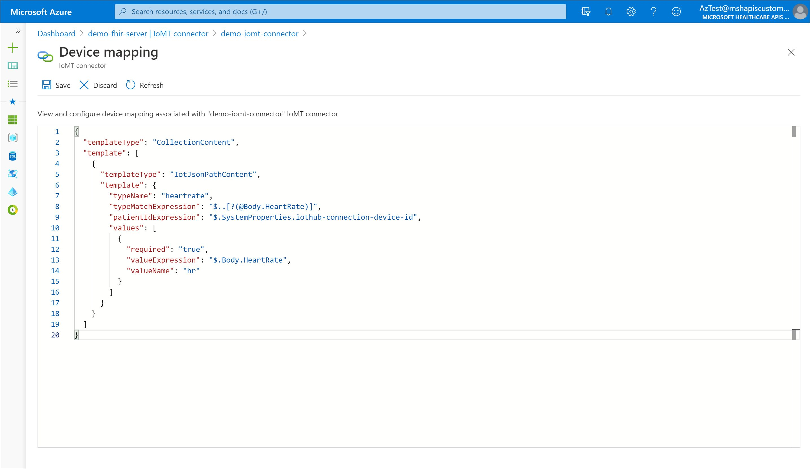](media/quickstart-iomt-fhir-portal/portal-iomt-device-mapping.jpg#lightbox)


#### FHIR mapping

FHIR mapping template transforms a normalized message to a FHIR-based Observation resource. On the **IoMT connector** page, click on **Configure FHIR mapping** button to go to the **FHIR mapping** page.  

[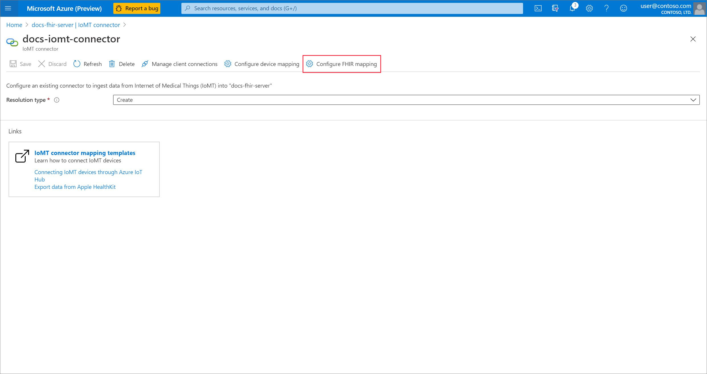](media/quickstart-iomt-fhir-portal/portal-iomt-connector-click-fhir-mapping.jpg#lightbox)

On the **FHIR mapping** page, add the following script to the JSON editor and click **Save**.

```json
{
  "templateType": "CollectionFhir",
  "template": [
    {
      "templateType": "CodeValueFhir",
      "template": {
        "codes": [
          {
            "code": "8867-4",
            "system": "http://loinc.org",
            "display": "Heart rate"
          }
        ],
        "periodInterval": 0,
        "typeName": "heartrate",
        "value": {
          "unit": "count/min",
          "valueName": "hr",
          "valueType": "Quantity"
        }
      }
    }
  ]
}
```

[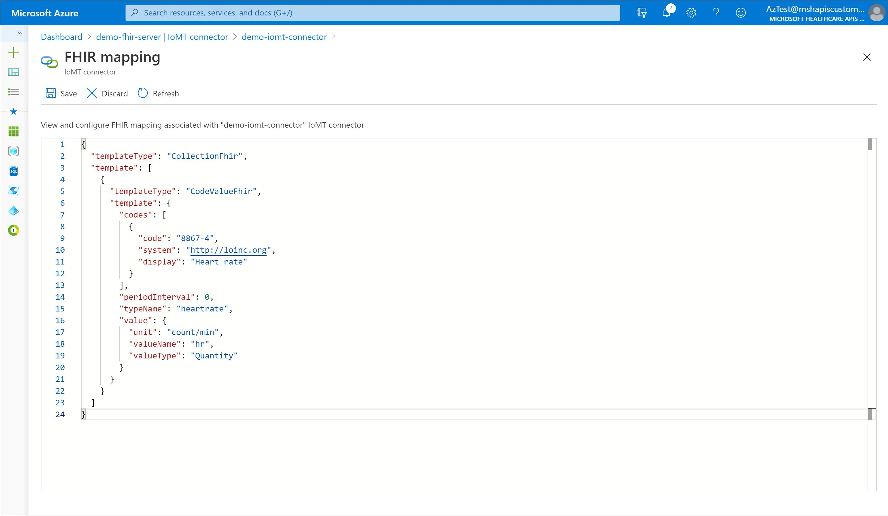](media/quickstart-iomt-fhir-portal/portal-iomt-fhir-mapping.jpg#lightbox)

## Generate a connection string

IoMT device needs a connection string to connect and send messages to IoMT connector. On the **IoMT connector** page for the newly deployed IoMT connector, select **Manage client connections** button. 

[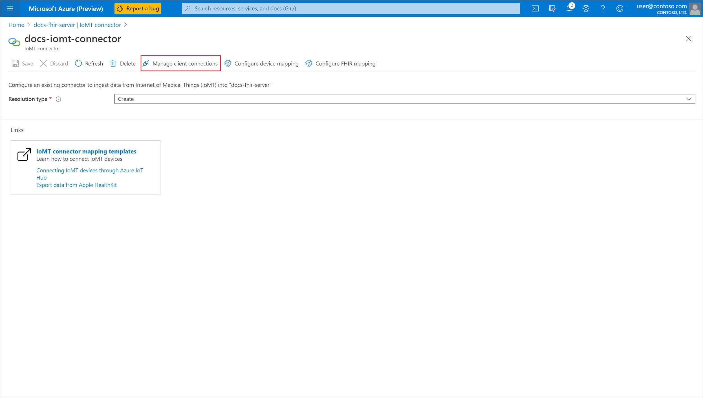](media/quickstart-iomt-fhir-portal/portal-iomt-connector-click-client-connections.jpg#lightbox)

Once on **Connections** page, click on **Add** button to create a new connection. 

[](media/quickstart-iomt-fhir-portal/portal-iomt-connections.jpg#lightbox)

Provide a friendly name for this connection on the overlay window and select the **Create** button.

[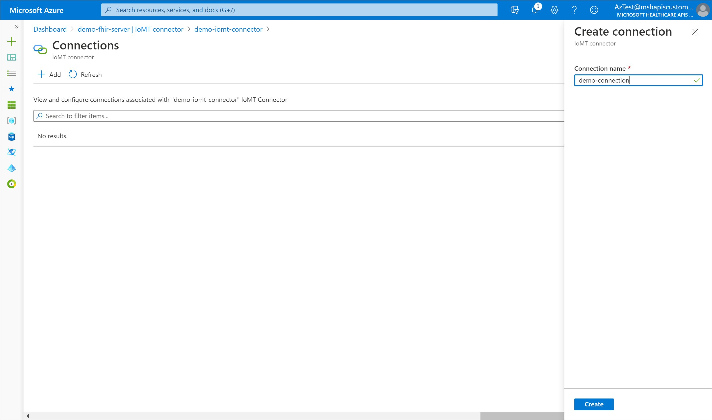](media/quickstart-iomt-fhir-portal/portal-iomt-new-connection.jpg#lightbox)

Select the newly created connection from the **Connections** page and copy the value of **Primary connection string** field from the overlay window on the right.

[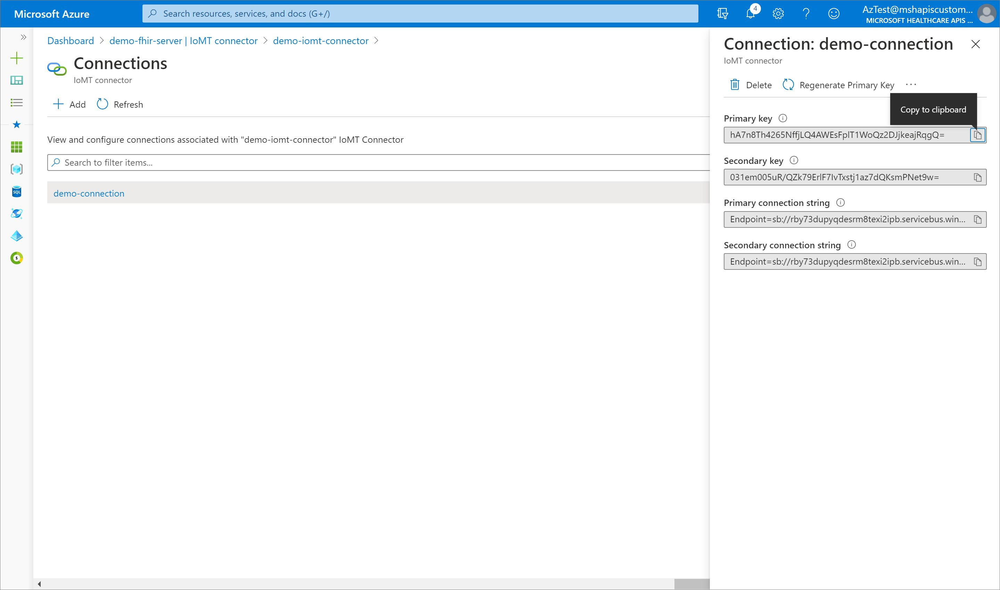](media/quickstart-iomt-fhir-portal/portal-iomt-connection-string.jpg#lightbox)

Preserve this connection string to be used at a later step. 

## Connect your devices to IoT

Azure offers an extensive suite of IoT products to connect and manage your IoT devices. You can build your own solution based on PaaS using Azure IoT Hub, or start with a manage IoT apps platform with Azure IoT Central. For this tutorial we'll leverage Azure IoT Central which has industry-focused solution templates to help you get started.

Deploy the [Continuous patient monitoring application template](https://docs.microsoft.com/azure/iot-central/healthcare/tutorial-continuous-patient-monitoring#create-an-application-template). This template includes two simulated devices producing real-time data to help you get started: **Smart Vitals Patch** and **Smart Knee Brace**.

> [!NOTE]
> Whenever your real devices are ready, you can use same IoT Central application to [onboard your devices](https://docs.microsoft.com/azure/iot-central/core/howto-set-up-template) and replace device simulators. Your device data will automatically start flowing to FHIR as well. 

## Connect your IoT data with the IoMT connector (preview)
Once you've deployed your IoT Central application, your two out-of-the-box simulated devices will start generating telemetry. For this tutorial we'll ingest the telemetry from *Smart Vitals Patch* simulator into FHIR via the IoMT connector. To export your IoT data to the IoMT connector we'll want to [set up a continuous data export within IoT Central](https://docs.microsoft.com/azure/iot-central/core/howto-export-data#set-up-data-export). On the continuous data export page:
- Pick *Azure Event Hubs* as the export destination.
- Select *Use a connection string* value for **Event Hubs namespace** field.
- Provide IoMT connector's connection string obtained in a previous step for the **Connection String** field.
- Keep **Telemetry** option *On* for **Data to Export** field.

## View device data in Azure API for FHIR

You can view the FHIR-based Observation resource(s) created by IoMT connector on Azure API for FHIR using Postman. Set up your [Postman to access Azure API for FHIR](access-fhir-postman-tutorial.md) and make a `GET` request to `https://your-fhir-server-url/Observation?code=http://loinc.org|8867-4` to view Observation FHIR resources with heart rate value. 

> [!TIP]
> Ensure that your user has appropriate access to Azure API for FHIR data plane. Use [Azure Role Based Access Control](configure-azure-rbac.md) to assign required data plane roles.

## Clean up resources

When no longer needed, you can delete an instance of IoMT connector by removing the associated resource group, or the associated Azure API for FHIR service, or the IoMT connector instance itself. 

To directly remove an IoMT connector instance, select the instance from **IoMT connectors** page to go to **IoMT connector** page and click on **Delete** button. Select **Yes** when asked for confirmation. 

[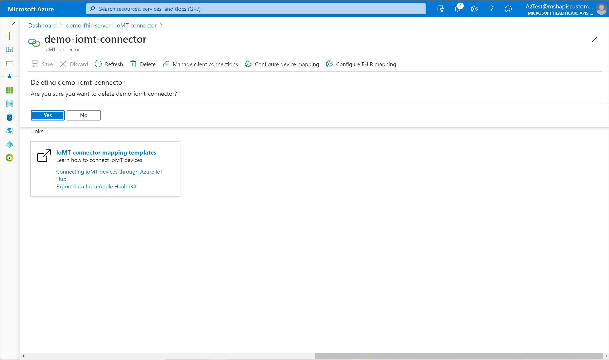](media/quickstart-iomt-fhir-portal/portal-iomt-connector-delete.jpg#lightbox)

