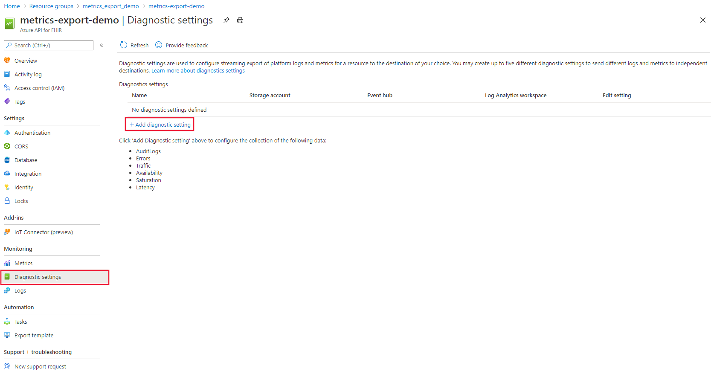

# Export Azure IoT Connector for FHIR (preview) metrics through Diagnostic settings

In this article, you'll learn how to export Azure IoT Connector FHIR* metrics logs. The feature that enables metric logging is the [**Diagnostic settings**](https://docs.microsoft.com/azure/azure-monitor/platform/diagnostic-settings) in the Azure portal. 

> [!TIP]
> Follow the guidance in [Enable Diagnostic Logging in Azure API for FHIR and Azure IoT Connector for FHIR](enable-diagnostic-logging.md#enable-diagnostic-logging-in-azure-api-for-fhir) to set up audit logging.

## Enable metric logging for the Azure IoT Connector for FHIR (preview)
1. To enable metric logging for IoT Connector, select your Azure API for FHIR service in the Azure portal 

2. Navigate to **Diagnostic settings** 

3. Select **+ Add diagnostic setting**

 

4. Enter a name in the **Diagnostic setting name** dialog box.

5. Select the method you want to use to access your diagnostic logs:

    1. **Archive to a storage account** for auditing or manual inspection. The storage account you want to use needs to be already created.
    2. **Stream to event hub** for ingestion by a third-party service or custom analytic solution. You will need to create an event hub namespace and event hub policy before you can configure this step.
    3. **Stream to the Log Analytics** workspace in Azure Monitor. You will need to create your Logs Analytics Workspace before you can select this option.

6. Select **Errors, Traffic, and Latency** for the IoT Connector and any additional metrics you want to capture for the Azure API for FHIR.

7. Select **Save**

 

> [!Note] 
> It might take up to 15 minutes for the first metric logs to display in the repository of your choice.  
 
For more information about how to work with diagnostic logs, see the [Azure Resource Log documentation](https://docs.microsoft.com/azure/azure-monitor/platform/resource-logs-overview)

## Conclusion 
Having access to metric logs is essential for monitoring and troubleshooting.  Azure IoT Connector for FHIR allows you to do these actions through metric logs. 

# Next steps

Check out frequently asked questions about the Azure IoT Connector for FHIR.

>[!div class="nextstepaction"]
>[Azure IoT Connector for FHIR FAQs](fhir-faq.md#azure-iot-connector-for-fhir-preview)

*In the Azure portal, the Azure IoT Connector for FHIR is referred to as IoT Connector (preview).

FHIR is the registered trademark of HL7 and is used with the permission of HL7.