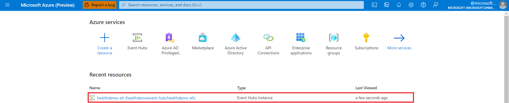

# Deploy the IoT Connector in the Azure portal

> [!IMPORTANT]
> Azure Healthcare APIs is currently in PREVIEW. The [Supplemental Terms of Use for Microsoft Azure Previews](https://azure.microsoft.com/support/legal/preview-supplemental-terms/) include additional legal terms that apply to Azure features that are in beta, preview, or otherwise not yet released into general availability.

In this quickstart, you'll learn how to deploy the IoT Connector in the Azure portal. Configuring an IoT Connector will enable you to ingest data from Internet of Things (IoT) into your FHIR service using an Event Hub.

## Prerequisites

It's important that you have the following prerequisites completed before you begin the steps of creating an IoT Connector instance in Azure Healthcare APIs.

* [Azure account](https://azure.microsoft.com/free/search/?OCID=AID2100131_SEM_c4b0772dc7df1f075552174a854fd4bc:G:s&ef_id=c4b0772dc7df1f075552174a854fd4bc:G:s&msclkid=c4b0772dc7df1f075552174a854fd4bc)
* [Resource group deployed in the Azure portal](https://docs.microsoft.com/azure/azure-resource-manager/management/manage-resource-groups-portal)
* [Workspace deployed in Azure Healthcare APIs](../workspace-overview.md)  
* [FHIR service deployed in Azure Healthcare APIs](../fhir/fhir-portal-quickstart.md) 

* [Event Hubs namespace and Event Hub deployed in the Azure portal](https://docs.microsoft.com/azure/event-hubs/event-hubs-create)

## Deploy IoT Connector 

1. In the [Azure portal](https://portal.azure.com), browse to the **Resource group** page.
2. Select the name of your Healthcare APIs workspace.

   

3. Select the **IoT Connector** blade.

   

4. Next, select **Add IoT Connector**.

   

## Configure IoT Connector to ingest data

Under the **Basics** tab, complete the required fields under **Instance details**.

1. Enter the **IoT Connector name**.

2. Enter the **Event Hub name**.

   The Event Hub name is located by selecting the name of the **Event Hubs Instance** in the **Azure Recent resources** page.

     

   For information about Azure Event Hubs, see [Quickstart: Create an Event Hub using Azure portal](https://docs.microsoft.com/azure/event-hubs/event-hubs-create#create-an-event-hubs-namespace).

3. Enter the **Consumer Group**.

   The Consumer Group name is located by selecting the name of the Event Hubs instance in the **Azure Recent resources** page and by selecting the **Consumer groups** blade.

   

   For information about Consumer Groups,  see [Features and terminology in Azure Event Hubs](../../event-hubs/event-hubs-features.md?WT.mc_id=Portal-Microsoft_Healthcare_APIs#event-consumers).

4. Enter the name of the **Fully Qualified Namespace**.

    The **Fully Qualified Namespace** is the **Host name** located on the **Event Hubs Overview** page as shown in the image below.

      

    Before you select **Review + Create**, you must configure the **Destination** properties because they’re required fields for creating and deploying an IoT Connector.

    For more information about Event Hubs Namespaces, see [Namespace](../../event-hubs/event-hubs-features.md?WT.mc_id=Portal-Microsoft_Healthcare_APIs#namespace) in the Features and terminology in Azure Event Hubs document.

5. (Optional) Select **Next: Device mapping >**. 
    
    Proceed to the next section about entering device mapping properties and for information the Device Mapper tool. Otherwise, proceed to the section [Configure Destination](#configure-destination).
  
## Configure Device mapping properties

 The Device Mapper is a tool to visualize the mapping configuration for normalizing a device's input data, and then transform it to FHIR resources. Developers can use this tool to edit and test devices, FHIR mappings, and export the data to upload to an IoT Connector in the Azure portal. This tool also helps developers understand their device's mapping configurations.

For more information, see the open source documentation [Device Content Mapping](https://github.com/microsoft/iomt-fhir/blob/master/docs/Configuration.md#device-content-mapping).

1. Under the **Device Mapping** tab, enter the device mapping JSON code associated with your IoT Connector.

   

2. Select **Review + create**, or select **Next: Destination >** to configure the destination properties associated with your IoT Connector.

## Configure Destination

1. Under the **Destination** tab, enter the destination properties associated with the IoT Connector.

   

2. Enter the Azure Resource ID of the **FHIR Server**.

   The **FHIR Server** name (also known as the **FHIR service**)  is located by selecting the name of your FHIR service in the **Azure Recent resources** page. In the **FHIR service Overview** page, select the **Properties** blade. Copy and paste the **Resource ID** string to the **FHIR Server** text field.

     

3. Enter the **Destination Name**.

   The **Destination Name** is a friendly name for the destination. Enter a unique name for your destination. As an example, you can name it `iotmedicdevice`.

4. Select **Create** or **Lookup** for the **ResolutionType**.

   When you select **Lookup**, this option allows you to select from a list if you have more IoT connectors created. The lookup feature looks for the destination maps of the other apps that have been previously created.

    > [!NOTE]
    > For the IoT Connector destination to create a valid observation resource in the FHIR Server, a device resource and patient resource **must** exist in the FHIR Server, so the observation can properly reference the device that created the data, and the patient the data was measured from. There are two modes the IoT Connector can use to resolve the device and patient resources.

   **Create**

     The IoT Connector destination attempts to retrieve a device resource from the FHIR Server using the device identifier included in the Event Hub message. It also attempts to retrieve a patient resource from the FHIR Server using the patient identifier included in the Event Hub message. If either resource is not found, new resources will be created (device, patient, or both) containing just the identifier contained in the Event Hub message. When you use the **Create** option, both a device identifier and a patient identifier can be configured in the device mapping. In other words, when the IoT Connector destination is in **Create** mode, it can function normally **without** adding device and patient resources to the FHIR Server.

   **Lookup**

     The IoT Connector destination attempts to retrieve a device resource from the FHIR Server using the device identifier included in the event hub message. If the device resource is not found, this will cause an error, and the data won't be processed. For **Lookup** to function properly, a device resource with an identifier matching the device identifier included in the event hub message **must** exist and the device resource **must** have a reference to a patient resource that also exists. In other words, when the IoT Connector destination is in the Lookup mode, device and patient resources **must** be added to the FHIR Server before data can be processed.

   For more information, see the open source documentation [FHIR Mapping](https://github.com/microsoft/iomt-fhir/blob/master/docs/Configuration.md#fhir-mapping).

5. Under **Destination Mapping**, enter the JSON code inside the code editor.

   For information about the Mapper Tool, see [IoMT Connector Data Mapper Tool.](https://github.com/microsoft/iomt-fhir/tree/master/tools/data-mapper).

6. You may select **Review + create**, or you can select **Next: Tags >**.  

## (Optional) Configure Tags

Tags are name and value pairs used for categorizing resources. For more information about tags, see [Use tags to organize your Azure resources and management hierarchy](../../azure-resource-manager/management/tag-resources.md).

Under the **Tags** tab, enter the tag properties associated with the IoT Connector.

   
 
1. Enter a **Name**.
2. Enter a **Value**.
3. Select **Review + create**.

   You should notice a **Validation success** message like what's shown in the image below. 

    

   > [!NOTE]
   > If your IoT Connector didn’t validate, review the validation failure message, and troubleshoot the issue. It’s recommended that you review the properties under each IoT Connector tab that you've configured.

4. Next, select **Create**.

   The newly deployed IoT Connector will appear in your resource group of the Azure **Recent resources** page

     

## Next steps

In this article, you've learned how to deploy an IoT Connector in the Azure portal. For an overview of the IoT Connector, see

>[!div class="nextstepaction"]
>[IoT Connector overview](iot-connector-overview.md)