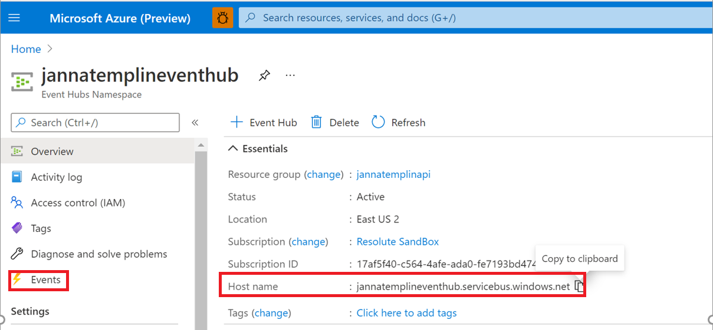
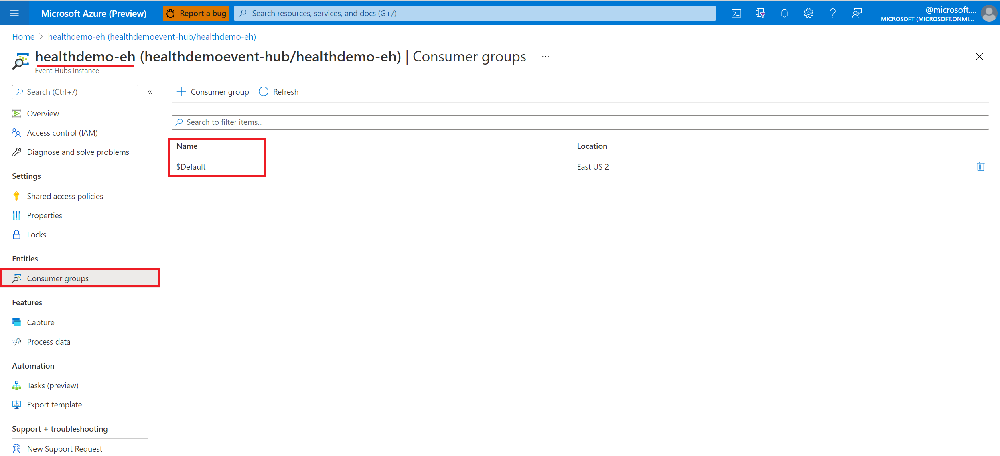

# Deploy the IoT Connector in the Azure portal

> [!IMPORTANT]
> Azure Healthcare APIs is currently in PREVIEW. The [Supplemental Terms of Use for Microsoft Azure Previews](https://azure.microsoft.com/support/legal/preview-supplemental-terms/) include additional legal terms that apply to Azure features that are in beta, preview, or otherwise not yet released into general availability.

In this quickstart, you'll learn how to deploy the IoT Connector in the Azure portal. Configuring an IoT Connector will enable you to ingest data from Internet of Things (IoT) into your FHIR service using an Event Hub.

## Prerequisite

Before getting started, you should have the following prerequisites completed before creating an IoT Connector instance in Azure Healthcare APIs.

* [A workspace deployed](../workspace-overview.md)  
* [A FHIR service deployed](../fhir/fhir-portal-quickstart.md) 
* [A resource group created](https://docs.microsoft.com/azure/azure-resource-manager/management/manage-resource-groups-portal)
* [An Azure event hub and event hub namespace](https://docs.microsoft.com/azure/event-hubs/event-hubs-create)

## Deploy IoT Connector 

1. In the [Azure portal](https://portal.azure.com), browse to the **Resource group** page.
2. Select the name of your Healthcare APIs workspace.

   

3. Select **Deploy IoT Connectors**, or select the **IoT Connector** blade.

   

4. Next, select **Add IoT Connector**.

   

## Configure IoT Connector to ingest data

1. Under the **Basics** tab, enter the Instance Details.

   

2. Enter a name for the IoT Connector.

3. Enter a name of the Azure Event Hub.

   The Event Hub name is also known as the Host Name and is obtained when you select the **Events** blade.

   

   For information about Azure event hubs, see [Quickstart: Create an event hub using Azure portal](https://docs.microsoft.com/azure/event-hubs/event-hubs-create#create-an-event-hubs-namespace).

4. Enter a name for the Consumer Group.

   The Consumer Group name is located in your Event Hub namespace by selecting the **Consumer group** blade.

   

   For information about Consumer Groups,  see [Features and terminology in Azure Event Hubs](../../event-hubs/event-hubs-features.md?WT.mc_id=Portal-Microsoft_Healthcare_APIs#event-consumers).

5. Enter the name of the **Fully Qualified Namespace**.

   A Fully Qualified Namespace is the **Host name** located on the **Event Hubs Overview** page. 

   For more information about Event Hub namespaces, see [Namespace](../../event-hubs/event-hubs-features.md?WT.mc_id=Portal-Microsoft_Healthcare_APIs#namespace) in the Features and terminology in Azure Event Hubs document].

6. To review and create the IoT Connector, select **Review + create**, or select **Next: Destination >**. To enter the destination mapping properties associated with the IoT Connector, refer to the instructions in the following section. 

## Configure destination mapping properties

1. Under the **Destination** tab, enter the destination mapping properties associated with the IoT Connector.

   

2. Enter the name of the **FHIR Server**.

3. Enter the **Destination Name**.

4. Select **Create** or **Lookup** for the **ResolutionType**.

5. Under **Destination Mapping**, enter the JSON code inside the code editor.
For more information about the Mapper Tool, see [IoMT Connector Data Mapper Tool](https://github.com/microsoft/iomt-fhir/tree/master/tools/data-mapper).

6.To review and create the IoT Connector, select **Review + create**, or select **Next: Device Mapping >**. 
To enter the device mapping properties associated with the IoT Connector, refer to the instructions in the following section.

## Configure device mapping properties

1. Under the **Device Mapping** tab, enter the device mapping JSON code associated with the IoT Connector.

   
2. To review and create the IoT Connector, select **Review + create**, or select **Next: Tags >**. 

To enter the tagging properties associated with the IoT Connector, refer to the instructions in the following section.

## Configure tags

1. Under the **Tags** tab, enter the tag properties associated with the IoT Connector.

   

2. Enter a **Name**.
3. Enter a **Value**.
4. Select **Review + create**.
5. When you notice the green validation checkmark, select **Create** to deploy the IoT Connector.

Tags are name/value pairs used for categorizing resources. For more information about tags, see [Use tags to organize your Azure resources and management hierarchy](../../azure-resource-manager/management/tag-resources.md).

## Next steps

In this article, you've learned how to deploy an IoT Connector in the Azure portal.  For an overview of the IoT Connector, see

>[!div class="nextstepaction"]
>[IoT Connector overview](iot-connector-overview.md)