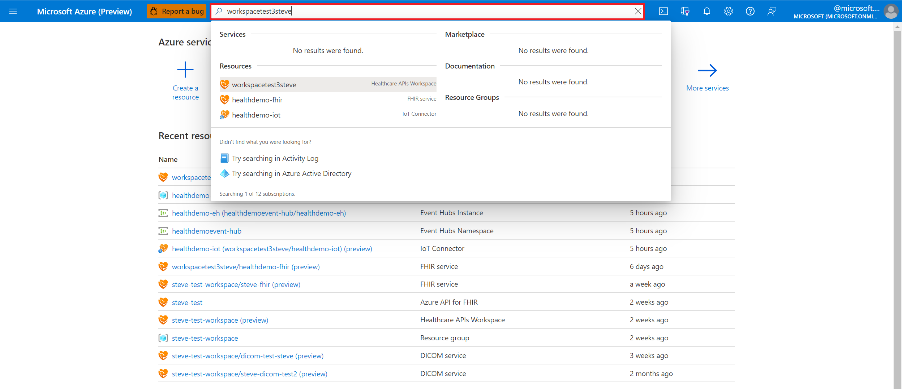
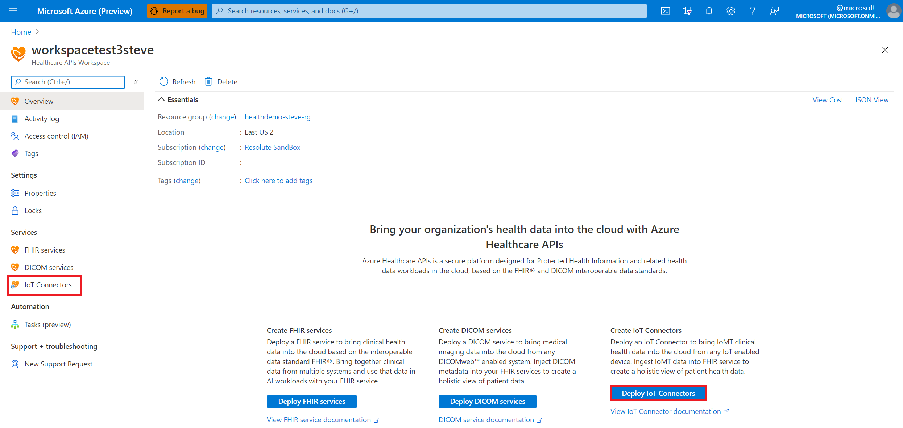
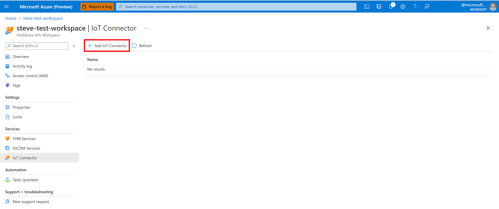
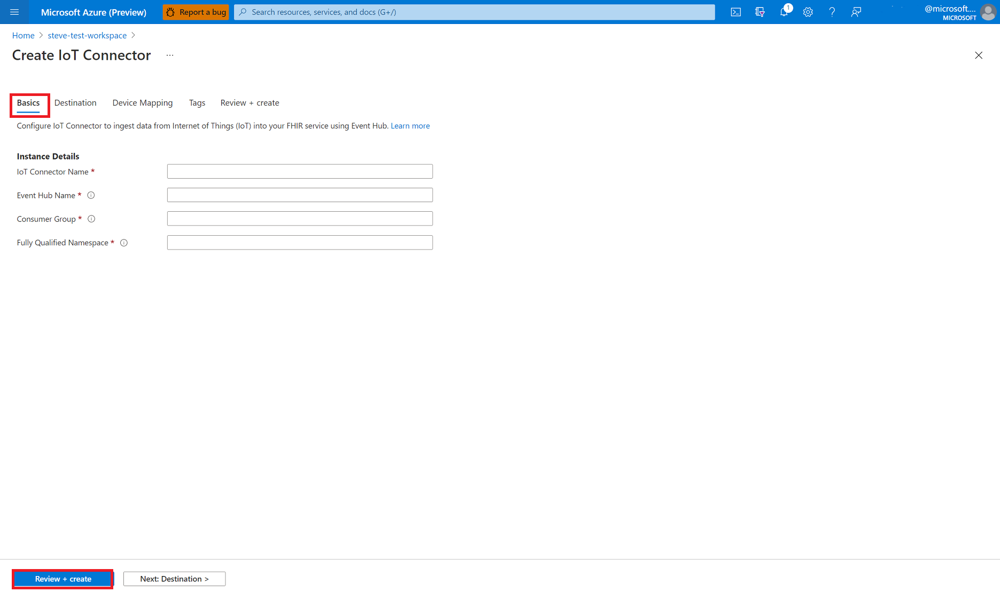
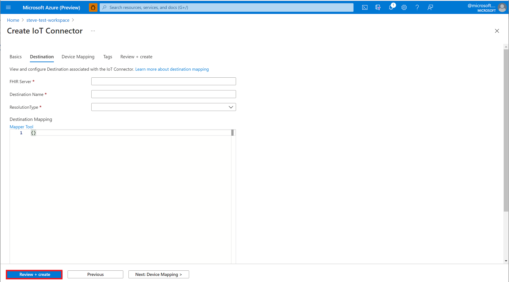
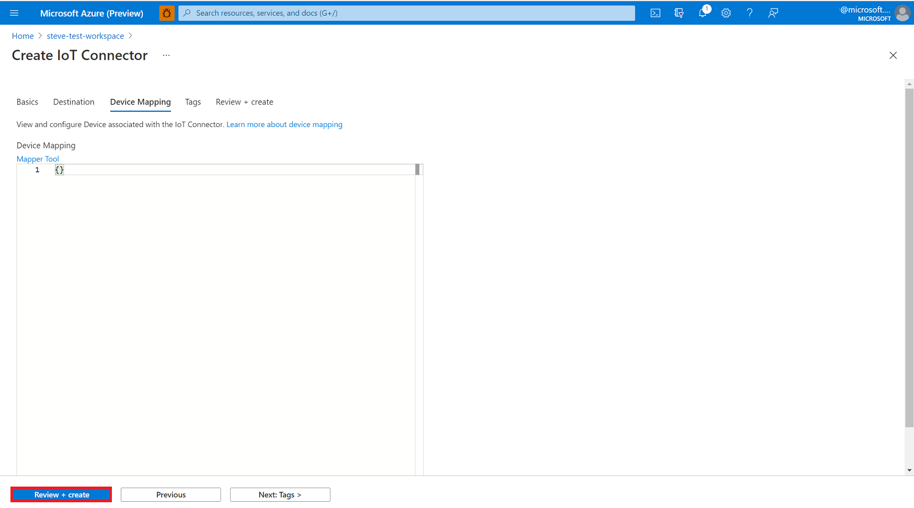
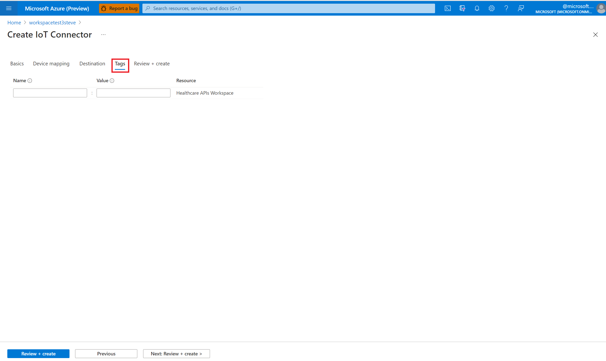

# Deploy the IoT Connector in the Azure portal

In this quickstart, you'll learn how to deploy the IoT Connector in the Azure portal. Configuring an IoT Connector will enable you to ingest data from Internet of Things (IoT) into your FHIR service using an Event Hub.

## Prerequisite

Before getting started, you should have already deployed the Azure Healthcare APIs. For more information about deploying Azure Healthcare APIs, see **Deploy workspace in the Azure portal**.

## Deploy IoT Connector 

1. In the [Azure portal](https://portal.azure.com), browse to the **Resource group** page.
2. Select the name of your Healthcare APIs workspace.

   

3. Under Services, select the **IoT Connector** blade.

   

4. Next, select **Add IoT Connector**.

   

## Configure IoT Connector to ingest data

1. Under the **Basics** tab, enter the Instance Details.

   

2. Enter a name for the IoT Connector.

3. Enter a name for the Event Hub.
For more information about Event Hubs, see [Azure Event Hubs overview](https://docs.microsoft.com/azure/event-hubs/).

4. Enter a name for the Consumer Group.
For more information about Consumer Groups,  see [Features and terminology in Azure Event Hubs](https://docs.microsoft.com/azure/event-hubs/event-hubs-features?WT.mc_id=Portal-Microsoft_Healthcare_APIs#event-consumers).

5. Enter a namespace for the IoT Connector.
For more information about Event Hub namespaces,  see [Namespace](https://docs.microsoft.com/azure/event-hubs/event-hubs-features?WT.mc_id=Portal-Microsoft_Healthcare_APIs#namespace) in the Features and terminology in Azure Event Hubs document].

6. To review and create the IoT Connector, select **Review + create**, or select **Next: Destination >**. To enter the destination mapping properties associated with the IoT Connector, refer to the instructions in the following section. 

## Configure destination mapping properties

1. Under the **Destination** tab, enter the destination mapping properties associated with the IoT Connector.

   

2. Enter the name of the **FHIR Server**.

3. Enter the **Destination Name**.

4. Select **Create** or **Lookup** for the **ResolutionType**.

5. Under **Destination Mapping**, enter the JSON code inside the code editor.
For more information about the Mapper Tool, see [IoMT Connector Data Mapper Tool](https://github.com/microsoft/iomt-fhir/tree/master/tools/data-mapper).

6.To review and create the IoT Connector, select **Review + create**, or select **Next: Device Mapping >**. 
To enter the device mapping properties associated with the IoT Connector, refer to the instructions in the following section.

## Configure device mapping properties

1. Under the **Device Mapping** tab, enter the device mapping JSON code associated with the IoT Connector.

   
2. To review and create the IoT Connector, select **Review + create**, or select **Next: Tags >**. 

To enter the tagging properties associated with the IoT Connector, refer to the instructions in the following section.

## Configure tags

1. Under the **Tags** tab, enter the tag properties associated with the IoT Connector.

   

2. Enter a **Name**.
3. Enter a **Value**.
4. Select **Review + create**.
5. When you notice the green validation checkmark, select **Create** to deploy the IoT Connector.

Tags are name/value pairs used for categorizing resources. For more information about tags, see [Use tags to organize your Azure resources and management hierarchy](../../azure-resource-manager/management/tag-resources.md).

## Next steps

>[!div class="nextstepaction"]
>[IoT Connector overview](iot-connector-overview.md)

