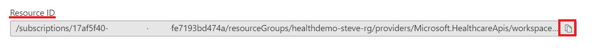
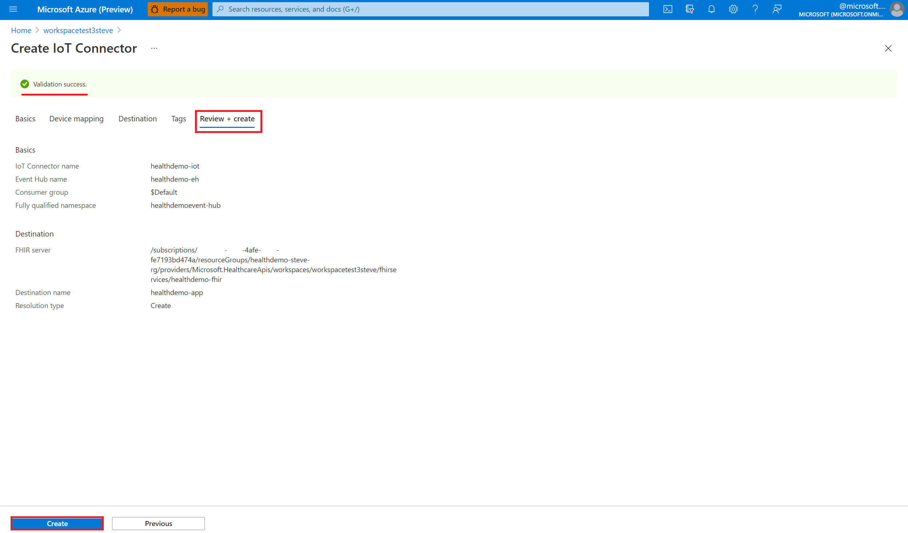
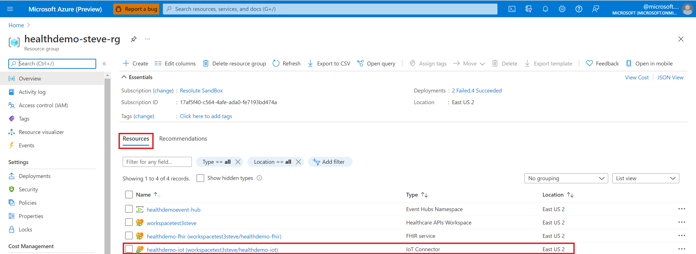

# Deploy the IoT Connector in the Azure portal

> [!IMPORTANT]
> Azure Healthcare APIs is currently in PREVIEW. The [Supplemental Terms of Use for Microsoft Azure Previews](https://azure.microsoft.com/support/legal/preview-supplemental-terms/) include additional legal terms that apply to Azure features that are in beta, preview, or otherwise not yet released into general availability.

In this quickstart, you'll learn how to deploy the IoT Connector in the Azure portal. Configuring an IoT Connector will enable you to ingest data from Internet of Things (IoT) into your FHIR service using an Event Hub.

## Prerequisite

Before getting started, you should have the following prerequisites completed before creating an IoT Connector instance in Azure Healthcare APIs.

* [A free Azure subscription](https://azure.microsoft.com/free/search/?OCID=AID2100131_SEM_c4b0772dc7df1f075552174a854fd4bc:G:s&ef_id=c4b0772dc7df1f075552174a854fd4bc:G:s&msclkid=c4b0772dc7df1f075552174a854fd4bc)
* [A workspace deployed](../workspace-overview.md)  
* [A FHIR service deployed](../fhir/fhir-portal-quickstart.md) 
* [A resource group created](https://docs.microsoft.com/azure/azure-resource-manager/management/manage-resource-groups-portal)
* [An Azure event hub and event hub namespace](https://docs.microsoft.com/azure/event-hubs/event-hubs-create)

## Deploy IoT Connector 

1. In the [Azure portal](https://portal.azure.com), browse to the **Resource group** page.
2. Select the name of your Healthcare APIs workspace.

   

3. Select the **IoT Connector** blade.

   

4. Next, select **Add IoT Connector**.

   

   Proceed to the next section to configure the properties of the IoT Connector.

## Configure IoT Connector to ingest data

1. Under the **Basics** tab, enter the **Instance Details**.

   

2. Enter the **IoT Connector name**.

3. Enter the **Event Hub name**.

   The Event Hub name is located by selecting the name of the **Event Hubs Instance** in the **Azure Recent resources** page. 

   

   For information about Azure event hubs, see [Quickstart: Create an event hub using Azure portal](https://docs.microsoft.com/azure/event-hubs/event-hubs-create#create-an-event-hubs-namespace).

4. Enter the **Consumer Group**.

   The Consumer Group name is located by selecting the name of the Event Hubs instance in the **Azure Recent resources** page and by selecting the **Consumer groups** blade.

   

   For information about Consumer Groups,  see [Features and terminology in Azure Event Hubs](../../event-hubs/event-hubs-features.md?WT.mc_id=Portal-Microsoft_Healthcare_APIs#event-consumers).

5. Enter the name of the **Fully Qualified Namespace**.

    The **Fully Qualified Namespace** is the **Host name** located on the **Event Hubs Overview** page.  

    Before you select **Review + Create**, you must configure the **Destination** properties because they’re required fields for creating and deploying an IoT Connector.

    For more information about Event Hub namespaces, see [Namespace](../../event-hubs/event-hubs-features.md?WT.mc_id=Portal-Microsoft_Healthcare_APIs#namespace) in the Features and terminology in Azure Event Hubs document.

6. (Optional) Select **Next: Destination >**. 

   The Device Mapper is a tool to visualize the mapping configuration for normalizing a device's input data, and then transform it to FHIR resources. Developers can use this tool to edit and test devices, FHIR mappings, and export the data to upload to an IoT Connector in the Azure portal. This tool also helps developers understand their device's mapping configurations. 

## Configure destination mapping properties

1. Under the **Destination** tab, enter the destination mapping properties associated with the IoT Connector.

   

2. Enter the name of the **FHIR Server**.

   The **FHIR Server** (also known as the **FHIR service**) name is located by selecting the name of your FHIR service in the **Azure Recent resources** page. In the **FHIR service Overview** page, select the **Properties** blade. Copy and paste the **Resource ID** string to the **FHIR Server** text field.

     

3. Enter the **Destination Name**.

   The **Destination Name** is a friendly name of the app. Enter a unique name for your app. As an example, you can name it `iotmedicdevice`.

4. Select **Create** or **Lookup** for the **ResolutionType**.

   When you select **Look up**, this option allows you to select from a list if you have more IoT connectors created. The lookup feature looks for the destination maps of the other apps that have been previously created.

5. Under **Destination Mapping**, enter the JSON code inside the code editor.

   For information about the Mapper Tool, see [IoMT Connector Data Mapper Tool.](https://github.com/microsoft/iomt-fhir/tree/master/tools/data-mapper).

6. You may select **Review + create**, or you can select **Next: Device Mapping >**. 

   To enter the device mapping properties associated with the IoT Connector, refer to the instructions in the next section.

## Configure device mapping properties

1. (Optional) Under the **Device Mapping** tab, enter the device mapping JSON code associated with the IoT Connector.

   

2. Select **Review + create**, or select **Next: Tags >** to configure the tagging properties associated with the IoT Connector. 

## Configure tags

1. Under the **Tags** tab, enter the tag properties associated with the IoT Connector.

   

   Tags are name and value pairs used for categorizing resources. For information about tags, see [Use tags to organize your Azure resources and management hierarchy](../../azure-resource-manager/management/tag-resources.md).
 
2. Enter a **Name**.
3. Enter a **Value**.
4. Select **Review + create**.
5. You should notice a **Validation success** message as shown in the sample image below. 

    
 
   If your IoT Connector didn’t validate, review the validation failure message, and troubleshoot the issue. It’s recommended that you review the properties under each IoT Connector tab that you configured.

6. Select **Create**.

   The newly deployed IoT Connector will appear in the list of **Azure Recent resources**.

     

## Next steps

In this article, you've learned how to deploy an IoT Connector in the Azure portal. For an overview of the IoT Connector, see

>[!div class="nextstepaction"]
>[IoT Connector overview](iot-connector-overview.md)