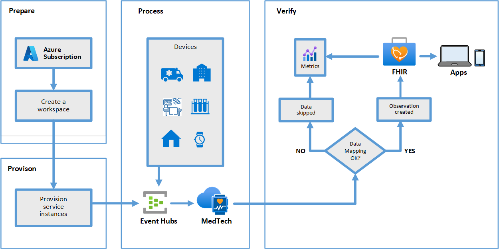

# Get started with the MedTech service

This article outlines the basic steps to get started with the MedTech service in [Azure Health Data Services](../healthcare-apis-overview.md). 

As a prerequisite, you'll need an Azure subscription and have been granted proper permissions to create Azure resource group and deploy Azure resources.

You can follow all the steps, or skip some if you have an existing environment. Also, you can combine all the steps and complete them in PowerShell, Azure CLI, and REST API scripts.

## Create a workspace in your Azure subscription

You can create a workspace from the [Azure portal](../healthcare-apis-quickstart.md) or using PowerShell, Azure CLI and REST API]. You can find scripts from the [Azure Health Data Services samples](https://github.com/microsoft/healthcare-apis-samples/tree/main/src/scripts).

> [!NOTE]
> There are limits to the number of workspaces and the number of MedTech service instances you can create in each Azure subscription.

## Create the FHIR service and an Event Hub

The MedTech service works with the Azure Event Hub and the FHIR service. You can create a new [FHIR service](../fhir/get-started-with-fhir.md) or use an existing one in the same or different workspace. Similarly, you can create a new [Event Hub](../../event-hubs/event-hubs-create.md) or use an existing one.

## Create a MedTech service in the workspace

You can create a MedTech service from the [Azure portal](deploy-iot-connector-in-azure.md) or using PowerShell, Azure CLI, or REST API. You can find scripts from the [Azure Health Data Services samples](https://github.com/microsoft/healthcare-apis-samples/tree/main/src/scripts).

Optionally, you can create a [FHIR service](../fhir/fhir-portal-quickstart.md) and [DICOM service](../dicom/deploy-dicom-services-in-azure.md) in the workspace.

## Assign roles to allow MedTech service to access Event Hub

By design, the MedTech service retrieves data from the specified Event Hub using the system-managed identity. For more information on how to assign the role to the MedTech service from [Event Hub](../../healthcare-apis/iot/deploy-iot-connector-in-azure.md#granting-medtech-service-access).

## Assign roles to allow MedTech service to access FHIR service

The MedTech service persists the data to the FHIR store using the system-managed identity. See details on how to assign the role to the MedTech service from the [FHIR service](../../healthcare-apis/iot/deploy-iot-connector-in-azure.md#accessing-the-medtech-service-from-the-fhir-service).

## Sending data to the MedTech service

You can send data to the Event Hub, which is associated with the MedTech service. If you don't see any data in the FHIR service, check the mappings and role assignments for the MedTech service.

## MedTech service mappings, data flow, ML, Power BI, and Teams notifications

You can find more details about MedTech service mappings, data flow, machine-learning service, Power BI, and Teams notifications in the [MedTech service](iot-connector-overview.md) documentation.

## Next steps

This article described the basic steps to get started using the MedTech service. For information about deploying the MedTech service in the workspace, see

>[!div class="nextstepaction"]
>[Deploy MedTech service in the Azure portal](deploy-iot-connector-in-azure.md)
