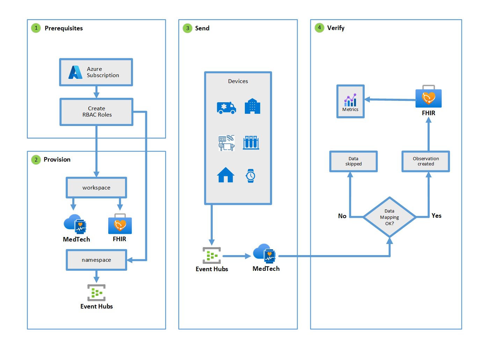

# Get started with the MedTech service in the Azure Health Data Services

This article will show you how to get started with the Azure MedTech service in the [Azure Health Data Services](../healthcare-apis-overview.md). There are six steps you need to follow to be able to deploy and process MedTech service to ingest health data from a medical device using Azure Event Hubs service, persist the data to Azure Fast Healthcare Interoperability Resources (FHIR&#174;) service as Observation resources, and link FHIR service Observations to patient and device resources. This article provides an architecture overview to help you follow the six steps through the implementation process.

## MedTech service architecture overview

The following diagram shows the basic architectural path that enables the MedTech service to receive data from a medical device and send it to the FHIR service. This diagram show how the six-step implementation process is divided into the three development stages: deployment, post-deployment, and data processing.

### Deployment

- Step 1 introduces the subscription and permissions prerequisites needed.

- Step 2 shows how Azure services are provisioned for the MedTech services.

- Step 3 presents the configuration process.

### Post-deployment

- Step 4 outlines how to connect to services.

### Data processing

- Step 5 represents how data flows from A device to an event hub and then is processed through the 5 parts of the MedTech service.

- Step 6 demonstrates the path needed to verify data sent from MedTech service to the FHIR service.

## Get started implementing MedTech service

The following six development steps will enable you to set up and start using MedTech service.

## Step 1: Prerequisites for deployment

In order to begin deployment, you need to determine if you have the appropriates: an Azure subscription and correct Azure RBAC (Role-Based Access Control) roles. If you already have the appropriate subscription and roles, you can skip this step.

- If you don't have an Azure subscription, see [Subscription decision guide](/azure/cloud-adoption-framework/decision-guides/subscriptions/).

- You must have the appropriate RBAC roles for the subscription resources you want to use. The roles required for a user to complete the provisioning would be Contributor AND User Access Administrator OR Owner. The Contributor role allows the user to provision resources, and the User Access Administrator role allows the user to grant access so resources can send data between them. The Owner role can perform both. For more information, see [Azure role-based access control](/azure/cloud-adoption-framework/ready/considerations/roles).

## Step 2: Provision services for deployment

After obtaining the required prerequisites, the next phase of deployment is to create a workspace and provision instances of the Event Hubs service, FHIR service, and MedTech service. You must also give the Event Hubs permission to read data from your device and give the MedTech service permission to read and write to the FHIR service.

### Create a resource group and workspace

You must first create a resource group to contain the deployed instances of a workspace, Event Hubs service, FHIR service, and MedTech service. A [workspace](../workspace-overview.md) is required as a container for the Azure Health Data Services. After you create a workspace from the [Azure portal](../healthcare-apis-quickstart.md), a FHIR service and MedTech service can be deployed to the workspace.

> [!NOTE]
> There are limits to the number of workspaces and the number of MedTech service instances you can create in each Azure subscription. For more information, see [MedTech service FAQs](iot-connector-faqs.md).

### Provision an Event Hubs instance to a namespace

In order to provision an Event Hubs service, an Event Hubs namespace must first be provisioned, because Event Hubs namespaces are logical containers for event hubs. Namespace must be associated with a resource. The event hub and namespace need to be provisioned in the same Azure subscription. For more information, see [Event Hubs](../../event-hubs/event-hubs-create.md).

Once an event hub is provisioned, you must give permission to the event hub to read data from the device. Then, MedTech service can retrieve data from the event hub using a [system-assigned managed identity](../../active-directory/managed-identities-azure-resources/overview.md). This system-assigned managed identity is assigned the **Azure Event Hubs Data Receiver** role. For more information on how to assign access to the MedTech service from an Event Hubs service instance, see [Granting access to the device message event hub](deploy-iot-connector-in-azure.md#granting-access-to-the-device-message-event-hub).

### Provision a FHIR service instance to the same workspace

You must provision a [FHIR service](../fhir/fhir-portal-quickstart.md) instance in your workspace. The MedTech service persists the data to FHIR service store using the system-managed identity. See details on how to assign the role to the MedTech service from the [FHIR service](deploy-iot-connector-in-azure.md#granting-access-to-the-fhir-service).

Once the FHIR service is provisioned, you must give the MedTech service permission to read and write to FHIR service. This permission enables the data to be persisted in the FHIR service store using system-assigned managed identity. See details on how to assign the **FHIR Data Writer** role to the MedTech service from the [FHIR service](deploy-iot-connector-in-azure.md#granting-access-to-the-fhir-service).

By design, the MedTech service retrieves data from the specified event hub using the system-assigned managed identity. For more information on how to assign the role to the MedTech service from [Event Hubs](deploy-iot-connector-in-azure.md#granting-access-to-the-device-message-event-hub). 

### Provision a MedTech service instance in the workspace

You must provision a MedTech service instance from the [Azure portal](deploy-iot-connector-in-azure.md) in your workspace. You can make the provisioning process easier and more efficient by automating everything with Azure PowerShell, Azure CLI, or Azure REST API. You can find automation scripts at the [Azure Health Data Services samples](https://github.com/microsoft/healthcare-apis-samples/tree/main/src/scripts) website.

The MedTech service persists the data to the FHIR store using the system-managed identity. See details on how to assign the role to the MedTech service from the [FHIR service](deploy-iot-connector-in-azure.md#granting-access-to-the-fhir-service).

## Step 3: Configure MedTech for deployment

After you have fulfilled the prerequisites and provisioned your services, the next phase of deployment is to configure MedTech services to ingest data, set up device mappings, and set up destination mappings. These configuration settings will ensure that the data can be translated from your device to Observations in the FHIR service.

### Configuring MedTech service to ingest data

MedTech service must be configured to ingest data it will receive from an event hub. First you must begin the official deployment process at the Azure portal. For more information about configuring MedTech service using the Azure portal, see [Deployment using the Azure portal](deploy-iot-connector-in-azure#prerequisites).

<!--The link above needs to go to a new head in Deployment that needs to be created to introduce the portal.-->

Once you have starting using the portal and added MedTech service to your workspace, you must then configure MedTech service to ingest data from an event hub. For more information about configuring MedTech service to ingest data, see [Configure the MedTech service to ingest data](deploy-iot-connector-in-azure#configure-the-medtech-service-to-ingest-data).

### Configuring device mappings

You must configure MedTech to map to the needs of the device you want to receive data from. Each device has unique settings that MedTech service must use. For more information on how to use Device mappings, see [How to use Device mappings](./how-to-use-device-mappings.md).

#### IoMT Connector Data Mapper

Fortunately Azure Health Data Services provides an open source tool you can use called [IoMT Connector Data Mapper](https://github.com/microsoft/iomt-fhir/tree/main/tools/data-mapper) that will help you map your device's data structure to a form that MedTech can use. For more information on device content mapping, see [Device Content Mapping](https://github.com/microsoft/iomt-fhir/blob/main/docs/Configuration.md#device-content-mapping). 

#### Configuring device mapping properties for deployment

When you are deploying MedTech service, you must set specific device mapping properties. For more information on device mapping properties, see [Configure the Device mapping properties](deploy-iot-connector-in-azure#configure-the-device-mapping-properties).

### Configuring destination mappings

Once your device's data is properly mapped to your device's data format, you must also map it to an Observation in the FHIR service. For an overview of FHIR destination mappings, see [How to use the FHIR destination mappings](how-to-use-fhir-mappings).

For step-by-step destination property mapping, see [Configure destination properties](deploy-iot-connector-in-azure#configure-destination-properties
)

For more technical details on FHIR destination mappings, see [FHIR Mapping](https://github.com/microsoft/iomt-fhir/blob/main/docs/Configuration.md#fhir-mapping)

### Ready to deploy

If you have done the three steps of prerequisites, provisioning, and configuration, you are now ready to deploy the MedTech service. Create and deploy your MedTech service by following deployment the procedure at [Create your MedTech service](deploy-iot-connector-in-azure#create-your-medtech-service).

## Step 4: Connect to services post deployment

When you complete the final [deployment procedure](deploy-iot-connector-in-azure#create-your-medtech-service) and don't get any errors, you must link MedTech service to an Event Hubs and the FHIR service. This will enable a connection from MedTech to an Event Hubs instance and the FHIR service so that data can flow smoothly from device to FHIR Observation. In order to do this, the Event Hubs instance for device message flow must be granted access via role assignment so MedTech service can receive Event Hubs data. You must also grant access to The FHIR service via role assignments in order for MedTech to receive the data.

For more information about granting access via role assignments, see [Granting the MedTech service access to the device message event hub and FHIR service](deploy-iot-connector-in-azure#granting-the-medtech-service-access-to-the-device-message-event-hub-and-fhir-service)

### Granting access to the device message event hub

The Event Hubs instance for device message event hub must be granted access using managed identity in order for the MedTech service to receive data sent to the event hub from a device. The step-by-step procedure for doing this is at [Granting access to the device message event hub](deploy-iot-connector-in-azure#granting-access-to-the-device-message-event-hub)

For more information about authorizing access to Event Hubs resources, see [Authorize access with Azure Active Directory](https://docs.microsoft.com/en-us/azure/event-hubs/authorize-access-azure-active-directory).

For more information about application roles, see [Authentication and Authorization for Azure Health Data Services](../authentication-authorization.mds/authentication-authorization).

### Granting access to FHIR service

You must also grant access via role assignments to the FHIR service. This will enable FHIR service to receive data from the MedTech service by granting access using managed identity. The step-by-step procedure for doing this is at [Granting access to the FHIR service](deploy-iot-connector-in-azure#granting-access-to-the-fhir-service).

For more information about assigning roles to the FHIR services, see [Configure Azure RBAC role for Azure Health Data Services](../configure-azure-rbac.md).

For more information about application roles, see [Authentication and Authorization for Azure Health Data Services](../authentication-authorization.mds/authentication-authorization).

## Step 5: Send the data for processing

When MedTech service is deployed and connected to the Event Hubs and FHIR services, it is ready to process data from a device and translate it into a FHIR service Observation.

### Data from Device to Event Hubs

The data is sent to an Event Hub instance so that it can wait until MedTech service is ready to receive it. The data transfer needs to be asynchronous because it is sent over the Internet and delivery times cannot be precisely measured. Normally the data won't sit on an event hub longer than 24 hours.

For more information about Event Hubs, see [https://docs.microsoft.com/en-us/azure/event-hubs/event-hubs-about](https://docs.microsoft.com/en-us/azure/event-hubs/event-hubs-about).

For more information on Event Hubs data retention, see [What is the maximum retention period for events?](https://docs.microsoft.com/en-us/azure/event-hubs/event-hubs-faq#what-is-the-maximum-retention-period-for-events-).

### Data from Event Hubs to MedTech

MedTech requests the data from the Event Hubs instance. This is called ingestion.

### MedTech processes the data

MedTech processes the data in five steps: 

- ingest
- normalize
- group
- transform
- persist

For more details on the data flow through MedTech, see [MedTech service data flow](iot-data-flow.md).

If all went well, your device data is now a FHIR service [Observation](http://hl7.org/fhir/observation.html) resource.

## Step 6: Verify the processed data

You can verify the processed data by seeing if it is an Observation resource in the FHIR service. If the data isn't mapped or if the mapping isn't authored properly, the data will be skipped. If there are no problems with the [device mapping](./how-to-use-device-mappings.md) or the [FHIR destination mapping](how-to-use-fhir-mappings.md), the data is persisted in the FHIR service as an Observation resource.

### Metrics

You can verify that the data is correctly persisted into the FHIR service by using the [MedTech service metrics](how-to-display-metrics.md) in the Azure portal.

## Next steps

This article only described the basic steps needed to get started using MedTech service. For information about deploying MedTech service in the workspace, see

>[!div class="nextstepaction"]
>[Deploy the MedTech service in the Azure portal](deploy-iot-connector-in-azure.md)

FHIR&#174; is a registered trademark of Health Level Seven International, registered in the U.S. Trademark Office and is used with their permission.
