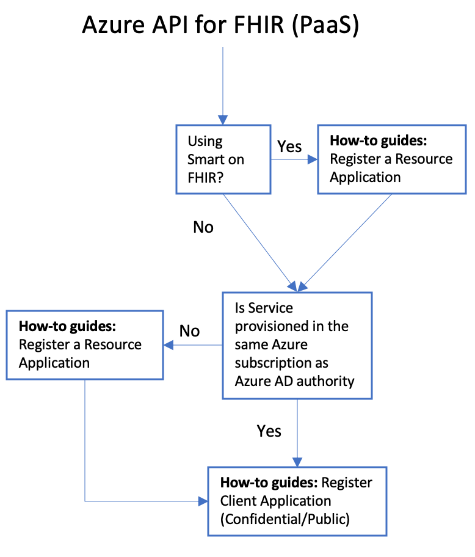
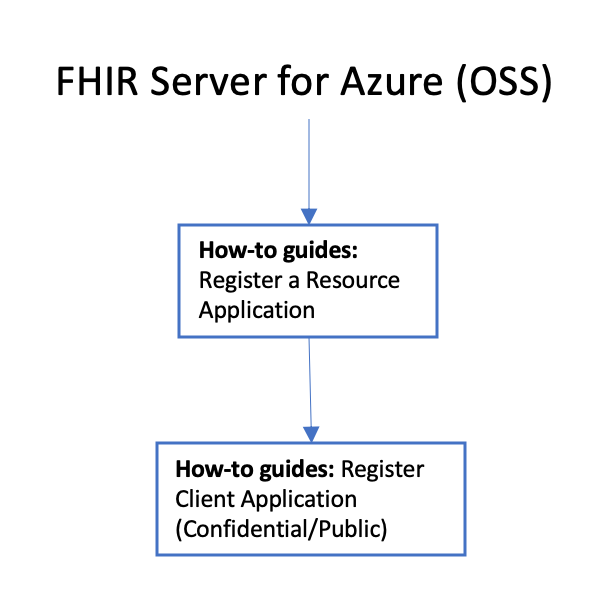

# Register the applications for Azure API for FHIR

You have several configuration options to choose from when you're setting up the environment for Azure API for FHIR, or FHIR Server for Azure. You need to ask yourself the following questions:
* Are you using or planning to use SMART on FHIR?
* Are you deploying the managed service version (platform as a service), or the open source software (OSS) version?
* Are you using the same Azure Active Directory (Azure AD) tenant to secure access to the Azure subscription and FHIR server?

## Application registrations

In order for an application to interact with Azure AD, it needs to be registered. In the context of the FHIR server, there are two kinds of application registrations to discuss:

1. Resource application registrations.
1. Client application registrations.

**Resource applications** are representations in Azure AD of an API or resource that is secured with Azure AD, specifically it would be the Azure API for FHIR. In order to secure the Azure API for FHIR with Azure AD you will need to [register a resource application](register-resource-azure-ad-client-app.md) in Azure AD. This resource application will have an identifier URI. It is recommended that this URI be the same as the URI of the FHIR server. This URI should then be configured as the required `Audience` for the FHIR server. A client application can request access to this FHIR server when it requests a token.

*Client applications* are registrations of the clients that will be requesting tokens. Often in OAuth 2.0, we distinguish between at least 3 different types of applications:

1. **Confidential clients**, also known as web apps in Azure AD. These are clients that will use [authorization code flow](https://docs.microsoft.com/azure/active-directory/develop/v1-protocols-oauth-code) to obtain a token on behalf of a signed in user presenting valid credentials. They are called confidential clients because they are able to hold a secret and will present this secret to Azure AD when exchanging the authentication code for a token. Since confidential clients are able to authenticate themselves using the client secret, they are trusted more than public clients and can have longer lived tokens and be granted a refresh token. Read the details on how to [register a confidential client](register-confidential-azure-ad-client-app.md). Note that is important to register the reply url at which the client will be receiving the authorization code.
1. **Public clients**. These are clients that cannot keep a secret. Typically this would be a mobile device application or a single page javascript application, where a secret in the client could be discovered by a user. Public clients also use authorization code flow, but they are not allowed to present a secret when obtaining a token and they may have shorter lived tokens and no refresh token. Read the details on how to [register a public client](register-public-azure-ad-client-app.md).
1. Service clients. These clients obtain tokens on behalf of themselves (not on behalf of a user) using the [client credentials flow](https://docs.microsoft.com/azure/active-directory/develop/v1-oauth2-client-creds-grant-flow). They typically represent applications that access the FHIR server in a non-interactive way. An example would be an ingestion process. When using a service client, it is not necessary to start the process of getting a token with a call to the `/authorize` endpoint. A service client can go straight to the `/token` endpoint and present client ID and client secret to obtain a token. Read the details on how to [register a service client](register-service-azure-ad-client-app.md)

## Decision flow for Azure API for FHIR and FHIR server for Azure 

If you're using Azure API for FHIR (the managed service), use the decision flow shown in the following flowchart:

If you're deploying FHIR Server for Azure (the OSS version), use this decision flow:

## Next steps

In this overview, you've gone through the decision flow on how to register applications based on the version of the FHIR service you're deploying.

Based on the decisions you made above, please see the how-to-guides to register your applications

* [Register a resource application](register-resource-azure-ad-client-app.md)
* [Register a confidential client application](register-confidential-azure-ad-client-app.md)
* [Register a public client application](register-public-azure-ad-client-app.md)

Once this is complete, you can deploy the Azure API for FHIR.

>[!div class="nextstepaction"]
>[Deploy Azure API for FHIR](fhir-paas-powershell-quickstart.md)