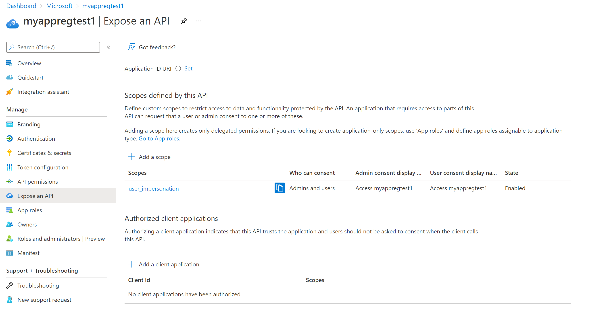
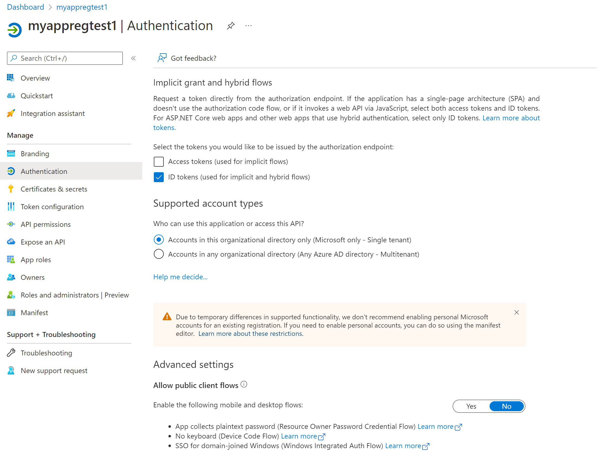

# Register a client application using CLI and REST API

In this article, you'll learn how to register a client application in the Microsoft Entra ID using Azure Command-Line Interface (CLI) and REST API to access Azure Health Data Services. While you can register a client application using the Azure portal, the scripting approach enables you to test and deploy resources directly. For more information, see [Register a client application with the Azure portal](register-application.md).

You can create a confidential or public client application by following the steps, including some optional steps, one by one or in a combined form. Also, you can define the variables upfront instead of placing them in the middle of the scripts. For more information, see [Azure Health Data Services Samples](https://github.com/microsoft/healthcare-apis-samples/blob/main/src/scripts/appregistrationcli.http).

> [!Note] 
> The scripts are created and tested in Visual Studio Code. However, you'll need to validate them in your environment and make necessary adjustments. For example, you can run the scripts in the PowerShell environment, but you'll need to add the `$` symbol for your variables.

## Sign in to your Azure subscription

Before signing in to Azure, check the `az` version you've installed in your environment, and upgrade it to the latest version if necessary. Also, ensure that you have the account and Azure Health Data Services extensions installed.

```
az --version
az extension add --name account
az extension add --name healthcareapis
az provider register --namespace 'Microsoft.HealthcareApis'
az provider show --namespace Microsoft.HealthcareApis --query "resourceTypes[?resourceType=='services'].locations"
```
You can sign in to Azure using the CLI login command, and list the Azure subscription and tenant you are in by default. For more information, see [change the default subscription](/cli/azure/account#az-account-set). For more information about how to sign in to a specific tenant, see [Azure login](/cli/azure/authenticate-azure-cli).

```
az login
az account show --output table
```

## Create a client application

You can use the CLI command to create a confidential client application registration. You'll need to change the display name "myappregtest1" in your scripts.

`
az ad app create --display-name myappregtest1
`

In practice, you'll define variables, assign values to them, and set references to client app ID and object ID, which are used in subsequent steps.

```
### Define app registration name, etc.
appregname=myappregtest1
clientid=$(az ad app create --display-name $appregname --query appId --output tsv)
objectid=$(az ad app show --id $clientid --query objectId --output tsv)
```

You can use `echo $<variable name>` to display the value of a specified variable.

`echo $clientid`

## Remove the user_impersonation scope

The `az ad app create` command in its current form adds a `user_impersonation` scope to expose the application as an API. You can view the setting by selecting the **Expose an API** blade in application registrations from the Azure portal. This scope isn't required in most cases. Therefore, you can remove it.

[](media/app-registration-scope.png#lightbox)

```
###Remove api permissions: disable default exposed scope first
default_scope=$(az ad app show --id $clientid | jq '.oauth2Permissions[0].isEnabled = false' | jq -r '.oauth2Permissions')
az ad app update --id $clientid --set oauth2Permissions="$default_scope"
az ad app update --id $clientid --set oauth2Permissions="[]"
```

You can use `az rest` to call Microsoft Graph directly, instead of Azure Graph, without creating the user_impersonation scope. Use the query parameter to obtain the application ID.

```
az rest -m post -u https://graph.microsoft.com/v1.0/applications  --headers 'Content-Type=application/json' --body '{"displayName": "xxx"}'

### Use --query to obtain the client app id
clientid=$(az rest -m post -u https://graph.microsoft.com/v1.0/applications  --headers 'Content-Type=application/json' --body '{"displayName": "myappregtest1"}' --query appId --output tsv)
```

## Add a client secret for confidential client applications

For confidential client applications, you'll need to add a client secret. For public client applications, you can skip this step.

Choose a name for the secret and specify the expiration duration. The default is one year, but you can use the `--end-date` option to specify the duration. The client secret is saved in the variable and can be displayed with the echo command. Make a note of it as it isn't visible on the portal.  In your deployment scripts, you can save and store the value in Azure Key Vault and rotate it periodically.

```
###Add client secret with expiration. The default is one year.
clientsecretname=mycert2
clientsecretduration=2
clientsecret=$(az ad app credential reset --id $clientid --append --display-name $clientsecretname --years $clientsecretduration --query password --output tsv)
echo $clientsecret
```

## Change the flag for public client applications

For public client applications, change the **Allow public client flows** flag to **Yes**. For confidential client applications, skip this step.

[](media/app-registration-public-client.png#lightbox)

```
###Optionally, change the app registration from confidential to public
az ad app update  --id $clientid  --set publicClient=true 
```

## Add redirect URLs

Adding redirect URLs is an optional step. You can use the `--reply-urls` to add one or more reply (or redirect) URLs for web apps. However, you can't specify application or platform type with the parameter. 

For single page app, mobile, and desktop applications, use the REST API instead and specify the application or platform type. 

```
###Update app registration using REST. az ad supports reply-urls only. 
#https://github.com/Azure/azure-cli/issues/9501
#redirecttype=spa | web | publicClient

redirecttype=publicClient
redirecturl=https://www.getpostman.com/oauth2/callback
graphurl=https://graph.microsoft.com/v1.0/applications/$objectid
az rest --method PATCH --uri $graphurl --headers 'Content-Type=application/json' --body '{"'$redirecttype'":{"redirectUris":["'$redirecturl'"]}}'
```

For more information about iOS/macOS, and Android applications, see [GitHub](https://github.com/Azure/azure-cli/issues/9501).

## Create a service principal

To complete the application registration process, you'll need to create a service principal for the client application. The service principal is used to grant permissions (or role assignments) to the client application.

```
###Create an AAD service principal
spid=$(az ad sp create --id $clientid --query objectId --output tsv)
###Look up a service principal
spid=$(az ad sp show --id $clientid --query objectId --output tsv)
```

## Review the manifest

Reviewing the manifest step is optional. You can view and download the client application detail, or the manifest.

`
az ad app list --app-id $clientid
`

Now that you've completed the application registration using CLI and REST API, you'll need to grant permissions or complete role assignments to the client application service principal and use the client application credentials in your web or mobile applications.

## Next steps

In this article, you learned how to register a client application in Microsoft Entra ID using CLI and REST API. For information on how to grant permissions for Azure Health Data Services, see 

>[!div class="nextstepaction"]
>[Configure RBAC for Azure Health Data Services](configure-azure-rbac.md)
