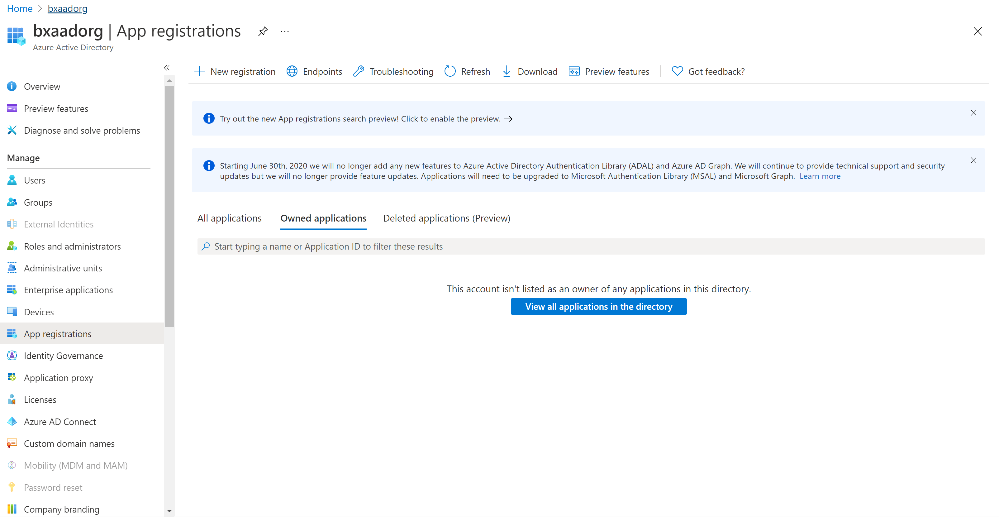
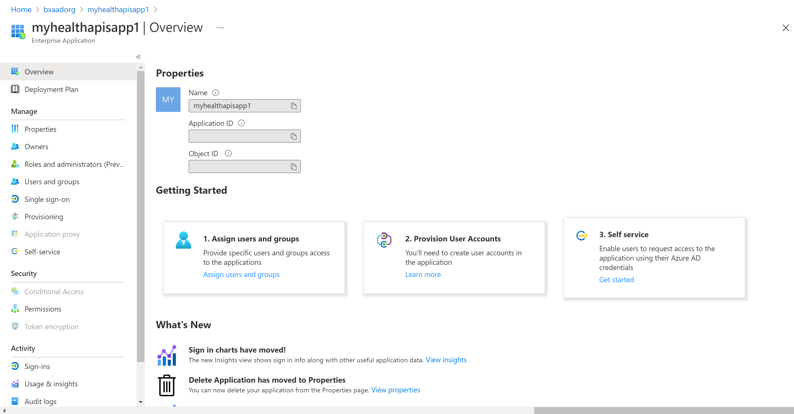
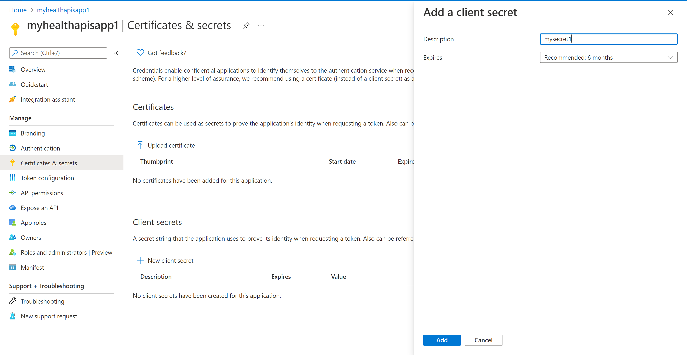

# Register a client application in Azure Active Directory

> [!IMPORTANT]
> Azure Healthcare APIs is currently in PREVIEW. The [Supplemental Terms of Use for Microsoft Azure Previews](https://azure.microsoft.com/support/legal/preview-supplemental-terms/) include additional legal terms that apply to Azure features that are in beta, preview, or otherwise not yet released into general availability.

In this article, you'll learn how to register a client application in Azure Active Directory (Azure AD) in order to access the Healthcare APIs. You can find more information on [Register an application with the Microsoft identity platform](../active-directory/develop/quickstart-register-app.md).

## Register a new application

1. In the [Azure portal](https://portal.azure.com), select **Azure Active Directory**.
2. Select **App registrations**.

3. Select **New registration**.
4. For Supported account types, select **Accounts in this organization directory only**. Leave the other options as is.

5. Select **Register**.

## Application ID (client ID)

After registering a new application, you can find the application (client) ID and Directory (tenant) ID from the overview menu option. Make a note of the values for use later.

## Authentication setting: confidential vs. public

Click on **Authentication** to review the settings. The default value for **Allow public client flows** is "No".

If you keep this default value, the application registration is a **confidential client application** and a certificate or secret is required.

If you change the default value to "Yes" for the "Allow public client flows" option in the advanced setting, the application registration is a **public client application** and a certificate or secret is not required. The "Yes" value is useful when you want to use the client application in your mobile app or a JavaScript app where you do not want to store any secrets.

For tools that require a redirect URL, select **Add a platform** to configure the platform.

For Postman, select **Mobile and desktop applications**. Enter "https://www.getpostman.com/oauth2/callback" in the **Custom redirect URIs** section. Select the **Configure** button to save the setting.

## Certificates & secrets

Select **Certificates & Secrets** and select **New Client Secret**. Select **Recommended 6 months** in the **Expires** field. This new secret will be valid for six months. You can also choose different values such as:
 
* 03 months
* 12 months
* 24 months
* Custom start date and end date.

>[!NOTE]
>It is important that you save the secret value, not the secret ID.

Optionally, you can upload a certificate (public key) and use the Certificate ID, a GUID value associated with the certificate. For testing purposes, you can create a self-signed certificate using tools such as the PowerShell command line, `New-SelfSignedCertificate`, and then export the certificate from the certificate store.

## API permissions

The following steps are required for the DICOM service, but optional for the FHIR service. In addition, user access permissions or role assignments for the Healthcare APIs are managed through RBAC. For more details, visit [Configure Azure RBAC for the Healthcare APIs](configure-azure-rbac.md).

1. Select the **API permissions** blade.

   

2. Select **Add a permission**.

   If you're using the Azure Healthcare APIs, you'll add a permission to the DICOM service by searching for **Azure API for DICOM** under **APIs my organization** uses. 

   

   The search result for Azure API for DICOM will only return if you've already deployed the DICOM service in the workspace.

   If you're referencing a different resource application, select your DICOM API Resource Application Registration that you created previously under **APIs my organization**.

3. Select scopes (permissions) that the confidential client application will ask for on behalf of a user. Select **user_impersonation**, and then select **Add permissions**.

   

>[!NOTE]
>Use  grant_type of client_credentials when trying to otain an access token for the FHIR service using tools such as Postman or Rest Client. For more details, visit [Access using Postman](./fhir/use-postman.md) and [Accessing the Healthcare APIs using the REST Client Extension in Visual Studio Code](./fhir/using-rest-client.md).
>>Use  grant_type of client_credentials or authentication_doe when trying to otain an access token for the DICOM service. For more details, visit [Using DICOM with cURL](dicom/dicomweb-standard-apis-curl.md).

Your application registration is now complete.

## Next steps

In this article, you learned how to register a client application in the Azure AD. Additionally, you learned how to add a secret and API permissions to the Azure Healthcare APIs. For more information about Azure Healthcare APIs, see

>[!div class="nextstepaction"]
>[Overview of Azure Healthcare APIs](healthcare-apis-overview.md)
