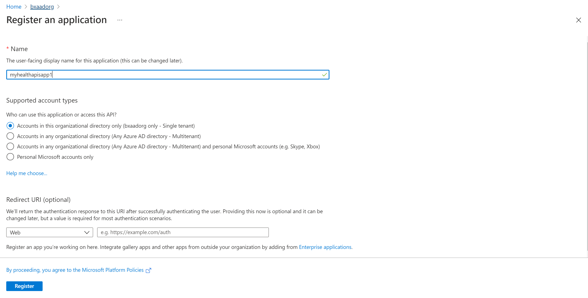
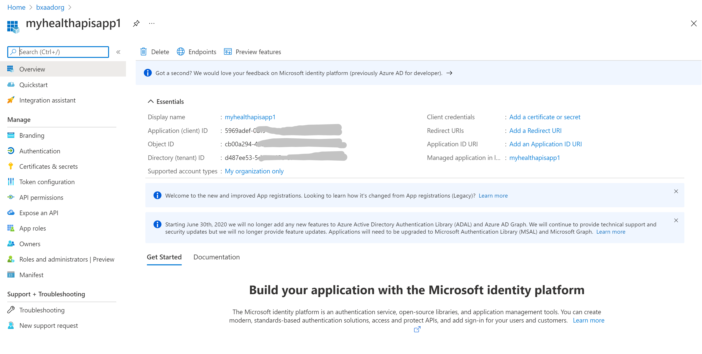

# Register a confidential client application in Azure Active Directory

> [!IMPORTANT]
> Azure Healthcare APIs is currently in PREVIEW. The [Supplemental Terms of Use for Microsoft Azure Previews](https://azure.microsoft.com/support/legal/preview-supplemental-terms/) include additional legal terms that apply to Azure features that are in beta, preview, or otherwise not yet released into general availability.

In this article, you will learn how to register a client application in Azure Active Directory (Azure AD) in order to access the Healthcare APIs. You can find more information on [Register an application with the Microsoft identity platform](../active-directory/develop/quickstart-register-app.md).

## Register a new application

1. In the [Azure portal](https://portal.azure.com), select **Azure Active Directory**.
2. Select **App registrations**.

3. Select **New registration**.
4. For Supported account types, select “Accounts in this organization directory only”. Leave other options as is.

5. Select **Register**.

## Application ID (client ID)

After registering a new application, you can find the application (client) ID and Directory (tenant) ID from the overview menu option. Make a note of the values for use later.

## Authentication setting: confidential vs. public

Click on **Authentication** to review the settings. The default value for **Allow public client flows** is "No".

If you keep this default value, the application registration is a **confidential client application** and a certificate or secret is required.

If you change the default value to "Yes", the application registration is a **public client application** and a certificate or secret is not required. This is useful when you want to use the client application in your mobile app or a JavaScript app where you do not want to store any secrets.

For tools that require redirect url, click on “Add a platform” to configure the platform.

For Postman, select Mobile and desktop applications. Enter “https://www.getpostman.com/oauth2/callback” in the Custom redirect URIs section. Click on the “Configure” button to save the setting.

## Certificates & secrets

Select **Certificates & Secrets** and click on “New Client Secret”. Select “Recommended 6 months” in the Expires field. This new secret will be valid for 6 months. You can also choose different values, 3 months, 12 months, 24 months, or a custom start date and end date.

>[!NOTE]
>It is important that you save the secret value, not the secret ID.

Optionally, you can upload a certificate (public key) and use the Certificate ID, a GUID value associated with the certificate. For testing purposes you can create a self-signed certificate using tools such the PowerShell command line, New-SelfSignedCertificate, and then export the certificate from the certificate store.

## API permissions

Select which API permissions option. Click on “Add a permission”. From the Request API permissions screen, select the “APIs my organization uses” tab. Type “Azure Healthcare APIs” in the search box.

The search result for Azure Healthcare APIs will return if you've already deployed the Azure Healthcare APIs in the tenant. Select “Azure Healthcare APIs”, check “user impersonation” and click on the “Add permissions”.

Your application registration is now complete.