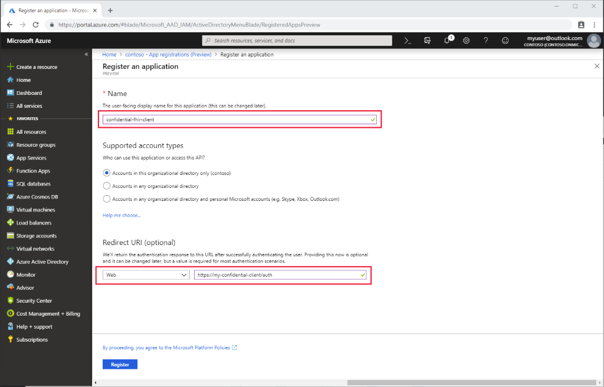
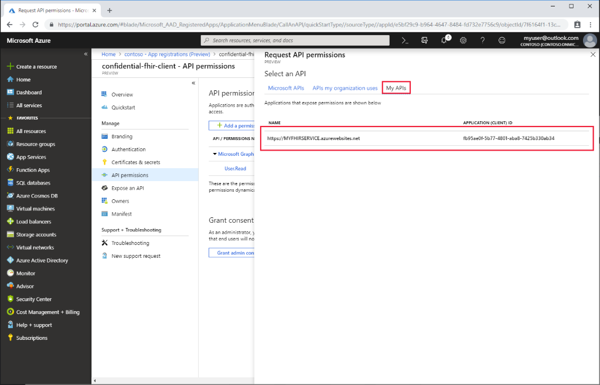
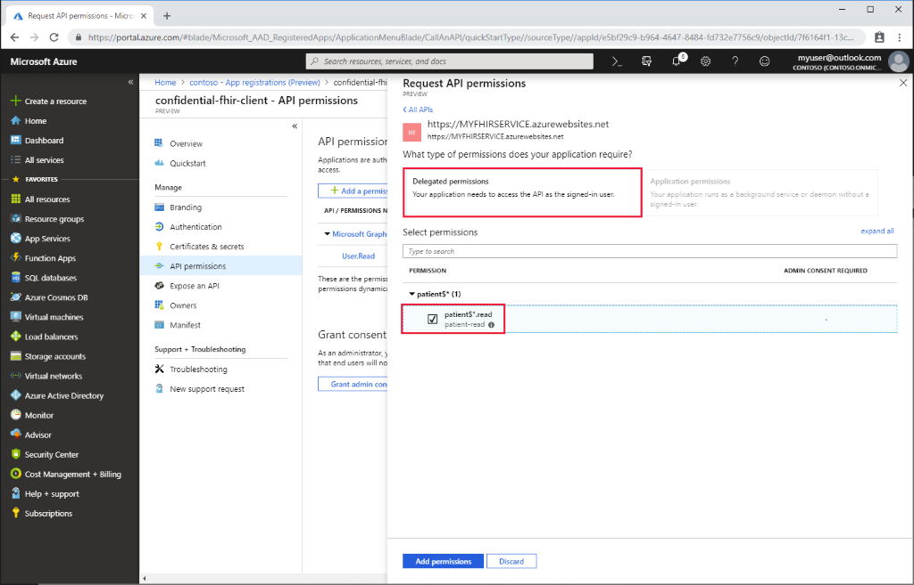
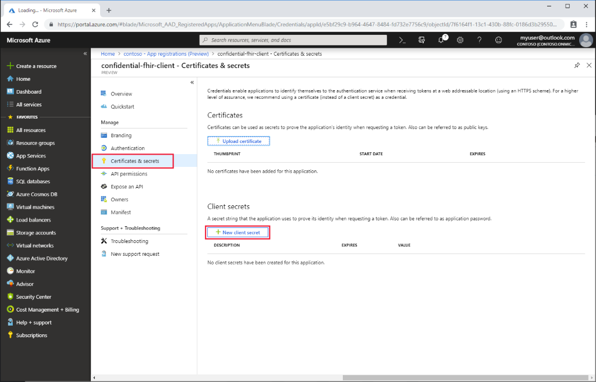

# Register a confidential client application in Azure Active Directory

In this tutorial, you'll learn how to register a confidential client application in Azure Active Directory. 

A client application registration is an Azure Active Directory representation of an application that can be used to authenticate on behalf of a user and request access to [resource applications](register-resource-azure-ad-client-app.md). A confidential client application is an application that can be trusted to hold a secret and present that secret when requesting access tokens. Examples of confidential applications are server-side applications.

To register a new confidential application in the portal, follow the steps below.

## App registrations in Azure portal

1. In the [Azure portal](https://portal.azure.com), on the left navigation panel, click **Azure Active Directory**.

2. In the **Azure Active Directory** blade click **App registrations**:

    

3. Click the **New registration**.

## Register a new application

1. Give the application a display name.

2. Provide a reply URL. These details can be changed later, but if you know the reply URL of your application, enter it now.

    

## API permissions

Next add API permissions:

1. Open the **API permissions**:

    

2. Click **Add a permission**

3. Select appropriate resource API:

    For the Azure API for FHIR (managed service), click **APIs my organization uses** and search for "Azure Healthcare APIs". For the Open Source FHIR server for Azure, select your [FHIR API Resource Application Registration](register-resource-azure-ad-client-app.md):

    

4. Select scopes (permissions) that the confidential application should be able to ask for on behalf of a user:

    

## Application secret

1. Create an application secret (client secret):

    

2. Provide a description and duration of the secret.

3. Once generated, it will be displayed in the portal only once. Make a note of it and store it securely.

## Next steps

In this article, you've learned how to register a confidential client application in Azure Active Directory. You are now ready to deploy the [Azure API for FHIR](fhir-paas-powershell-quickstart.md).

Once you have deployed the Azure API for FHIR, you can review additional available settings.
 
>[!div class="nextstepaction"]
>[Deploy Azure API for FHIR](fhir-paas-powershell-quickstart.md)