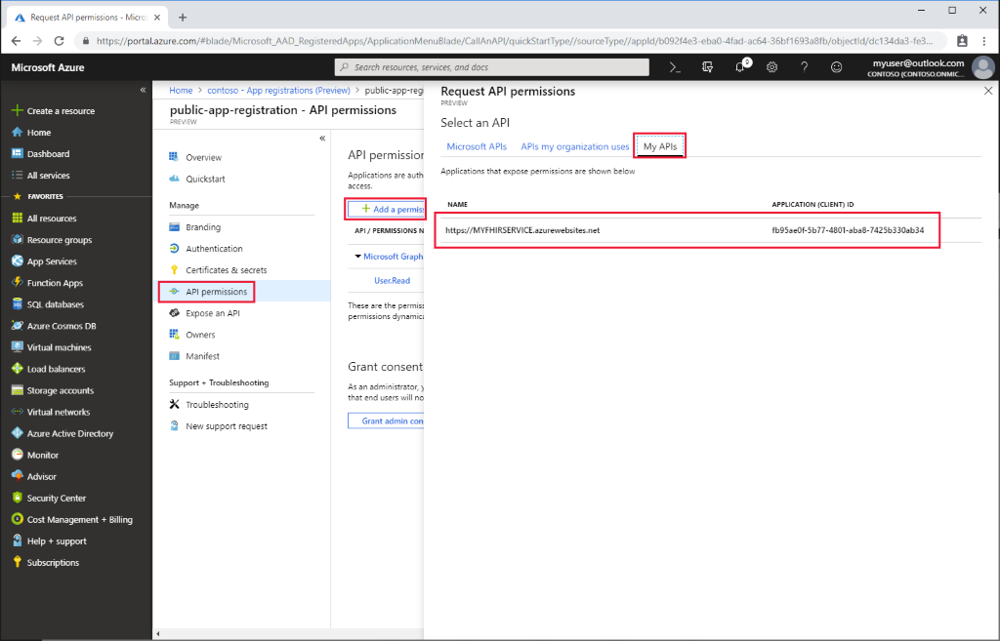

# Register a public client application in Azure Active Directory

In this How-to guide, you'll learn how to register a public application in Azure Active Directory. Client application registrations are Azure Active Directory representations of applications that can authenticate and ask for API permissions on behalf of a user. Public clients are applications such as mobile applications and single page javascript applications that cannot keep secrets confidential. The procedure is similar to [registering a confidential client](register-confidential-aad-client-app.md), but since public clients cannot be trusted to hold an application secret, there is no need to add one.

## Open the Azure portal's Active Directory section

Azure Active Directory applications can be registered and edited in the "App registrations" view of the Azure AD section of the Azure portal:

Click the "+ New registration".

## Application registration overview

You can give the application with a display name and a reply URL:

The Reply URL is where authentication codes will be returned to the client application. You can add more reply URLs and edit existing ones later.

## API Permissions

Similarly to the [confidential client application](register-confidential-aad-client-app.md), you will need to select which API permissions this application should be able to request on behalf of users:

