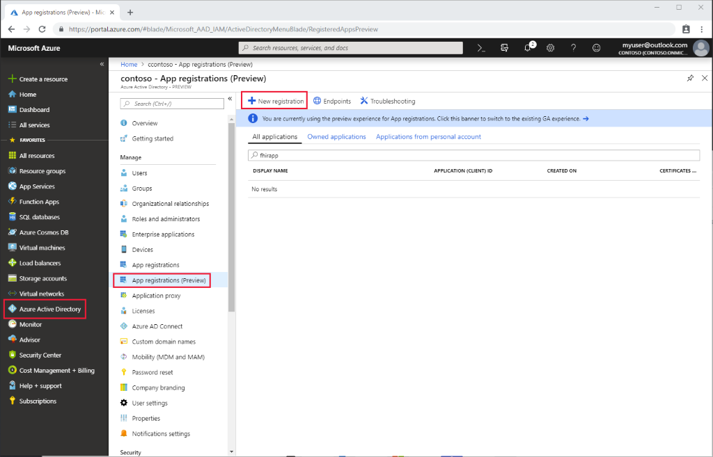
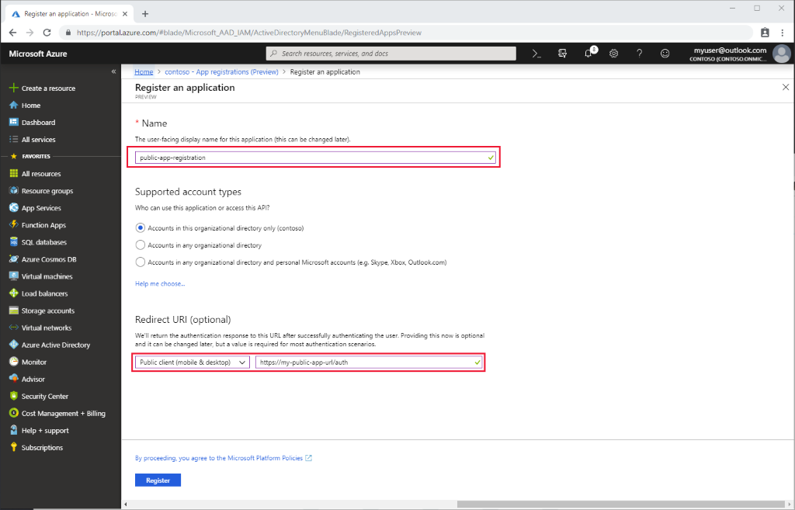

# Register a public client application in Azure Active Directory

In this article, you'll learn how to register a public application in Azure Active Directory.  

Client application registrations are Azure Active Directory representations of applications that can authenticate and ask for API permissions on behalf of a user. Public clients are applications such as mobile applications and single page JavaScript applications that can't keep secrets confidential. The procedure is similar to [registering a confidential client](register-confidential-azure-ad-client-app.md), but since public clients can't be trusted to hold an application secret, there's no need to add one.

## App registrations in Azure portal

1. In the [Azure portal](https://portal.azure.com), on the left navigation panel, click **Azure Active Directory**.

2. In the **Azure Active Directory** blade, click **App registrations**:

    

3. Click the **New registration**.

## Application registration overview

1. Give the application a display name.

2. Provide a reply URL. The reply URL is where authentication codes will be returned to the client application. You can add more reply URLs and edit existing ones later.

    

## API permissions

Similarly to the [confidential client application](register-confidential-azure-ad-client-app.md), you'll need to select which API permissions this application should be able to request on behalf of users:

1. Open the **API permissions**.

    If you are using the Azure API for FHIR, you will add a permission to the Azure Healthcare APIs by searching for Azure Healthcare APIs under **APIs my organization uses** (image below).
    
    If you are referencing a different Resource Application, select your [FHIR API Resource Application Registration](register-resource-azure-ad-client-app.md) that you created previously under **My APIs**:

    

2. Select the permissions that you would like the application to be able to request:
    

## Validate FHIR server authority
If the application you registered in this article and your FHIR server are in the same Azure AD tenant, you are good to proceed to the next steps.

If you configure your client application in a different Azure AD tenant from your FHIR server, you will need to update the **Authority**. In Azure API for FHIR, you do set the Authority under Settings --> Authentication. Set your Authority to **https://login.microsoftonline.com/\<TENANT-ID>**.

## Next steps

In this article, you've learned how to register a public client application in Azure Active Directory. Next, test access to your FHIR server using Postman.
 
>[!div class="nextstepaction"]
>[Access Azure API for FHIR with Postman](access-fhir-postman-tutorial.md)
