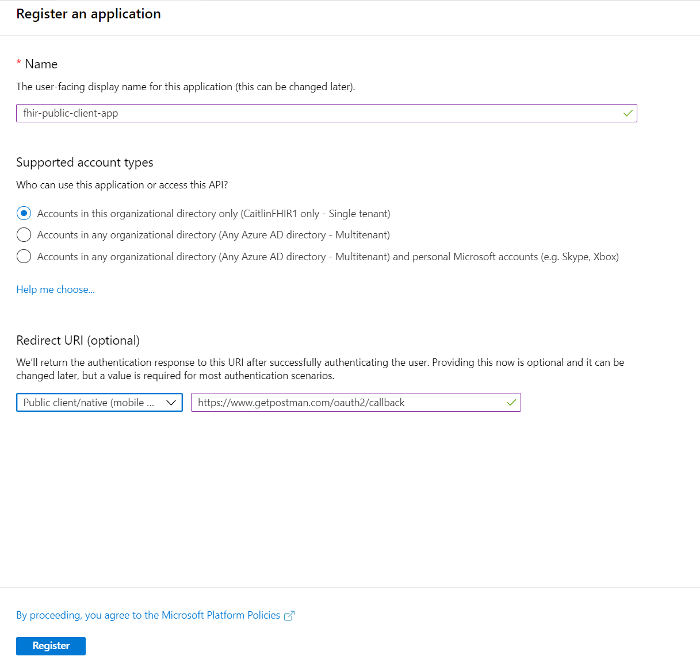
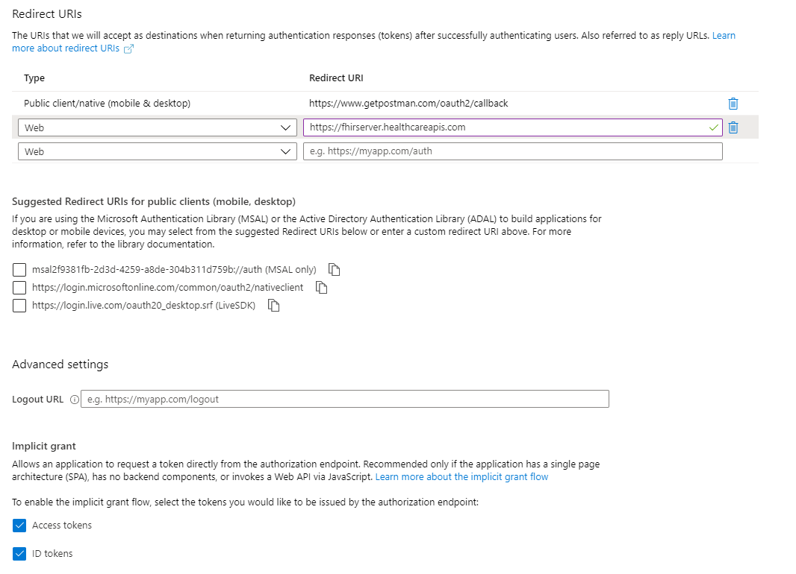

# Client Application Registration
In the previous tutorial, you deployed and set up your Azure API for FHIR. Now that you have your Azure API for FHIR setup, we will register a public client application. You can read through the full [register a public client app](register-public-azure-ad-client-app.md) how-to guide for more details or troubleshooting, but we have called out the major steps for this tutorial below.

1. Navigate to Azure Active Directory
1. Select **App Registration** --> **New Registration**
1. Name your application and set up the redirect URI to https://www.getpostman.com/oauth2/callback

## Client Application Settings
Once your client application is registered, copy the Application (client) ID from the Overview Page. You will need this value later when accessing the client.

Next, set the correct authentication options. Select **Authentication** from the left-hand side. Check the **Access Token** and **ID token** boxes. You can also setup the redirect URI in preparation for when you create your web application in the fourth part of this tutorial. To do this, add https://\<WEB-APP-NAME>.azurewebsites.net to the redirect URI list. If you choose a different name during the step where you [write your web app](tutorial-web-app-write-web-app.md), you will need to come back and update this.

Now that you have setup the correct authentication, set the API permissions. 
1. Select **API permissions** and click **Add a permission**
1. Under **APIs my organization uses**, search for Azure Healthcare APIs
1. Select **user_impersonation** and click **add permissions**

## Next Steps
You now have a public client application. In the next tutorial, we will walk through testing and gaining access to this application through Postman.

>[!div class="nextstepaction"]
>[Test client application in Postman](tutorial-web-app-test-postman.md)
