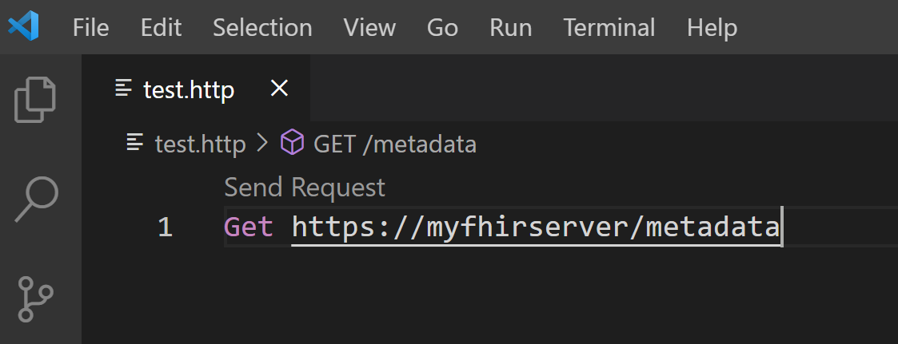
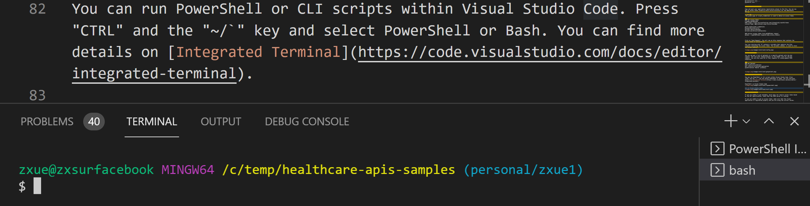

# Accessing the Healthcare APIs (preview) using the REST Client Extension in Visual Studio Code

> [!IMPORTANT]
> Azure Healthcare APIs is currently in PREVIEW. The [Supplemental Terms of Use for Microsoft Azure Previews](https://azure.microsoft.com/support/legal/preview-supplemental-terms/) include additional legal terms that apply to Azure features that are in beta, preview, or otherwise not yet released into general availability.

In this article, you will learn how to access the Healthcare APIs using [REST Client extension in Visual Studio Code](https://marketplace.visualstudio.com/items?itemName=humao.rest-client).

## Install REST Client extension

Select the Extensions icon on the left side panel of your Visual Studio Code, and search for "REST Client". Find the [REST Client extension](https://marketplace.visualstudio.com/items?itemName=humao.rest-client) and install.

[  ](media/rest-install.png#lightbox)

## Create a `.http` file and define variables

Create a new file in Visual Studio Code. Enter a `GET` request command line in the file, and save it as `test.http`. The file suffix `.http` automatically activates the REST Client environment. Click on `Send Request` to get the metadata. 

[  ](media/rest-send-request.png#lightbox)

## Get client application values

> [!Important]
> Before making RESTful API calls to the FHIR server (other than getting the metadata), you must complete **[application registration](register-application.md)**. Make a note of your Azure **tenant ID**, **client ID**, **client secret** and the **service URL**.

While you can use values such as the client ID directly in the RESTful API calls, it is a good practice that you define a few variables for these values and use the variables instead.

In your `test.http` file, include the following information obtained from registering your application: 

```
### REST Client
@fhirurl =https://xxx.azurehealthcareapis.com
@clientid =xxx....
@clientsecret =xxx....
@tenantid =xxx....
```

## Get Azure AD Access Token

After including the information below in your `test.http` file, hit `Send Request`. You will see an HTTP response that contains your access token.

The line starting with `@name` contains a variable that captures the HTTP response containing the access token. The variable, `@token`, is used to store the access token.

>[!Note] 
>The `grant_type` of `client_credentials` is used to obtain an access token.

```
### Get access token 
@name getAADToken 
POST https://login.microsoftonline.com/{{tenantid}}/oauth2/token
Content-Type: application/x-www-form-urlencoded

grant_type=client_credentials
&resource={{fhirurl}}
&client_id={{clientid}}
&client_secret={{clientsecret}}

### Extract access token from getAADToken request
@token = {{getAADToken.response.body.access_token}}
```

[  ](media/rest-config.png#lightbox)

## `GET` FHIR Patient data

You can now get a list of patients or a specific patient with the `GET` request. The line with `Authorization` is the header info for the `GET` request. You can also send `PUT` or `POST` requests to create/update FHIR resources.

```
### GET Patient 
GET {{fhirurl}}/Patient/<patientid>
Authorization: Bearer {{token}}
```

[  ](media/rest-patient.png#lightbox)

## Run PowerShell or CLI

You can run PowerShell or CLI scripts within Visual Studio Code. Press `CTRL` and the `~` key and select PowerShell or Bash. You can find more details on [Integrated Terminal](https://code.visualstudio.com/docs/editor/integrated-terminal).

### PowerShell in Visual Studio Code
[  ](media/rest-powershell.png#lightbox)

### CLI in Visual Studio Code
[  ](media/rest-cli.png#lightbox)

## Troubleshooting

If you are unable to get the metadata, which does not require access token based on the HL7 specification, check that your FHIR server is running properly.

If you are unable to get an access token, make sure that the client application is registered properly and you are using the correct values from the application registration step.

If you are unable to get data from the FHIR server, make sure that the client application (or the service principal) has been granted access permissions such as "FHIR Data Contributor" to the FHIR server.
