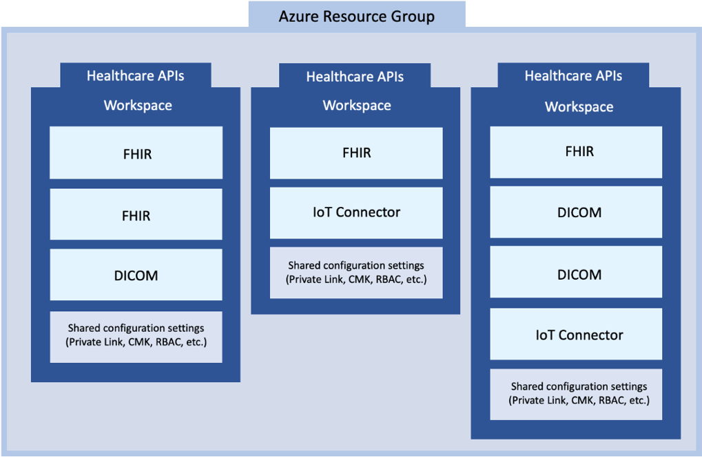

# What is Healthcare APIs (preview) workspace?

> [!IMPORTANT]
> Azure Healthcare APIs is currently in PREVIEW. The [Supplemental Terms of Use for Microsoft Azure Previews](https://azure.microsoft.com/support/legal/preview-supplemental-terms/) include additional legal terms that apply to Azure features that are in beta, preview, or otherwise not yet released into general availability.

The Azure Healthcare APIs workspace is a logical container for all your healthcare service instances such as Fast Healthcare Interoperability Resources (FHIR®) services, Digital Imaging and Communications in Medicine (DICOM®) services, and Internet of things (IoT) Connectors. The workspace also creates a compliance boundary (HIPAA, HITRUST) within which protected health information can travel.

You can provision multiple data services within a workspace, and by design, they work seamlessly with one another. With the workspace, you can organize all your Healthcare APIs instances and manage certain configuration settings that are shared among all the underlying datasets and services where it is applicable.

## Workspace provisioning process
 
One or more workspaces can be created in a resource group from the Azure portal, or using deployment scripts. A Healthcare APIs workspace, as a parent item in the hierarchical service tree, must be created first before one or more child service instances can be created.   
 
A workspace can't be deleted unless all child service instances within the workspace have been deleted. This feature helps prevent any accidental deletion of service instances. However, when a workspace resource group is deleted, all the workspaces and child service instances within the workspace resource group get deleted. 

## Workspace and Azure region selection 
 
When you create a workspace, it must be configured for an Azure region, which can be the same as or different from the resource group. The region cannot be changed after the workspace is created. Within each workspace, all Healthcare APIs services (FHIR service, DICOM service, and IoT Connector service) must be created in the region of the workspace and cannot be moved to a different workspace. 

## Workspace and Azure Healthcare APIs service instances 

Once the Azure Healthcare APIs workspace is created, you’re now ready to create one or more service instances from the Azure portal. You can create multiple service instances of the same type or different types in one workspace. Within the workspace, you can apply shared configuration settings to child service instances, which are covered in the workspace and configuration settings section.

Additionally, workspaces can be created using Azure Resource Manager deployment templates, a process commonly known as infrastructure as code (IaC). This option offers the ability to customize the ARM templates and complete the workspace creation and service instance creation in a combined step. 

You can use PowerShell, CLI, Terraform scripts, or the .NET SDK to deploy the Healthcare APIs service. To create a service instance in the workspace, select **Create** (FHIR service, DICOM service, or IoT Connectors), and then enter the account details for that service instance that is being created.

## FHIR service

FHIR service includes FHIR APIs and endpoints in Azure for data access and storage in FHIR data 
format. A FHIR service manages Protected Health Information (PHI) in a secure and compliant cloud 
environment. Deploying a FHIR service allows you to bring together clinical heath data from multiple 
systems into the Azure Cloud based on the [FHIR](https://www.hl7.org/fhir/index.html) interoperable data standard published by HL7. For more information, see [About FHIR service](https://docs.microsoft.com/azure/healthcare-apis/fhir/overview).

## DICOM service

Deploy a DICOM service to bring medical imaging data into the cloud from any DICOMwebTM enabled system. For more information, see [Overview of DICOM service](dicom/dicom-services-overview.md).

## IoT Connector

The IoT Connector service enables you to ingest high-frequency IoT device data into the FHIR Service in a scalable, secure, and compliant manner. For more information, see [the IoT connector documentation page](./iot/index.yml).
 
## Workspace configuration settings

Some features are configured at the workspace level and apply to all child services within that workspace.

### Application monitoring

Azure Monitor helps you maximize the availability and performance of your applications and services. It delivers a comprehensive solution for collecting, analyzing, and acting on telemetry from your cloud and on-premises environments. This information provides you insights to how your applications are performing and lets you proactively identify and resolve issues affecting them and the resources they depend on. For information about Azure Monitor, see [Azure Monitor overview](https://docs.microsoft.com/azure/azure-monitor/) documentation.

### Role-based access control (RBAC)

Azure role-based access control (Azure RBAC) is a system that provides fine-grained access management 
of Azure resources. Using Azure RBAC, you can segregate duties within your team and grant only the 
amount of access to users that they need to perform their jobs. Furthermore, it helps you manage who 
has access to Azure resources, what they can do with those resources, and what areas they have access 
to. For more information, see [Azure RBAC](https://docs.microsoft.com/azure/role-based-access-control/) documentation.

## Next steps

To start working with the Azure Healthcare APIs, follow the 5-minute quick start to deploying a workspace.

>[!div class="nextstepaction"]
>[Deploy workspace in the Azure portal](healthcare-apis-quickstart.md)

