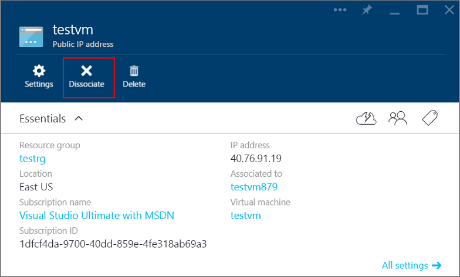

<properties
   pageTitle="How to create a Fully Qualified Domain Name in Azure Portal"
   description="Learn how to create a Fully Qualified Domain Name in the Azure preview portal."
   services="virtual-machines"
   documentationCenter=""
   authors="dsk-2015"
   manager="timlt"
   editor="tysonn"
   tags="azure-resource-management"/>

<tags
   ms.service="virtual-machines"
   ms.devlang="na"
   ms.topic="article"
   ms.tgt_pltfrm="vm-windows"
   ms.workload="infrastructure-services"
   ms.date="08/17/2015"
   ms.author="dkshir"/>

# Create a Fully Qualified Domain Name in Azure Portal

When you create a virtual machine in the [Azure Preview Portal](https://portal.azure.com), it also creates a public IP resource. You can use this IP address to remotely access the virtual machine. However, the portal does not create a Fully Qualified Domain Name (or FQDN) by default. This article demonstrates how you can add a domain name to your virtual machine.

The article assumes that you have logged in to your subscription in the portal, and created a virtual machine with the available images, using **Resource Manager** deployment model. Follow these steps once your virtual machine starts running. We will use an Ubuntu Server virtual machine as an example.

1.  View the virtual machine settings on the portal and click on the Public IP address.

    

2.  **Dissociate** the Public IP from the virtual machine. Note that it does not yet show a domain name. After you click on the **Yes** button, it might take a few seconds before it completes the dissociation.

    

3.  Once the **Dissociate** button grays out, click the **All settings** section of the Public IP and open the **Configuration** tab. Enter the desired DNS name label. **Save** this configuration.

    

4.  Go back to the virtual machine blade in the portal and click the **All settings** for the virtual machine. Open the **Network interfaces** tab and click on the Network interface resource associated with this virtual machine. This will open the **Network interface** blade in the portal.

    

5.  Note that the **Public IP address** field for the Network interface is blank. Click the **All settings** section for this Network interface and open the **IP addresses** tab. On the **IP addresses** blade, click **Enabled** for the **Public IP address** field. Select the **IP address Configure required settings** tab and select the default IP that you had dissociated earlier. Click **Save**. It might take a few moments to add back the IP resource.

    

6.  Close all other blades and go back to the **Virtual Machine** blade. Click on the Public IP resource in the settings. Notice that the Public IP blade now shows the desired FQDN as the **DNS name**. You can now connect remotely to the virtual machine using this DNS name, for example, `SSH adminuser@testdnslabel.eastus.cloudapp.azure.com`.

    
