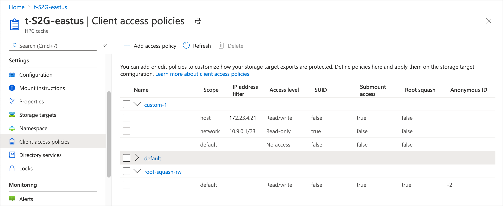
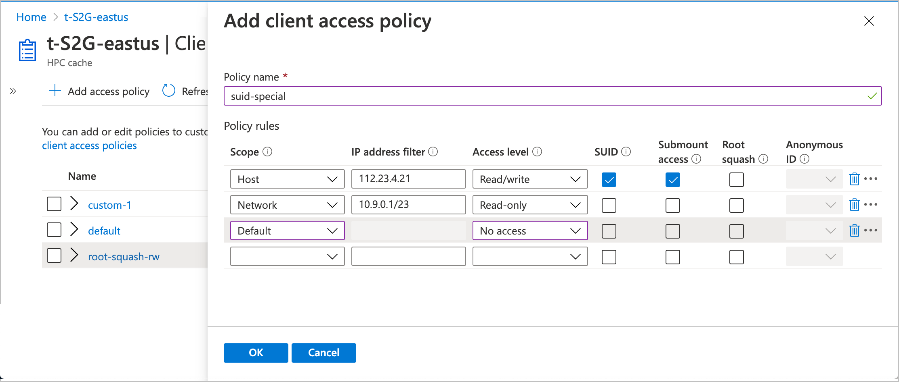

# Control client access

This article explains how to create and apply custom client access policies for your storage targets.

Client access policies control how clients are permitted to connect to the storage target exports. You can control things like root squash and read/write access at the client host or network level.

Access policies are applied to a namespace path, which means that you can use different access policies for two different exports on an NFS storage system.

This feature is for workflows where you need to control how different groups of clients access the storage targets.

If you don't need fine-grained control over storage target access, you can use the default policy, or you can customize the default policy with extra rules. For example, if you want to enable root squash for all clients that connect through the cache, you can edit the policy named **default** to add the root squash setting.

## Create a client access policy

Use the **Client access policies** page in the Azure portal to create and manage policies. <!-- is there AZ CLI for this yet? -->

Each policy is made up of rules. The rules are applied to hosts in order from the smallest scope (host) to the largest (default). The first rule that matches is applied and later rules are ignored.

To create a new access policy, click the **+ Add access policy** button at the top of the list. Give the new access policy a name, and enter at least one rule.

The rest of this section explains the values you can use in rules.

### Scope

The scope term and the address filter work together to define which clients are affected by the rule.

Use them to specify whether the rule applies to an individual client (host), a range of IP addresses (network), or all clients (default).

Select the appropriate **Scope** value for your rule:

* **Host** - The rule applies to an individual client
* **Network** - The rule applies to clients in a range of IP addresses
* **Default** - The rule applies to all clients.

Rules in a policy are evaluated in that order. After a client mount request matches one rule, the others are ignored.

### Address filter

The **Address filter** value specifies which clients match the rule.

If you set the scope to **host**, you can specify only one IP address in the filter. For the scope setting **default**, you can't enter any IP addresses in the **Address filter** field because the default scope matches all clients.

Specify the IP address or range of addresses for this rule. Use CIDR notation (example: 0.1.0.0/16) to specify an address range.

### Access level

Set what privileges to grant the clients that match the scope and filter.

Options are **read/write**, **read-only**, or **no access**.

### SUID

Check the **SUID** box to allow files in storage to set user IDs upon access.

SUID typically is used to increase a user’s privileges temporarily so that the user can accomplish a task related to that file.

### Submount access

Check this box to allow the specified clients to directly mount this export's subdirectories.

### Root squash

Choose whether or not to set root squash for clients that match this rule.

This setting controls how Azure HPC Cache treats requests from the root user on client machines. When root squash is enabled, root users from a client are automatically mapped to a non-privileged user when they send requests through the Azure HPC Cache. It also prevents client requests from using set-UID permission bits.

If root squash is disabled, a request from the client root user (UID 0) is passed through to a back-end NFS storage system as root. This configuration might allow inappropriate file access.

Setting root squash for client requests can provide extra security for your storage target back-end systems. This might be important if you use a NAS system that is configured with ``no_root_squash`` as a storage target. (Read more about [NFS storage target prerequisites](hpc-cache-prerequisites.md#nfs-storage-requirements).)

If you turn on root squash, you must also set the anonymous ID user value. The portal accepts integer values between 0 and 4294967295. (The old values -2 and -1 are supported for backward compatibility, but not recommended for new configurations.)

These values are mapped to specific user values:

* **-2** or **65534** (nobody)
* **-1** or **65535** (no access)
* **0** (unprivileged root)

Your storage system might have other values with special meanings.

## Update access policies

You can edit or delete access policies from the table in the **Client access policies** page.

Click the policy name to open it for editing.

To delete a policy, mark the checkbox next to its name in the list, then click the **Delete** button at the top of the list. You can't delete the policy named "default".

> [!NOTE]
> You can't delete an access policy that is in use. Remove the policy from any namespace paths that include it before trying to delete it.

## Next steps

* Apply access policies in the namespace paths for your storage targets. Read [Set up the aggregated namespace](add-namespace-paths.md) to learn how.
