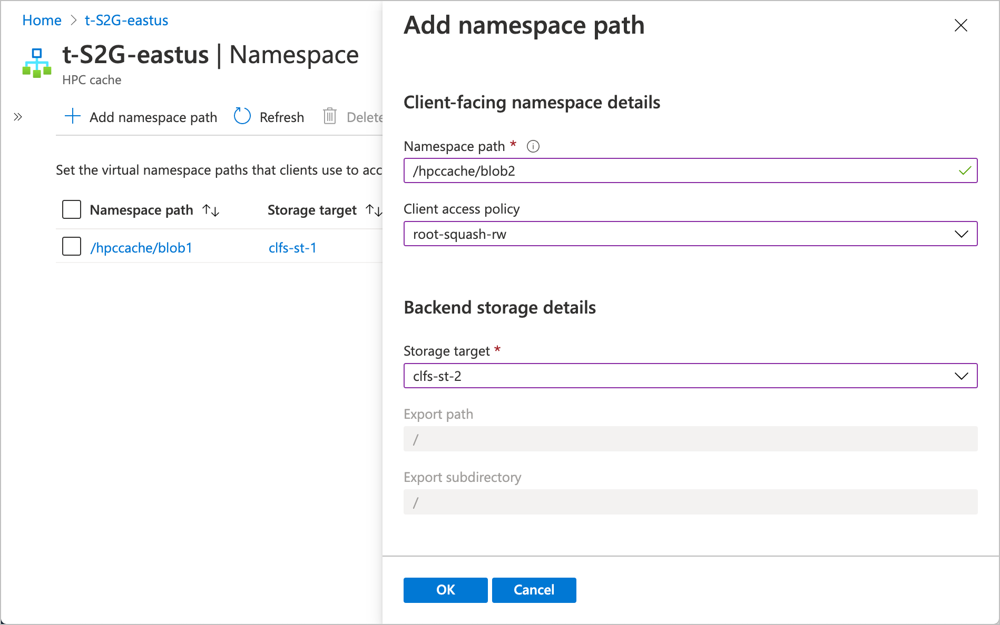
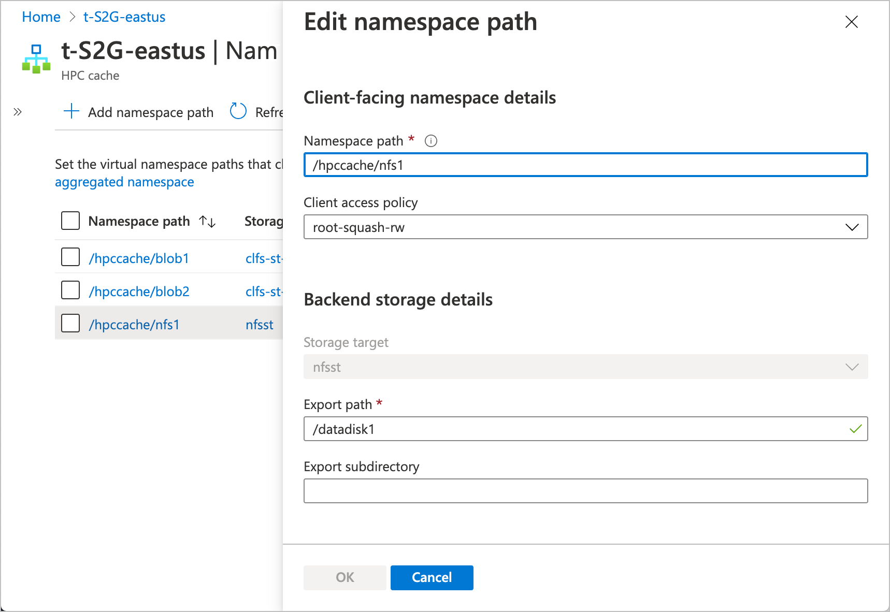
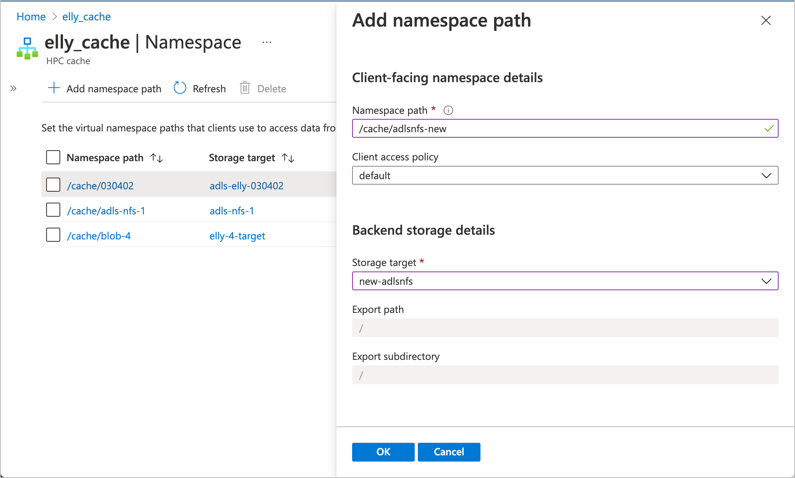

# Set up the aggregated namespace

After you create storage targets, you must also create namespace paths for them. Client machines use these virtual paths to access files through the cache instead of connecting to the back-end storage directly. This system lets cache administrators change back-end storage systems without having to rewrite client instructions.

Read [Plan the aggregated namespace](hpc-cache-namespace.md) to learn more about this feature.

The **Namespace** page in the Azure portal shows the paths that clients use to access your data through the cache. Use this page to create, remove, or change namespace paths. You also can configure namespace paths by using the Azure CLI.

All of the client-facing paths that have been defined for this cache are listed on the **Namespace** page. Storage targets that don't have any namespace paths defined yet don't appear in the table.

You can sort the table columns to better understand your cache's aggregated namespace. Click the arrows in the column headers to sort the paths.

## Add or edit namespace paths

You must create at least one namespace path before clients can access the storage target. (Read [Mount the Azure HPC Cache](hpc-cache-mount.md) for more about client access.)

If you recently added a storage target or customized an access policy, it might take a minute or two before you can create a namespace path.

### Blob namespace paths

An Azure Blob storage target can have only one namespace path.

Follow the instructions below to set or change the path with the Azure portal or Azure CLI.

### [Portal](#tab/azure-portal)

From the Azure portal, load the **Namespace** settings page. You can add, change, or delete namespace paths from this page.

* **Add a new path:** Click the **+ Add** button at the top and fill in information in the edit panel.

  

  * Enter the path clients will use to access this storage target.

  * Select which access policy to use for this path. Learn more about customizing client access in [Use client access policies](access-policies.md).

  * Select the storage target from the drop-down list. If a blob storage target already has a namespace path, it can't be selected.

  * For an Azure Blob storage target, the export and subdirectory paths are automatically set to ``/``.

* **Change an existing path:** Click the namespace path. The edit panel opens. You can modify the path and the access policy, but you can't change to a different storage target.

* **Delete a namespace path:** Select the checkbox to the left of the path and click the **Delete** button.

### [Azure CLI](#tab/azure-cli)

[Set up Azure CLI for Azure HPC Cache](./az-cli-prerequisites.md).

When using the Azure CLI, you must add a namespace path when you create the storage target. Read [Add a new Azure Blob storage target](hpc-cache-add-storage.md?tabs=azure-cli#add-a-new-azure-blob-storage-target) for details.

To update the target's namespace path, use the [az hpc-cache blob-storage-target update](/cli/azure/hpc-cache/blob-storage-target#az-hpc-cache-blob-storage-target-update) command. The arguments for the update command are similar to the arguments in the create command, except that you do not pass the container name or storage account.

You cannot delete a namespace path from a blob storage target with the Azure CLI, but you can overwrite the path with a different value.

---

### NFS namespace paths

An NFS storage target can have multiple virtual paths, as long as each path represents a different export or subdirectory on the same storage system.

When planning your namespace for an NFS storage target, keep in mind that each path must be unique, and can't be a subdirectory of another namespace path. For example, if you have a namespace path that is called ``/parent-a``, you can't also create namespace paths like ``/parent-a/user1`` and ``/parent-a/user2``. Those directory paths are already accessible in the namespace as subdirectories of ``/parent-a``.

All of the namespace paths for an NFS storage system are created on one storage target.

For each NFS namespace path, provide the client-facing path, the storage system export, and optionally an export subdirectory.

### [Portal](#tab/azure-portal)

From the Azure portal, load the **Namespace** settings page. You can add, edit, or delete namespace paths from this page.

* **To add a new path:** Click the **+ Add** button at the top and fill in information in the edit panel.
* **To change an existing path:** Click the namespace path. The edit panel opens and you can modify the path.
* **To delete a namespace path:** Select the checkbox to the left of the path and click the **Delete** button.

Fill in these values for each namespace path:

* **Namespace path** - The client-facing file path.

* **Client access policy** - Select which access policy to use for this path. Learn more about customizing client access in [Use client access policies](access-policies.md).

* **Storage target** - If creating a new namespace path, select a storage target from the drop-down menu.

* **Export path** - Enter the path to the NFS export. Make sure to type the export name correctly - the portal validates the syntax for this field but does not check the export until you submit the change.

* **Export subdirectory** - If you want this path to mount a specific subdirectory of the export, enter it here. If not, leave this field blank.

### [Azure CLI](#tab/azure-cli)

[Set up Azure CLI for Azure HPC Cache](./az-cli-prerequisites.md).

When using the Azure CLI, you must add at least one namespace path when you create the storage target. Read [Add a new NFS storage target](hpc-cache-add-storage.md?tabs=azure-cli#add-a-new-nfs-storage-target) for details.

To update the target's namespace path or to add additional paths, use the [az hpc-cache nfs-storage-target update](/cli/azure/hpc-cache/nfs-storage-target#az-hpc-cache-nfs-storage-target-update) command. Use the ``--junction`` option to specify all of the namespace paths you want.

The options used for the update command are similar to the "create" command, except that you do not pass the storage system information (IP address or hostname), and the usage model is optional. Read [Add a new NFS storage target](hpc-cache-add-storage.md?tabs=azure-cli#add-a-new-nfs-storage-target) for more details about the syntax of the ``--junction`` option.

---

### ADLS-NFS namespace paths

Like a regular blob storage target, an ADLS-NFS storage target only has one export, so it can only have one namespace path.

Follow the instructions below to set or change the path with the Azure portal.

Load the **Namespace** settings page.

* **Add a new path:** Click the **+ Add** button at the top and fill in information in the edit panel.

  

  * Enter the path clients will use to access this storage target.

  * Select which access policy to use for this path. Learn more about customizing client access in [Use client access policies](access-policies.md).

  * Select the storage target from the drop-down list. If an ADLS-NFS storage target already has a namespace path, it can't be selected.

  * For an ADLS-NFS storage target, the export and subdirectory paths are automatically set to ``/``.

* **Change an existing path:** Click the namespace path. The edit panel opens. You can modify the path and the access policy, but you can't change to a different storage target.

* **Delete a namespace path:** Select the checkbox to the left of the path and click the **Delete** button.

## Next steps

After creating the aggregated namespace for your storage targets, you can mount clients on the cache. Read these articles to learn more.

* [Mount the Azure HPC Cache](hpc-cache-mount.md)
* [Move data to Azure Blob storage](hpc-cache-ingest.md)
