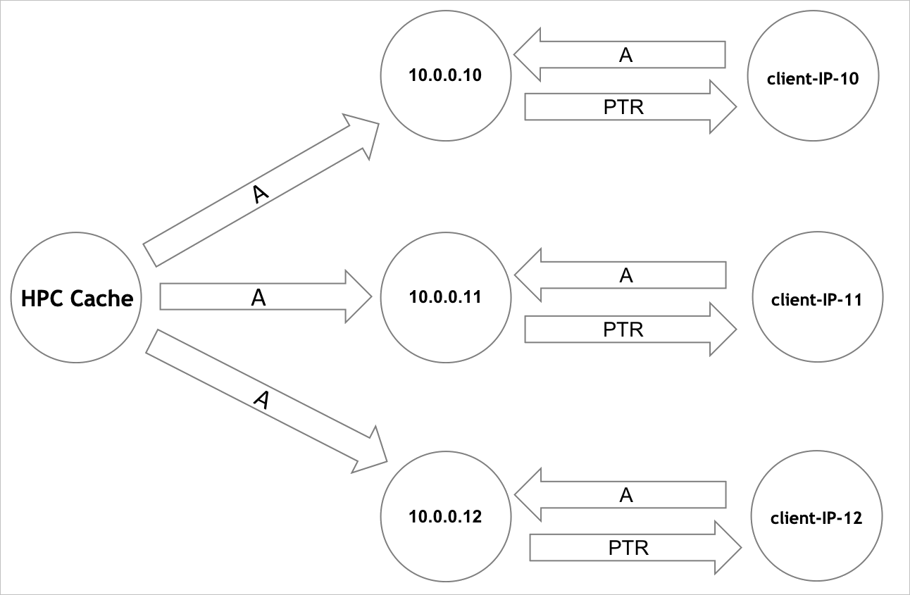

# Load balance HPC Cache traffic

This article explains some basic methods for balancing client traffic to all the mount points on your Azure HPC Cache.

Your cache has at least three different IP addresses. Caches with large throughput values have up to 12. It's important to use all of the IP addresses to get the full benefits of Azure HPC Cache.

There are various options for load-balancing your client mounts:

* Manually choose a different mount IP for each client
* Include IP address rotation in your client mounting scripts
* Configure a DNS system to automatically route client requests among all the available addresses (round-robin DNS)

The right load-balancing system for you depends on the complexity of your workflow, the number of IP addresses in your cache, and a large number of other factors. Consult your Azure advisor if you need help deciding which approach is best for you.

## Assign IPs manually

Your cache's mount IP addresses are shown on the cache **Overview** and **Mount instructions** pages in the Azure portal, and on the success message that prints when you create a cache with Azure CLI or PowerShell.

You can use the **Mount instructions** page to generate a customized mount command for each client. Select all of the  **Cache mount address** values when creating multiple commands.

Read [Mount the Azure HPC Cache](hpc-cache-mount.md) for details.

## Use a load-balancing script

There are several ways to programmatically randomize clients among the available IP addresses.

This example script uses client IP addresses as a randomizing element to distribute clients to all of the HPC Cache's available IP addresses.

***script needs to be updated to remove non-HPC-cache elements like node count***

```bash
function mount_round_robin() {
    # to ensure the nodes are spread out somewhat evenly the default
    # mount point is based on this node's IP octet4 % vFXT node count.
    declare -a AVEREVFXT_NODES="($(echo ${NFS_IP_CSV} | sed "s/,/ /g"))"
    OCTET4=$((`hostname -i | sed -e 's/^.*\.\([0-9]*\)/\1/'`))
    DEFAULT_MOUNT_INDEX=$((${OCTET4} % ${#AVEREVFXT_NODES[@]}))
    ROUND_ROBIN_IP=${AVEREVFXT_NODES[${DEFAULT_MOUNT_INDEX}]}

    DEFAULT_MOUNT_POINT="${BASE_DIR}/default"

    # no need to write again if it is already there
    if ! grep --quiet "${DEFAULT_MOUNT_POINT}" /etc/fstab; then
        echo "${ROUND_ROBIN_IP}:${NFS_PATH}    ${DEFAULT_MOUNT_POINT}    nfs hard,proto=tcp,mountproto=tcp,retry=30 0 0" >> /etc/fstab
        mkdir -p "${DEFAULT_MOUNT_POINT}"
        chown nfsnobody:nfsnobody "${DEFAULT_MOUNT_POINT}"
    fi
    if ! grep -qs "${DEFAULT_MOUNT_POINT} " /proc/mounts; then
        retrycmd_if_failure 12 20 mount "${DEFAULT_MOUNT_POINT}" || exit 1
    fi
}
```

## Use DNS load balancing

This section explains the basics of configuring a DNS system to load balance client traffic to all of the mount points on your Azure HPC Cache.

This document *does not include* instructions for setting up and managing a DNS server in the Azure environment. ***[ can you do it with built-in Azure DNS? ]***

DNS is not required to mount clients using NFS protocol and numeric IP addresses. It is needed if you want to use domain names instead of IP addresses to reach hardware NAS systems, or if your workflow includes certain advanced protocol settings. Read [Storage target DNS access](hpc-cache-prerequisites.md#dns-access) for more information.


### Configure round-robin distribution for cache mount points

A round-robin DNS (RRDNS) system automatically rotates client requests among all the available mount interfaces on your HPC Cache. To set this system up, you must create individual names for the cache's mount points, and then configure the DNS server to cycle among all of the entries.

For optimal performance, configure your DNS server to handle client-facing cluster addresses as shown in the following diagram.

The HPC Cache server is shown on the left, and its mount IP addresses appear in the center. The circles on the right side of the diagram show the corresponding DNS name for each client mount point. Configure each client access point with A records and pointers as illustrated.

:::image type="complex" source="media/rrdns-diagram-hpc.png" alt-text="Diagram showing client mount point DNS configuration.":::
   <detail The diagram shows connections among three categories of elements: the single HPC Cache entity (at the left), three IP addresses (middle column), and three client interfaces (right column). A single circle at the left labeled "HPC Cache" is connected by arrows pointing toward three circles labeled with IP addresses: 10.0.0.10, 10.0.0.11, and 10.0.0.12. The arrows from the HPC Cache circle to the three IP circles have the caption "A". Each of the IP address circles is connected by two arrows to a circle labeled as a client interface - the circle with IP 10.0.0.10 is connected to "client-IP-10", the circle with IP 10.0.0.11 is connected to "client-IP-11", and the circle with IP 10.0.0.12 is connected to "client-IP-11". The connections between the IP address circles and the client interface circles are two arrows: one arrow labeled "PTR" that points from the IP address circle to the client interface circle, and one arrow labeled "A" that points from the client interface circle to the IP address circle.>
:::image-end:::

<!--  -->

Each client-facing IP address must have a unique name for internal use by the HPC Cache. Clients mount the cluster using these names as the server argument.

Modify your DNS server’s ``named.conf`` file to set cyclic order for queries to your HPC Cache. This option ensures that all of the available values are cycled through. Add a statement like the following:

```bash
options {
    rrset-order {
        class IN A name "hpccache.example.com" order cyclic;
    };
};
```

The following ``nsupdate`` commands provide an example of configuring DNS correctly:

```bash
update add hpccache.example.com. 86400 A 10.0.0.10
update add hpccache.example.com. 86400 A 10.0.0.11
update add hpccache.example.com. 86400 A 10.0.0.12
update add client-IP-10.example.com. 86400 A 10.0.0.10
update add client-IP-11.example.com. 86400 A 10.0.0.11
update add client-IP-12.example.com. 86400 A 10.0.0.12
update add 10.0.0.10.in-addr.arpa. 86400 PTR client-IP-10.example.com
update add 11.0.0.10.in-addr.arpa. 86400 PTR client-IP-11.example.com
update add 12.0.0.10.in-addr.arpa. 86400 PTR client-IP-12.example.com
```

### Configure the HPC Cache to use the custom DNS server

When your DNS system is ready, use the **Networking** page in the portal to tell the cache to use it. Follow the instructions in [Set a custom DNS configuration](configuration.md#set-a-custom-dns-configuration).

## Next steps

***some things***