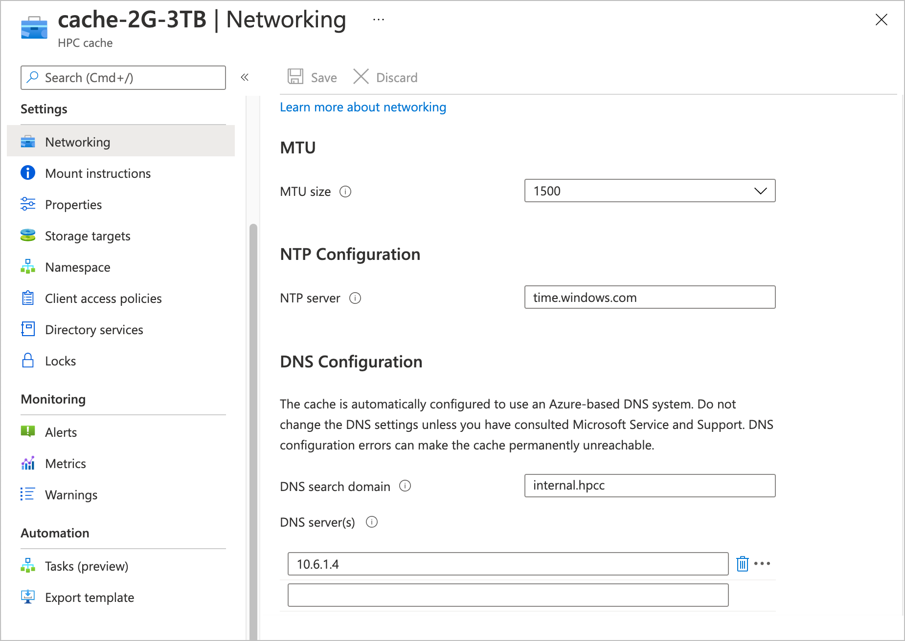

# Configure additional Azure HPC Cache settings

The **Networking** page in the Azure portal has options for customizing several settings. Most users don't need to change these settings from their default values.

This article also describes how to use the snapshot feature for Azure Blob storage targets. The snapshot feature has no configurable settings.

To see the settings, open the cache's **Networking** page in the Azure portal.

<!-- >> [!TIP]
> The [Managing Azure HPC Cache video](https://azure.microsoft.com/resources/videos/managing-hpc-cache/) shows the networking page and its settings. -->

## Adjust MTU value
<!-- linked from troubleshoot-nas article -->

You can select the maximum transmission unit size for the cache by using the drop-down menu labeled **MTU size**.

The default value is 1500 bytes, but you can change it to 1400.

> [!NOTE]
> If you lower the cache's MTU size, make sure that the clients and storage systems that communicate with the cache have the same MTU setting or a lower value.

Lowering the cache MTU value can help you work around packet size restrictions in the rest of the cache's network. For example, some VPNs can't transmit full-size 1500-byte packets successfully. Reducing the size of packets sent over the VPN might eliminate that issue. However, note that a lower cache MTU setting means that any other component that communicates with the cache - including clients and storage systems - must also have a lower MTU setting to avoid communication problems.

If you don't want to change the MTU settings on other system components, you should not lower the cache's MTU setting. There are other solutions to work around VPN packet size restrictions. Read [Adjust VPN packet size restrictions](troubleshoot-nas.md#adjust-vpn-packet-size-restrictions) in the NAS troubleshooting article to learn more about diagnosing and addressing this problem.

Learn more about MTU settings in Azure virtual networks by reading [TCP/IP performance tuning for Azure VMs](../virtual-network/virtual-network-tcpip-performance-tuning.md).

## Customize NTP

Your cache uses the Azure-based time server time.windows.com by default. If you want your cache to use a different NTP server, specify it in the **NTP configuration** section. Use a fully qualified domain name or an IP address.

## Set a custom DNS configuration

> [!CAUTION]
> Do not change your cache DNS configuration if you don't need to. Configuration mistakes can have dire consequences. If your configuration can't resolve Azure service names, the HPC Cache instance will become permanently unreachable.
>
> Check with your Azure representatives before attempting to set up a custom DNS configuration.

Azure HPC Cache is automatically configured to use the secure and convenient Azure DNS system. However, a few unusual configurations require the cache to use a separate, on-premises DNS system instead of the Azure system. The **DNS configuration** section of the **Networking** page is used to specify this kind of system.

Check with your Azure representatives or consult Microsoft Service and Support to determine whether or not you need to use a custom cache DNS configuration.

If you configure your own on-premises DNS system for the Azure HPC Cache to use, you must make sure that your local DNS server is able to directly resolve Azure service endpoint names. HPC Cache will not function if your DNS server is restricted from public name resolution.

Check that your DNS configuration can successfully resolve these items before using it for an Azure HPC Cache:

* ``*.core.windows.net``
* Certificate revocation list (CRL) download and online certificate status protocol (OCSP) verification services. A partial list is provided in the [firewall rules item](../security/fundamentals/tls-certificate-changes.md#will-this-change-affect-me) at the end of this [Azure TLS article](../security/fundamentals/tls-certificate-changes.md), but you should consult a Microsoft technical representative to understand all of the requirements.
* The fully qualified domain name of your NTP server (time.windows.com or a custom server)

If you need to set a custom DNS server for your cache, use the provided fields:

* **DNS search domain** (optional) - Enter your search domain, for example, ``contoso.com``. A single value is allowed, or you can leave it blank.
* **DNS server(s)** - Enter up to three DNS servers. Specify them by IP address.

<!-- 
  > [!NOTE]
  > The cache will use only the first DNS server it successfully finds. -->

Consider using a test cache to check and refine your DNS setup before you use it in a production environment.

### Refresh storage target DNS

If your DNS server updates IP addresses, the associated NFS storage targets will become temporarily unavailable. Read how to update your custom DNS system IP addresses in [View and manage storage targets](manage-storage-targets.md#update-ip-address).

## View snapshots for blob storage targets

Azure HPC Cache automatically saves storage snapshots for Azure Blob storage targets. Snapshots provide a quick reference point for the contents of the back-end storage container.

Snapshots are not a replacement for data backups, and they don't include any information about the state of cached data.

> [!NOTE]
> This snapshot feature is different from the snapshot feature included in NetApp or Isilon storage software. Those snapshot implementations flush changes from the cache to the back-end storage system before taking the snapshot.
>
> For efficiency, the Azure HPC Cache snapshot does not flush changes first, and only records data that has been written to the Blob container. This snapshot does not represent the state of cached data, so it might not include recent changes.

This feature is available for Azure Blob storage targets only, and its configuration can't be changed.

Snapshots are taken every eight hours, at UTC 0:00, 08:00, and 16:00.

Azure HPC Cache stores daily, weekly, and monthly snapshots until they are replaced by new ones. The snapshot retention limits are:

* Up to 20 daily snapshots
* Up to 8 weekly snapshots
* Up to 3 monthly snapshots

Access the snapshots from the `.snapshot` directory in the root of your mounted blob storage target.
