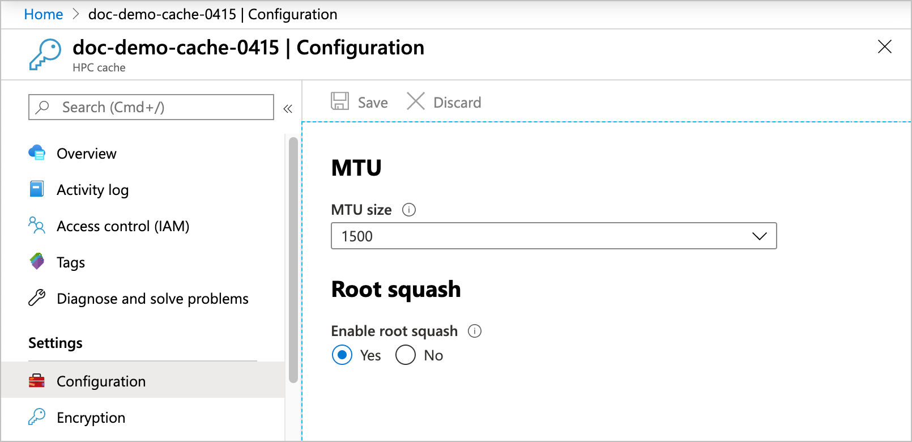

# Configure additional Azure HPC Cache settings

The **Configuration** page in the Azure portal has options for customizing several settings. Most users don't need to change these settings from their default values.

This article also describes how to use the snapshot feature for Azure Blob storage targets. The snapshot feature has no configurable settings.

To see the settings, open the cache's **Configuration** page in the Azure portal.

> [!TIP]
> The [Managing Azure HPC Cache video](https://azure.microsoft.com/resources/videos/managing-hpc-cache/) shows the configuration page and its settings.

## Adjust MTU value
<!-- linked from troubleshoot-nas article -->

You can select the maximum transmission unit size for the cache by using the drop-down menu labeled **MTU size**.

The default value is 1500 bytes, but you can change it to 1400.

> [!NOTE]
> If you lower the cache's MTU size, make sure that the clients and storage systems that communicate with the cache have the same MTU setting or a lower value.

Lowering the cache MTU value can help you work around packet size restrictions in the rest of the cache's network. For example, some VPNs can't transmit full-size 1500-byte packets successfully. Reducing the size of packets sent over the VPN might eliminate that issue. However, note that a lower cache MTU setting means that any other component that communicates with the cache - including clients and storage systems - must also have a lower MTU setting to avoid communication problems.

If you don't want to change the MTU settings on other system components, you should not lower the cache's MTU setting. There are other solutions to work around VPN packet size restrictions. Read [Adjust VPN packet size restrictions](troubleshoot-nas.md#adjust-vpn-packet-size-restrictions) in the NAS troubleshooting article to learn more about diagnosing and addressing this problem.

Learn more about MTU settings in Azure virtual networks by reading [TCP/IP performance tuning for Azure VMs](../virtual-network/virtual-network-tcpip-performance-tuning.md).

## Configure root squash
<!-- linked from troubleshoot -->

The **Enable root squash** setting controls how Azure HPC Cache treats requests from the root user on client machines.

When root squash is enabled, root users from a client are automatically mapped to the user "nobody" when they send requests through the Azure HPC Cache. It also prevents client requests from using set-UID permission bits.

If root squash is disabled, a request from the client root user (UID 0) is passed through to a back-end NFS storage system as root. This configuration might allow inappropriate file access.

Setting root squash on the cache can help compensate for the required ``no_root_squash`` setting on NAS systems that are used as storage targets. (Read more about [NFS storage target prerequisites](hpc-cache-prereqs.md#nfs-storage-requirements).) It also can improve security when used with Azure Blob storage targets.

The default setting is **Yes**. (Caches created before April 2020 might have the default setting **No**.)

## View snapshots for blob storage targets

Azure HPC Cache automatically saves storage snapshots for Azure Blob storage targets. Snapshots provide a quick reference point for the contents of the back-end storage container.

Snapshots are not a replacement for data backups, and they don't include any information about the state of cached data.

> [!NOTE]
> This snapshot feature is different from the snapshot feature included in NetApp or Isilon storage software. Those snapshot implementations flush changes from the cache to the back-end storage system before taking the snapshot.
>
> For efficiency, the Azure HPC Cache snapshot does not flush changes first, and only records data that has been written to the Blob container. This snapshot does not represent the state of cached data, so it might not include recent changes.

This feature is available for Azure Blob storage targets only, and its configuration can't be changed.

Snapshots are taken every eight hours, at UTC 0:00, 08:00, and 16:00.

Azure HPC Cache stores daily, weekly, and monthly snapshots until they are replaced by new ones. The limits are:

* up to 20 daily snapshots
* up to 8 weekly snapshots
* up to 3 monthly snapshots

Access the snapshots from the `.snapshot` directory in your blob storage target's namespace.
