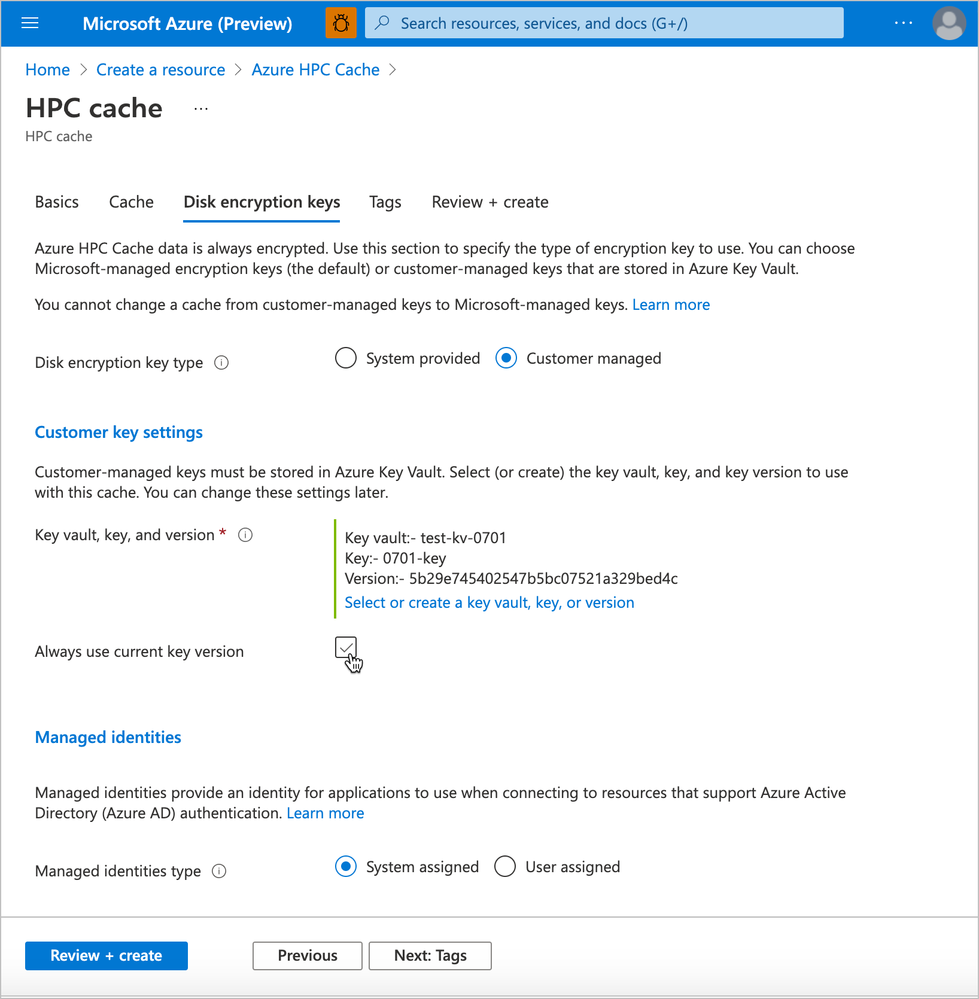

# Use customer-managed encryption keys for Azure HPC Cache

You can use Azure Key Vault to control ownership of the keys used to encrypt your data in Azure HPC Cache. This article explains how to use customer-managed keys for cache data encryption.

> [!NOTE]
> All data stored in Azure, including on the cache disks, is encrypted at rest using Microsoft-managed keys by default. You only need to follow the steps in this article if you want to manage the keys used to encrypt your data.

Azure HPC Cache also is protected by [VM host encryption](../virtual-machines/disk-encryption.md#encryption-at-host---end-to-end-encryption-for-your-vm-data) on the managed disks that hold your cached data, even if you add a customer key for the cache disks. Adding a customer-managed key for double encryption gives an extra level of security for customers with high security needs. Read [Server-side encryption of Azure disk storage](../virtual-machines/disk-encryption.md) for details.

There are three steps to enable customer-managed key encryption for Azure HPC Cache:

1. Set up an Azure Key Vault to store the keys.
1. When creating the Azure HPC Cache, choose customer-managed key encryption and specify the key vault and key to use. Optionally, supply a managed identity for the cache to use to access the key vault.

   Depending on the choices you make in this step, you might be able to skip step 3. Read [Choose a managed identity option for the cache](#choose-a-managed-identity-option-for-the-cache) for details.

1. If using a **system-assigned managed identity** or a **user-assigned identity that isn't configured with key vault access**: Go to the newly created cache and authorize it to access the key vault.

   If the managed identity doesn't already have access to the Azure Key Vault, your encryption is not completely set up until after you authorize it from the newly created cache (step 3).

   If you use a system-managed identity, the identity is created when the cache is created. You must pass the cache's identity to the key vault to make it an authorized user after cache creation.

   You can skip this step if you assign a user-managed identity that already has access to the key vault.

After you create the cache, you can't change between customer-managed keys and Microsoft-managed keys. However, if your cache uses customer-managed keys you can [change](#update-key-settings) the encryption key, the key version, and the key vault as needed.

## Understand key vault and key requirements

The key vault and key must meet these requirements to work with Azure HPC Cache.

Key vault properties:

* **Subscription** - Use the same subscription that is used for the cache.
* **Region** - The key vault must be in the same region as the Azure HPC Cache.
* **Pricing tier** - Standard tier is sufficient for use with Azure HPC Cache.
* **Soft delete** - Azure HPC Cache will enable soft delete if it is not already configured on the key vault.
* **Purge protection** - Purge protection must be enabled.
* **Access policy** - Default settings are sufficient.
* **Network connectivity** - Azure HPC Cache must be able to access the key vault, regardless of the endpoint settings you choose.

Key properties:

* **Key type** - RSA
* **RSA key size** - 2048
* **Enabled** - Yes

Key vault access permissions:

* The user that creates the Azure HPC Cache must have permissions equivalent to the [Key Vault contributor role](../role-based-access-control/built-in-roles.md#key-vault-contributor). The same permissions are needed to set up and manage Azure Key Vault.

  Read [Secure access to a key vault](../key-vault/general/security-features.md) for more information.

## Choose a managed identity option for the cache
<!-- check for cross-references from here and create -->

Your HPC Cache uses its managed identity credential to connect to the key vault.

Azure HPC Cache can use two kinds of managed identities:

* **System-assigned** managed identity - An automatically created, unique identity for your cache. This managed identity only exists while the HPC Cache exists, and it can't be directly managed or modified.

* **User-assigned** managed identity - A standalone identity credential that you manage separately from the cache. You can configure a user-assigned managed identity that has exactly the access you want and use it in multiple HPC Caches.

If you don't assign a managed identity to the cache when you create it, Azure automatically creates a system-assigned managed identity for the cache.

With a user-assigned managed identity, you can supply an identity that already has access to your key vault. (For example, it has been added to a key vault access policy or has an Azure RBAC role that permits access.) If you use a system-assigned identity, or provide a managed identity that doesn't have access, you'll need to request access from the cache after creation. This is a manual step, described below in [step 3](#3-authorize-azure-key-vault-encryption-from-the-cache-if-needed).

* Learn more about [Managed identities](../active-directory/managed-identities-azure-resources/overview.md)

* Learn [Azure Key Vault basics](../key-vault/general/basic-concepts.md)

## 1. Set up Azure Key Vault

You can set up a key vault and key before you create the cache, or do it as part of cache creation. Make sure these resources meet the requirements outlined [above](#understand-key-vault-and-key-requirements).

At cache creation time you must specify a vault, key, and key version to use for the cache's encryption.

Read the [Azure Key Vault documentation](../key-vault/general/overview.md) for details.

> [!NOTE]
> The Azure Key Vault must use the same subscription and be in the same region as the Azure HPC Cache. Make sure that the region you choose [supports both products](https://azure.microsoft.com/global-infrastructure/services/?regions=all&products=hpc-cache,key-vault).

## 2. Create the cache with customer-managed keys enabled

You must specify the encryption key source when you create your Azure HPC Cache. Follow the instructions in [Create an Azure HPC Cache](hpc-cache-create.md), and specify the key vault and key in the **Disk encryption keys** page. You can create a new key vault and key during cache creation.

> [!TIP]
> If the **Disk encryption keys** page does not appear, make sure that your cache is in one of the [supported regions](https://azure.microsoft.com/global-infrastructure/services/?regions=all&products=hpc-cache,key-vault).

The user who creates the cache must have privileges equal to the [Key Vault contributor role](../role-based-access-control/built-in-roles.md#key-vault-contributor) or higher.

1. Click the button to enable privately managed keys. After you change this setting, the key vault settings appear.

1. Click **Select a key vault** to open the key selection page. Choose or create the key vault and key for encrypting data on this cache's disks.

   If your Azure Key Vault does not appear in the list, check these requirements:

   * Is the cache in the same subscription as the key vault?
   * Is the cache in the same region as the key vault?
   * Is there network connectivity between the Azure portal and the key vault?

1. After selecting a vault, select the individual key from the available options, or create a new key. The key must be a 2048-bit RSA key.

1. Specify the version for the selected key. Learn more about versioning in the [Azure Key Vault documentation](../key-vault/general/about-keys-secrets-certificates.md#objects-identifiers-and-versioning).

These settings are optional:

* Check the **Always use current key version** box if you want to use [automatic key rotation](../virtual-machines/disk-encryption.md#automatic-key-rotation-of-customer-managed-keys).

* If you want to use a specific managed identity for this cache, select **User assigned** in the **Managed identities** section and select the identity to use. Read the [managed identities documentation](../active-directory/managed-identities-azure-resources/overview.md#managed-identity-types) for help.

  > [!TIP]
  > A user-assigned managed identity can simplify cache creation if you pass an identity that is already configured to access your key vault. With a system-assigned managed identity, you must take an extra step after the cache is created in order to authorize the cache's newly created system-assigned identity to use your key vault.

  > [!NOTE]
  > You cannot change the assigned identity after you create the cache.

Continue with the rest of the specifications and create the cache as described in [Create an Azure HPC Cache](hpc-cache-create.md).

## 3. Authorize Azure Key Vault encryption from the cache (if needed)
<!-- header is linked from create article, update if changed -->

> [!NOTE]
> This step is not required if you supplied a user-assigned managed identity with key vault access when you created the cache.

After a few minutes, the new Azure HPC Cache appears in your Azure portal. Go to the **Overview** page to authorize it to access your Azure Key Vault and enable customer-managed key encryption.

> [!TIP]
> The cache might appear in the resources list before the "deployment underway" messages clear. Check your resources list after a minute or two instead of waiting for a success notification.
>
> You must authorize encryption within 90 minutes after creating the cache. If you don't complete this step, the cache will time out and fail. A failed cache has to be re-created, it can't be fixed.

The cache shows the status **Waiting for key**. Click the **Enable encryption** button at the top of the page to authorize the cache to access the specified key vault.

Click **Enable encryption** and then click the **Yes** button to authorize the cache to use the encryption key. This action also enables soft-delete and purge protection (if not already enabled) on the key vault.

After the cache requests access to the key vault, it can create and encrypt the disks that store cached data.

After you authorize encryption, Azure HPC Cache goes through several more minutes of setup to create the encrypted disks and related infrastructure.

## Update key settings

You can change the key vault, key, or key version for your cache from the Azure portal. Click the cache's **Encryption** settings link to open the **Customer key settings** page.

You cannot change a cache between customer-managed keys and system-managed keys.

Click the **Change key** link, then click **Change the key vault, key, or version** to open the key selector.

Key vaults in the same subscription and same region as this cache are shown in the list.

After you choose the new encryption key values, click **Select**. A confirmation page appears with the new values. Click **Save** to finalize the selection.

## Read more about customer-managed keys in Azure

These articles explain more about using Azure Key Vault and customer-managed keys to encrypt data in Azure:

* [Azure storage encryption overview](../storage/common/storage-service-encryption.md)
* [Disk encryption with customer-managed keys](../virtual-machines/disk-encryption.md#customer-managed-keys) - Documentation for using Azure Key Vault with managed disks, which is a similar scenario to Azure HPC Cache

## Next steps

After you have created the Azure HPC Cache and authorized Key Vault-based encryption, continue to set up your cache by giving it access to your data sources.

* [Add storage targets](hpc-cache-add-storage.md)
