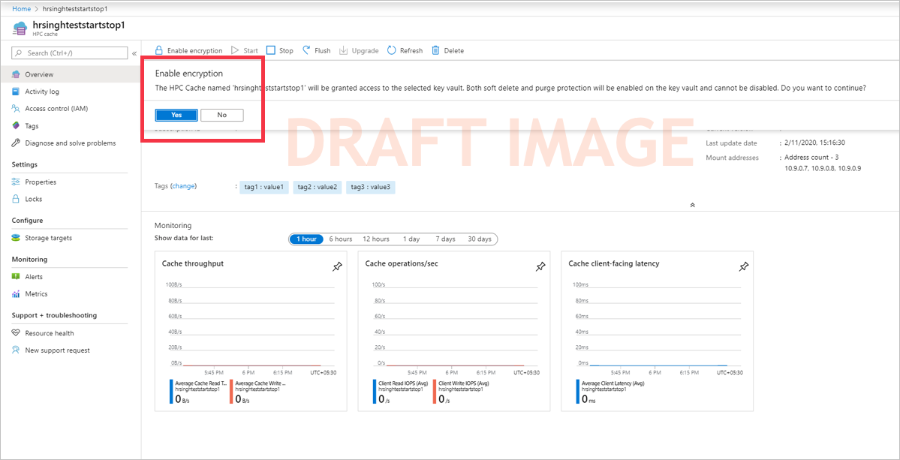

# Use customer-managed encryption keys for Azure HPC Cache

You can use Azure Key Vault to control ownership of the keys used to encrypt your data in Azure HPC Cache. This article explains how to use customer-managed keys for cache data encryption.

> [!NOTE]
> All data stored in Azure, including on the cache disks, is encrypted at rest with Microsoft-managed keys by default. You only need to follow the steps in this article if you want to manage the keys used to encrypt your data.

This feature is available only in these Azure regions:

* East US
* South Central US
* West US 2

There are three steps to enable customer-managed key encryption for Azure HPC Cache:

1. Set up an Azure Key Vault to store the keys.
1. When creating the Azure HPC Cache, choose customer-managed key encryption and specify the key vault and key to use.
1. After the cache is created, authorize it to access the key vault.

Encryption is not completely set up until after you authorize it from the newly created cache (step 3). This is because you must pass the cache's identity to the key vault to make it an authorized user. You can't do this before creating the cache, because the identity does not exist until the cache is created.

## 1. Set up Azure Key Vault

Before you create the Azure HPC Cache, set up an Azure Key Vault system and import or create the key you want to use for the cache's encryption. An Azure Key Vault administrator must set up these resources.

> [!NOTE]
> The Azure Key Vault must share the same subscription and be in the same region as the Azure HPC Cache. Use one of the supported regions listed at the beginning of this article.

Read the [Azure Key Vault documentation](../key-vault/key-vault-overview.md) for details.

If creating a new key vault for Azure HPC Cache, use these settings:

* **Subscription** - Use the same subscription that will be used for the cache.
* **Region** - The key vault must be in the same region as the Azure HPC Cache.
* **Pricing tier** - Standard is sufficient for use with Azure HPC Cache.
* **Soft delete** - Azure HPC Cache will enable soft delete if it is not already configured on the key vault.
* **Purge protection** - Azure HPC Cache will enable purge protection if it is not already active.
* **Access policy** - Default settings are sufficient.
* **Networking** - Azure HPC Cache must be able to access the key vault regardless of the endpoint settings you choose.

## 2. Create the cache with customer-managed keys enabled

After you have prepared a key vault and key, create your Azure HPC Cache. Follow the instructions in [Create an Azure HPC Cache](hpc-cache-create.md), and specify the key vault and key in the **Disk encryption keys** page.

> [!TIP]
> If the **Disk encryption keys** page does not appear, make sure that your cache is in one of the supported regions.

The user who creates the cache must have privileges equal to the [Key Vault contributor role](../role-based-access-control/built-in-roles.md#key-vault-contributor) or higher.

1. Click the button to enable privately managed keys. After you change this setting, the key vault settings appear.

1. Select a key vault from the list.

   If your Azure Key Vault does not appear in the list, check these requirements:

   * Is the cache in the same subscription as the key vault?
   * Is the cache in the same region as the key vault?
   * Is there network connectivity between the Azure portal and the key vault?

1. After selecting a vault, select the individual key from the available options. The key must be a 2048-bit RSA key.

1. Specify the version for the selected key. Learn more about versioning in the [Azure Key Vault documentation](../key-vault/about-keys-secrets-and-certificates.md#objects-identifiers-and-versioning).

Continue with the rest of the specifications and create the cache as described in [Create an Azure HPC Cache](hpc-cache-create.md).

## 3. Authorize Azure Key Vault encryption from the cache
<!-- header is linked from create article, update if changed -->

After a few minutes, the new Azure HPC Cache appears in your Azure Portal. Go to the **Overview** page to authorize it to access your Azure Key Vault and enable customer-managed key encryption.

A notification appears on the **Overview** page if encryption was configured during creation but has not yet been enabled from the cache. Click the **Yes** button to authorize the cache to use the encryption key. This action also enables soft-delete and purge protection on the key vault.

This two-step process is necessary because the Azure HPC Cache instance needs an identity to pass to the Azure Key Vault for authorization. The cache identity doesn't exist until after its initial creation steps are complete.

After the cache requests access to the key vault, it can create and encrypt the disks that store cached data.

After you authorize the encryption, Azure HPC Cache goes through several more minutes of setup to create the encrypted disks and related infrastructure.

<!-- add info about rotating keys when it's available -->

## Read more about customer-managed keys in Azure

These articles explain more about using Azure Key Vault and customer-managed keys to encrypt data in Azure:

* [Azure storage encryption overview](../storage/common/storage-service-encryption.md)
* [Disk encryption with customer-managed keys](../virtual-machines/linux/disk-encryption.md#customer-managed-keys) - Documentation for using Azure Key Vault and managed disks, which is similar to the process used with Azure HPC Cache

## Next steps

After you have created the Azure HPC Cache and authorized Key Vault-based encryption, continue to set up your cache by giving it access to your data sources.

* [Add storage targets](hpc-cache-add-storage.md)
