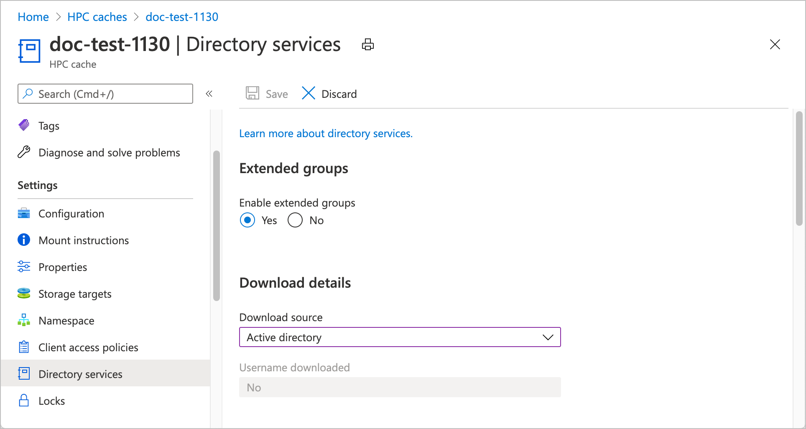
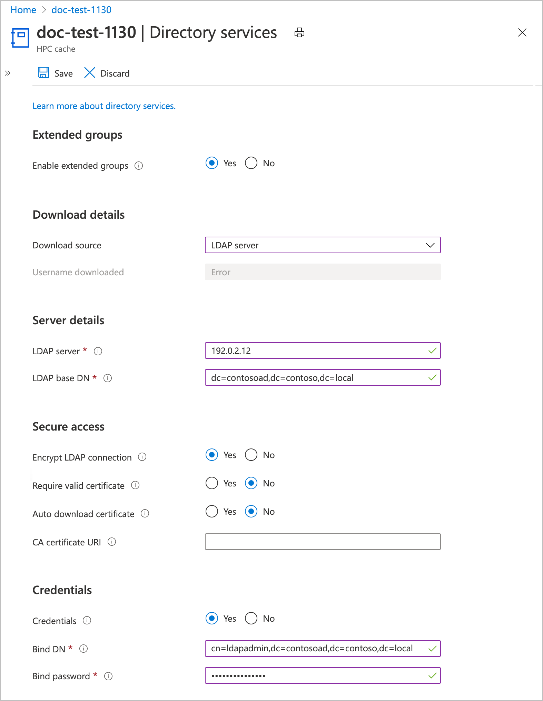

# Configure directory services

The **Directory services** settings allow your Azure HPC Cache to use an outside source to authenticate users for accessing back-end storage.

You might need to enable **Extended groups** if your workflow includes NFS storage targets and clients that are members of more than 16 groups.

After you click the button to enable extended groups, you must choose the source that Azure HPC Cache will use to get user and group credentials.

* [Active Directory](#configure-active-directory) - Get credentials from an external Active Directory server. (You can't use Azure Active Directory for this task.)
* [Flat file](#configure-a-file-download) - Download /etc/group and /etc/passwd files from a network location.
* [LDAP](#configure-ldap) - Get credentials from a Lightweight Directory Access Protocol (LDAP)-compatible source.

> [!NOTE]
> Make sure that your cache can access its group information source from inside its secure subnetwork.<!-- Provide a < what? > -->

## Configure Active Directory

This section explains how to set up the cache to get user and group credentials from an external Active Directory (AD) server.

Under **Active directory details**, supply these values:

* **Primary DNS** - Specify the IP address of a domain name server that the cache can use to resolve the AD domain name.

* **Secondary DNS** (optional) - Enter the address of a name server to use if the primary server is unavailable.

* **AD DNS domain name** - Provide the fully qualified domain name of the AD server that the cache will join to get the credentials.

* **Cache server name (computer account)** - Set the name that will be assigned to this HPC cache when it joins the AD domain. Specify a name that is easy to recognize as this cache. The name can be up to 15 characters long and can include capital or lowercase letters, numbers, and hyphens (-).

In the **Credentials** section, provide an AD administrator username and password that the Azure HPC Cache can use to access the AD server. This information is encrypted when stored, and can't be queried.

Save the settings by clicking the button at the top of the page.

## Configure a file download

These values are required if you want to download files with your user and group information. The files must be in the standard Linux/UNIX /etc/group and /etc/passwrd format.

* **User file URI** - Enter the complete URI for the /etc/passwrd file.
* **Group file URI** - Enter the complete URI for the /etc/group file.

## Configure LDAP

Fill in these values if you want to use a non-AD LDAP source to get user and group credentials.

* **LDAP server** - Enter the fully qualified domain name or the IP address of the LDAP server to use. You can enter up to three LDAP servers, separated by spaces. <!-- xxx check on this -->

* **LDAP base DN** - Specify the base distinguished name for the LDAP domain. <!-- xxx we specify base DN here but bind DN only if there's encryption?  xxx LDAP queries are performed on the base DN, the DN of the entry, and all entries below it in the directory tree. -->Ask your LDAP administrator if you don’t know your base DN.

The server and base DN are the only required settings to make LDAP work, but the additional options make your connection more secure.

In the **Secure access** section, you can enable encryption for the LDAP connection. After you click **Yes** to enable encryption, you have these options:

* **Require valid certificate** - Only accept externally validated security certificates. You must provide the certificate authority information in the field below.

  If you use a self-signed certificate, leave this set to **No** and leave the URI field empty.

*  **CA certificate URI** - Specify the path to the certificate provider. This field is required to use the externally validated certificates setting.

* **Auto-download certificate** - Choose **Yes** if you want to try to download a certificate as soon as you submit these settings.

Fill in the **Credentials** section if you want to use static credentials for LDAP security.

* **Bind DN** - Enter the bind distinguished name to use to authenticate to the LDAP server.
* **Bind password** - Provide the password for the bind DN.

----

<!-- does this mean anything? 
Base and bind DN entries use a similar format. So, for example, if the domain name is “ourdomain.server.company.com”, the DN entry is in the form ou=ourdomain,dc=server,dc=company,dc=com
-->

