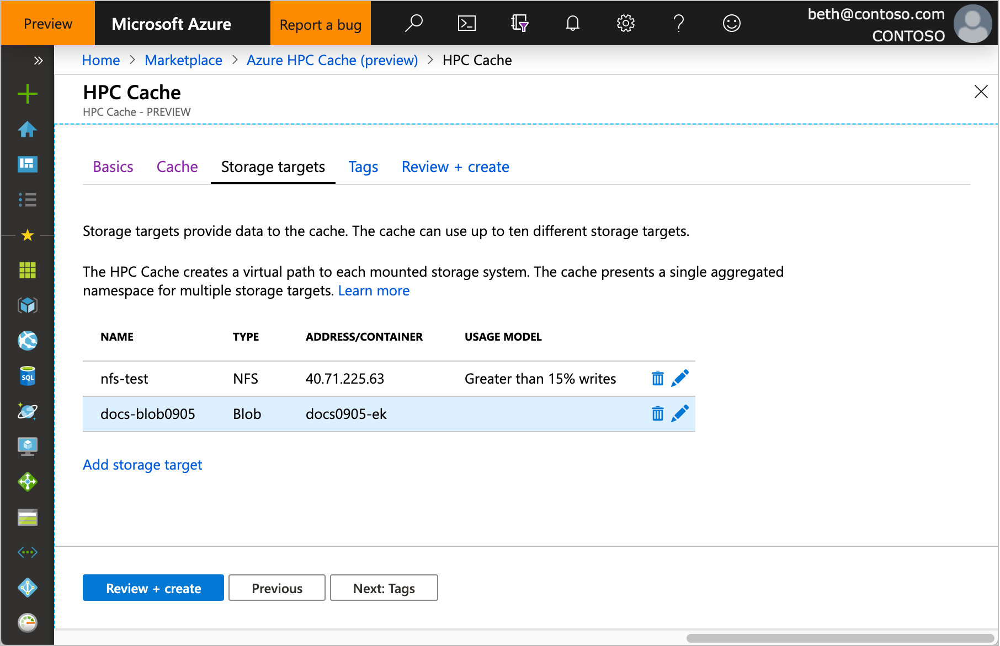
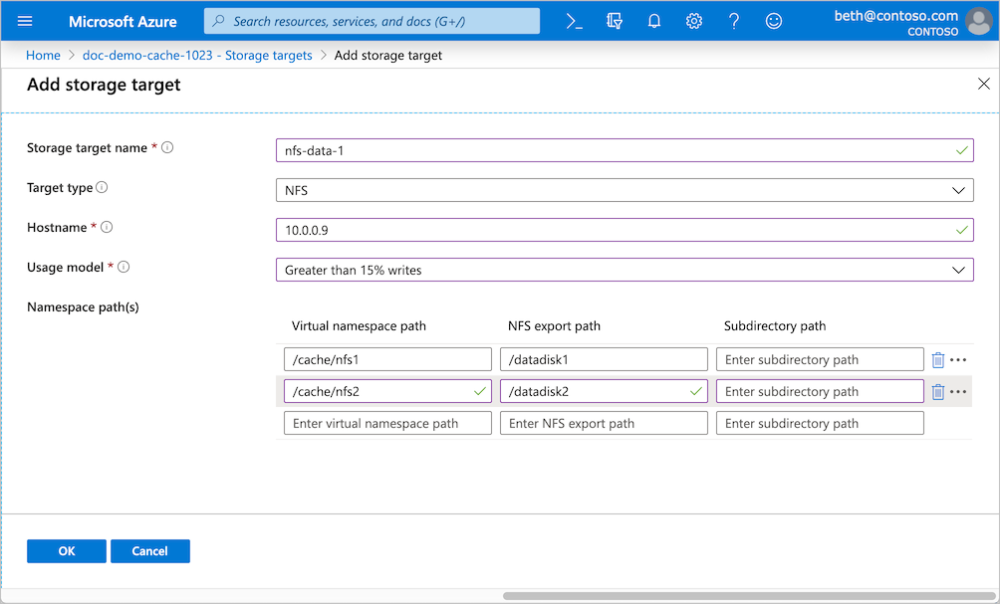

# Add storage

*Storage targets* are back-end storage for files that are accessed through an Azure HPC Cache instance. You can add NFS storage, like an on-premises hardware system, or store data in Azure Blob.

You can define up to ten different storage targets for one cache. The cache presents all of the storage targets in one aggregated namespace.

Remember that the storage exports must be accessible from your cache's virtual network. For on-premises hardware storage, you might need to set up a DNS server that can resolve hostnames for NFS storage access. Read more in [DNS access](hpc-cache-prereqs.md#dns-access).

You can add storage targets while creating your Azure HPC Cache, or afterward. The procedure is slightly different depending on whether you're adding Azure Blob storage or an NFS export. Details for each are below.

## Add storage targets while creating the cache

Use the **Storage targets** tab of the cache creation wizard to define storage at the same time you create the cache instance.

Click the **Add storage target** link to add storage.

## Add storage targets from the cache

From the Azure portal, open your cache instance and click **Storage targets** on the left sidebar. The storage target page lists all existing targets and gives a link to add a new one.

## Add a new Azure Blob storage target

A new Blob storage target needs an empty Blob container or a container that is populated with data in the Azure HPC Cache cloud filesystem format. Read more about pre-loading a Blob container in [Move data to Azure Blob storage](hpc-cache-ingest.md).

To define an Azure Blob container, enter this information.

* **Storage target name** - Set a name that identifies this storage target in the Azure HPC Cache.
* **Target type** - Choose **Blob**.
* **Storage account** - Select the account with the container to reference.

  You will need to authorize the cache instance to access the storage account as described in [Add the access roles](#add-the-access-control-roles-to-your-account).
* **Storage container** - Select the Blob container for this target.

* **Virtual namespace path** - Set the client-facing filepath for this storage target. Read [Configure aggregated namespace](hpc-cache-namespace.md) to learn more about the virtual namespace feature.

When finished, click **OK** to add the storage target.

### Add the access control roles to your account

The Azure HPC Cache uses [role-based access control (RBAC)](https://docs.microsoft.com/azure/role-based-access-control/index) to authorize the cache application to access your storage account for Azure Blob storage targets.

The storage account owner must explicitly add the roles [Storage Account Contributor](https://docs.microsoft.com/azure/role-based-access-control/built-in-roles#storage-account-contributor) and [Storage Blob Data Contributor](https://docs.microsoft.com/azure/role-based-access-control/built-in-roles#storage-blob-data-contributor) for the user "StorageCache Resource Provider".

You can do this ahead of time, or by clicking a link on the page where you add a Blob storage target.

Steps to add the RBAC roles:

1. Open the **Access control (IAM)** page for the storage account. (The link in the **Add storage target** page automatically opens this page for the selected account.)

1. Click the **+** at the top of the page and choose **Add a role assignment**.

1. Select the role "Storage Account Contributor" from the list.

1. In the **Assign access to** field, leave the default value selected ("Azure AD user, group, or service principal").  

1. In the **Select** field, search for "storagecache".  This string should match one security principal, named "HPC Cache Resource Provider". Click that principal to select it.

1. Click the **Save** button to add the role assignment to the storage account.

1. Repeat this process to assign the role "Storage Blob Data Contributor".  

## Add a new NFS storage target

An NFS storage target has some extra fields to specify how to reach the storage export and how to efficiently cache its data. Also, you can create multiple namespace paths from one NFS host if it has more than one export available.

Provide this information for an NFS-backed storage target:

* **Storage target name** - Set a name that identifies this storage target in the Azure HPC Cache.

* **Target type** - Choose **NFS**.

* **Hostname** - Enter the IP address or fully qualified domain name for your NFS storage system. (Use a domain name only if your cache has access to a DNS server that can resolve the name.)

* **Usage model** - Choose one of the data caching profiles based on your workflow, described in [Choose a usage model, below](#choose-a-usage-model).

You can create multiple namespace paths to represent different exports on the same NFS storage system, but you must create them all from one storage target.

For each export, fill in these values:

* **Virtual namespace path** - Set the client-facing filepath for this storage target. Read [Configure aggregated namespace](hpc-cache-namespace.md) to learn more about the virtual namespace feature.

<!--  The virtual path should start with a slash ``/``. -->

* **NFS export path** - Enter the path to the NFS export.

* **Subdirectory path** - If you want to mount a specific subdirectory of the export, enter it here. If not, leave this field blank. 

When finished, click **OK** to add the storage target.

### Choose a usage model 
<!-- link in GUI to this heading -->

When you create a storage target that points to an NFS storage system, you need to choose the *usage model* for that target. This model determines how your data is cached.

* Read heavy - If you mostly use the cache to speed up data read access, choose this option. 

* Read/write - If clients use the cache to read and write, choose this option.

* Clients bypass the cache - Choose this option if your clients write data directly to the storage system without first writing to the cache.

## Next steps

After creating storage targets, consider one of these tasks:

* [Mount the Azure HPC Cache](hpc-cache-mount.md)
* [Move data to Azure Blob storage](hpc-cache-ingest.md)