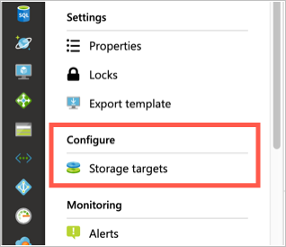

# Add storage targets

*Storage targets* are back-end storage for files that are accessed through an Azure HPC Cache. You can add NFS storage (like an on-premises hardware system), or store data in Azure Blob.

You can define up to ten different storage targets for one cache. The cache presents all of the storage targets in one aggregated namespace.

Remember that the storage exports must be accessible from your cache's virtual network. For on-premises hardware storage, you might need to set up a DNS server that can resolve hostnames for NFS storage access. Read more in [DNS access](hpc-cache-prerequisites.md#dns-access).

Add storage targets after creating your cache. The procedure is slightly different depending on whether you're adding Azure Blob storage or an NFS export. Details for each are below.

Click the image below to watch a [video demonstration](https://azure.microsoft.com/resources/videos/set-up-hpc-cache/) of creating a cache and adding a storage target from the Azure portal.

[](https://azure.microsoft.com/resources/videos/set-up-hpc-cache/)

## View storage targets

### [Portal](#tab/azure-portal)

From the Azure portal, open your cache instance and click **Storage targets** on the left sidebar. The storage targets page lists all existing targets and gives a link to add a new one.



### [Azure CLI](#tab/azure-cli)

[!INCLUDE [cli-reminder.md](includes/cli-reminder.md)]

Use the [az hpc-cache storage-target list](/cli/azure/ext/hpc-cache/hpc-cache/storage-target#ext-hpc-cache-az-hpc-cache-storage-target-list) option to show the existing storage targets for a cache. Supply the cache name and the resource group (unless you have set it globally).

```azurecli
az hpc-cache storage-target list --resource-group "scgroup" --cache-name "sc1"
```

Use [az hpc-cache storage-target show](/cli/azure/ext/hpc-cache/hpc-cache/storage-target#ext-hpc-cache-az-hpc-cache-storage-target-list) to see details about a particular storage target. (Specify the storage target by name.)

Example:

```azurecli
$ az hpc-cache storage-target show --cache-name doc-cache0629 --name nfsd1

{
  "clfs": null,
  "id": "/subscriptions/<subscription_ID>/resourceGroups/scgroup/providers/Microsoft.StorageCache/caches/doc-cache0629/storageTargets/nfsd1",
  "junctions": [
    {
      "namespacePath": "/nfs1/data1",
      "nfsExport": "/datadisk1",
      "targetPath": ""
    }
  ],
  "location": "eastus",
  "name": "nfsd1",
  "nfs3": {
    "target": "10.0.0.4",
    "usageModel": "WRITE_WORKLOAD_15"
  },
  "provisioningState": "Succeeded",
  "resourceGroup": "scgroup",
  "targetType": "nfs3",
  "type": "Microsoft.StorageCache/caches/storageTargets",
  "unknown": null
}
$
```

---

## Add a new Azure Blob storage target

A new Blob storage target needs an empty Blob container or a container that is populated with data in the Azure HPC Cache cloud file system format. Read more about pre-loading a Blob container in [Move data to Azure Blob storage](hpc-cache-ingest.md).

The Azure portal **Add storage target** page includes the option to create a new Blob container just before you add it.

### [Portal](#tab/azure-portal)


To define an Azure Blob container, enter this information.

* **Storage target name** - Set a name that identifies this storage target in the Azure HPC Cache.
* **Target type** - Choose **Blob**.
* **Storage account** - Select the account that you want to use.

  You will need to authorize the cache instance to access the storage account as described in [Add the access roles](#add-the-access-control-roles-to-your-account).

  For information about the kind of storage account you can use, read [Blob storage requirements](hpc-cache-prerequisites.md#blob-storage-requirements).

* **Storage container** - Select the Blob container for this target, or click **Create new**.

  

* **Virtual namespace path** - Set the client-facing file path for this storage target. Read [Configure aggregated namespace](hpc-cache-namespace.md) to learn more about the virtual namespace feature.

When finished, click **OK** to add the storage target.

> [!NOTE]
> If your storage account firewall is set to restrict access to only "selected networks," use the temporary workaround documented in [Work around Blob storage account firewall settings](hpc-cache-blob-firewall-fix.md).

### Add the access control roles to your account

Azure HPC Cache uses [Azure role-based access control (Azure RBAC)](https://docs.microsoft.com/azure/role-based-access-control/index) to authorize the cache service to access your storage account for Azure Blob storage targets.

The storage account owner must explicitly add the roles [Storage Account Contributor](https://docs.microsoft.com/azure/role-based-access-control/built-in-roles#storage-account-contributor) and [Storage Blob Data Contributor](https://docs.microsoft.com/azure/role-based-access-control/built-in-roles#storage-blob-data-contributor) for the user "HPC Cache Resource Provider".

You can do this ahead of time, or by clicking a link on the page where you add a Blob storage target. Keep in mind that it can take up to five minutes for the role settings to propagate through the Azure environment, so you should wait a few minutes after adding the roles before creating a storage target.

Steps to add the Azure roles:

1. Open the **Access control (IAM)** page for the storage account. (The link in the **Add storage target** page automatically opens this page for the selected account.)

1. Click the **+** at the top of the page and choose **Add a role assignment**.

1. Select the role "Storage Account Contributor" from the list.

1. In the **Assign access to** field, leave the default value selected ("Azure AD user, group, or service principal").  

1. In the **Select** field, search for "hpc".  This string should match one service principal, named "HPC Cache Resource Provider". Click that principal to select it.

   > [!NOTE]
   > If a search for "hpc" doesn't work, try using the string "storagecache" instead. Users who participated in previews (before GA) might need to use the older name for the service principal.

1. Click the **Save** button at the bottom.

1. Repeat this process to assign the role "Storage Blob Data Contributor".  


### [Azure CLI](#tab/azure-cli)

[!INCLUDE [cli-reminder.md](includes/cli-reminder.md)]

### Prerequisite: Storage account access

Before you add a blob storage target, check that the cache has the correct roles to access the storage account, and that firewall settings will allow the storage target creation.

Azure HPC Cache uses [Azure role-based access control (Azure RBAC)](../role-based-access-control/index.yml) to authorize the cache service to access your storage account for Azure Blob storage targets.

The storage account owner must explicitly add the roles [Storage Account Contributor](../role-based-access-control/built-in-roles.md#storage-account-contributor) and [Storage Blob Data Contributor](../role-based-access-control/built-in-roles.md#storage-blob-data-contributor) for the user "HPC Cache Resource Provider".

Storage target creation will fail if the cache doesn't have these roles.

It can take up to five minutes for the role settings to propagate through the Azure environment, so you should wait a few minutes after adding the roles before creating a storage target.

Read [Add or remove Azure role assignments using Azure CLI](../role-based-access-control/role-assignments-cli.md) for detailed instructions.

Also check your storage account's firewall settings. If the firewall is set to restrict access to only "selected networks," the storage target creation might fail. Use the workaround documented in [Work around Blob storage account firewall settings](hpc-cache-blob-firewall-fix.md).

### Add a blob storage target with Azure CLI

Use the [az hpc-cache blob-storage-target add](/cli/azure/ext/hpc-cache/hpc-cache/blob-storage-target#ext-hpc-cache-az-hpc-cache-blob-storage-target-add) interface to define an Azure Blob storage target.

In addition to the standard resource group and cache name parameters, you must provide these options for the storage target:

* ``--name`` - Set a name that identifies this storage target in the Azure HPC Cache.

* ``--storage-account`` - The account identifier, in this form:
  /subscriptions/*<subscription_id>*/resourceGroups/*<storage_resource_group>*/providers/Microsoft.Storage/storageAccounts/*<account_name>*

  For information about the kind of storage account you can use, read [Blob storage requirements](hpc-cache-prerequisites.md#blob-storage-requirements).

* ``--container-name`` - Specify the name of the container to use for this storage target.

* ``--virtual-namespace-path`` - Set the client-facing file path for this storage target. Enclose paths in quotation marks. Read [Plan the aggregated namespace](hpc-cache-namespace.md) to learn more about the virtual namespace feature.

Example command:

```azurecli
az hpc-cache blob-storage-target add --resource-group "hpc-cache-group" \
    --cache-name "cache1" --name "blob-target1" \
    --storage-account "/subscriptions/<subscriptionID>/resourceGroups/myrgname/providers/Microsoft.Storage/storageAccounts/myaccountname" \
    --container-name "container1" --virtual-namespace-path "/blob1"
```

---

## Add a new NFS storage target

An NFS storage target has more fields than the Blob storage target. These fields specify how to reach the storage export and how to efficiently cache its data. Also, an NFS storage target lets you create multiple namespace paths if the NFS host has more than one export available.


> [!NOTE]
> Before you create an NFS storage target, make sure your storage system is accessible from the Azure HPC Cache and meets permission requirements. Storage target creation will fail if the cache can't access the storage system. Read [NFS storage requirements](hpc-cache-prerequisites.md#nfs-storage-requirements) and [Troubleshoot NAS configuration and NFS storage target issues](troubleshoot-nas.md) for details.

### Choose a usage model
<!-- referenced from GUI - update aka.ms link if you change this heading -->

When you create a storage target that points to an NFS storage system, you need to choose the usage model for that target. This model determines how your data is cached.

There are three options:

* **Read heavy, infrequent writes** - Use this option if you want to speed up read access to files that are static or rarely changed.

  This option caches files that clients read, but passes writes through to the back-end storage immediately. Files stored in the cache are never compared to the files on the NFS storage volume.

  Do not use this option if there is a risk that a file might be modified directly on the storage system without first writing it to the cache. If that happens, the cached version of the file will never be updated with changes from the back end, and the data set can become inconsistent.

* **Greater than 15% writes** - This option speeds up both read and write performance. When using this option, all clients must access files through the Azure HPC Cache instead of mounting the back-end storage directly. The cached files will have recent changes that are not stored on the back end.

  In this usage model, files in the cache are not checked against the files on back-end storage. The cached version of the file is assumed to be more current. A modified file in the cache is written to the back-end storage system after it has been in the cache for an hour with no additional changes.

* **Clients write to the NFS target, bypassing the cache** - Choose this option if any clients in your workflow write data directly to the storage system without first writing to the cache. Files that clients request are cached, but any changes to those files from the client are passed back to the back-end storage system immediately.

  With this usage model, the files in the cache are frequently checked against the back-end versions for updates. This verification allows files to be changed outside of the cache while maintaining data consistency.

This table summarizes the usage model differences:

| Usage model                   | Caching mode | Back-end verification | Maximum write-back delay |
|-------------------------------|--------------|-----------------------|--------------------------|
| Read heavy, infrequent writes | Read         | Never                 | None                     |
| Greater than 15% writes       | Read/write   | Never                 | 1 hour                   |
| Clients bypass the cache      | Read         | 30 seconds            | None                     |

### Create an NFS storage target

### [Portal](#tab/azure-portal)


Provide this information for an NFS-backed storage target:

* **Storage target name** - Set a name that identifies this storage target in the Azure HPC Cache.

* **Target type** - Choose **NFS**.

* **Hostname** - Enter the IP address or fully qualified domain name for your NFS storage system. (Use a domain name only if your cache has access to a DNS server that can resolve the name.)

* **Usage model** - Choose one of the data caching profiles based on your workflow, described in [Choose a usage model](#choose-a-usage-model) above.

### NFS namespace paths

An NFS storage target can have multiple virtual paths, as long as each path represents a different export or subdirectory on the same storage system.

Create all of the paths from one storage target.

You can [add and edit namespace paths](hpc-cache-edit-storage.md) on a storage target at any time.

Fill in these values for each namespace path:

* **Virtual namespace path** - Set the client-facing file path for this storage target. Read [Configure aggregated namespace](hpc-cache-namespace.md) to learn more about the virtual namespace feature.

* **NFS export path** - Enter the path to the NFS export.

* **Subdirectory path** - If you want to mount a specific subdirectory of the export, enter it here. If not, leave this field blank.

When finished, click **OK** to add the storage target.

### [Azure CLI](#tab/azure-cli)

[!INCLUDE [cli-reminder.md](includes/cli-reminder.md)]

Use the Azure CLI command [az hpc-cache nfs-storage-target add](/cli/azure/ext/hpc-cache/hpc-cache/nfs-storage-target#ext-hpc-cache-az-hpc-cache-nfs-storage-target-add) to create the storage target. Supply these values in addition to the cache name and cache resource group:

* ``--name`` - Set a name that identifies this storage target in the Azure HPC Cache.
* ``--nfs3-target`` - The IP address of your NFS storage system. (You can use a fully qualified domain name here if your cache has access to a DNS server that can resolve the name.)
* ``--nfs3-usage-model`` - One of the data caching profiles, described in [Choose a usage model](#choose-a-usage-model), above.

  Verify the names of the usage models with the command [az hpc-cache usage-model list](/cli/azure/ext/hpc-cache/hpc-cache/usage-model#ext-hpc-cache-az-hpc-cache-usage-model-list).

* ``--junction`` - The junction parameter links the client-facing virtual file path with an export path on the storage system.

  An NFS storage target can have multiple virtual paths, as long as each path represents a different export or subdirectory on the same storage system. Create all of the paths for one storage system on one storage target.

  You can [add and edit namespace paths](hpc-cache-edit-storage.md) on a storage target at any time.

  The ``--junction`` parameter uses these values:

  * ``namespace-path`` - The client-facing virtual file path
  * ``nfs-export`` - The storage system export to associate with the client-facing path
  * ``target-path`` (optional) - A subdirectory of the export, if needed

  Example: ``--junction namespace-path="/nas-1" nfs-export="/datadisk1" target-path="/test"``

  Read [Configure aggregated namespace](hpc-cache-namespace.md) to learn more about the virtual namespace feature.

Example command:

```azurecli

az hpc-cache nfs-storage-target add --resource-group "hpc-cache-group" --cache-name "doc-cache0629" \
    --name nfsd1 --nfs3-target 10.0.0.4 --nfs3-usage-model WRITE_WORKLOAD_15 \
    --junction namespace-path="/nfs1/data1" nfs-export="/datadisk1" target-path=""
```

Output:
```azurecli

{- Finished ..
  "clfs": null,
  "id": "/subscriptions/<subscriptionID>/resourceGroups/hpc-cache-group/providers/Microsoft.StorageCache/caches/doc-cache0629/storageTargets/nfsd1",
  "junctions": [
    {
      "namespacePath": "/nfs1/data1",
      "nfsExport": "/datadisk1",
      "targetPath": ""
    }
  ],
  "location": "eastus",
  "name": "nfsd1",
  "nfs3": {
    "target": "10.0.0.4",
    "usageModel": "WRITE_WORKLOAD_15"
  },
  "provisioningState": "Succeeded",
  "resourceGroup": "hpc-cache-group",
  "targetType": "nfs3",
  "type": "Microsoft.StorageCache/caches/storageTargets",
  "unknown": null
}

```

---

## Next steps

After creating storage targets, consider one of these tasks:

* [Mount the Azure HPC Cache](hpc-cache-mount.md)
* [Move data to Azure Blob storage](hpc-cache-ingest.md)

If you need to update any settings, you can [edit a storage target](hpc-cache-edit-storage.md).
