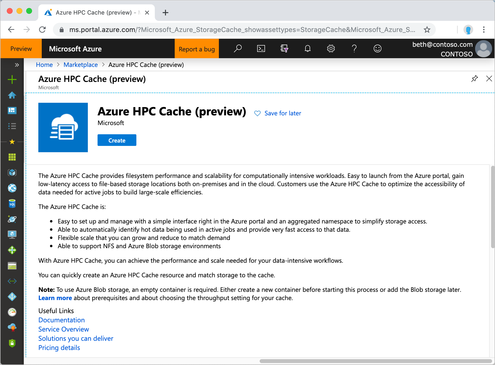
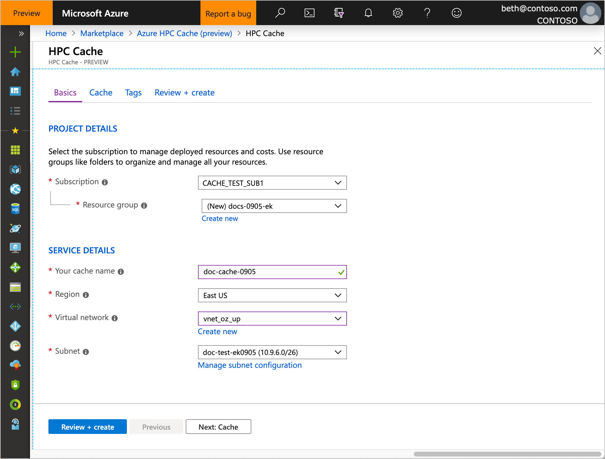
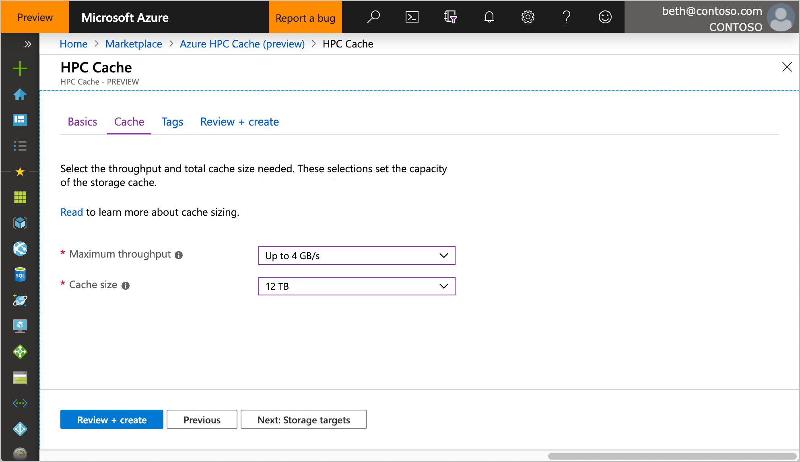
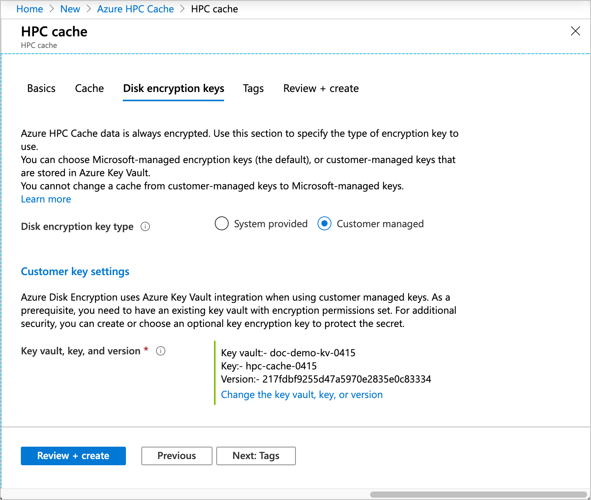
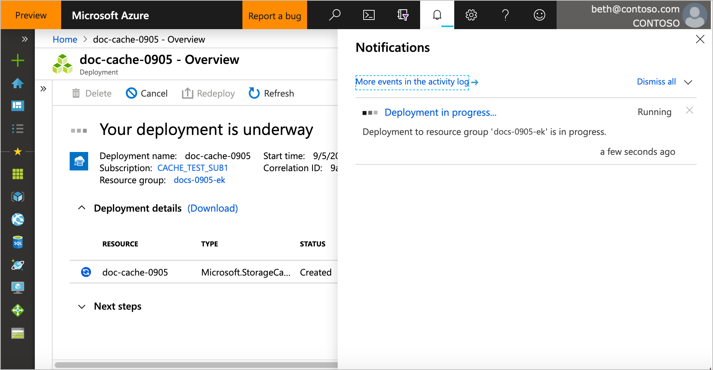
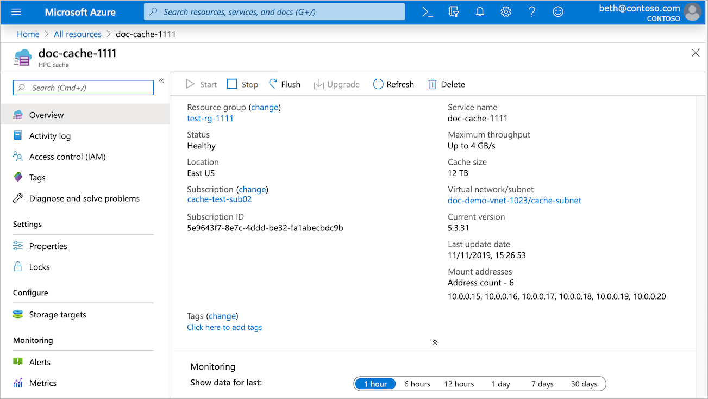

# Create an Azure HPC Cache

Use the Azure portal or the Azure CLI to create your cache.



Click the image below to watch a [video demonstration](https://azure.microsoft.com/resources/videos/set-up-hpc-cache/) of creating a cache and adding a storage target.

[](https://azure.microsoft.com/resources/videos/set-up-hpc-cache/)

## [Portal](#tab/azure-portal)

## Define basic details



In **Project Details**, select the subscription and resource group that will host the cache.

In **Service Details**, set the cache name and these other attributes:

* Location - Select one of the [supported regions](hpc-cache-overview.md#region-availability).
* Virtual network - You can select an existing one or create a new virtual network.
* Subnet - Choose or create a subnet with at least 64 IP addresses (/24). This subnet must be used only for this Azure HPC Cache instance.

## Set cache capacity
<!-- referenced from GUI - update aka.ms link if you change this header text -->

On the **Cache** page, you must set the capacity of your cache. The values set here determine how much data your cache can hold and how quickly it can service client requests.

Capacity also affects the cache's cost.

Choose the capacity by setting these two values:

* The maximum data transfer rate for the cache (throughput), in GB/second
* The amount of storage allocated for cached data, in TB

Choose one of the available throughput values and cache storage sizes.

Keep in mind that the actual data transfer rate depends on workload, network speeds, and the type of storage targets. The values you choose set the maximum throughput for the entire cache system, but some of that is used for overhead tasks. For example, if a client requests a file that isn't already stored in the cache, or if the file is marked as stale, your cache uses some of its throughput to fetch it from back-end storage.

Azure HPC Cache manages which files are cached and preloaded to maximize cache hit rates. Cache contents are continuously assessed, and files are moved to long-term storage when they're less frequently accessed. Choose a cache storage size that can comfortably hold the active set of working files, plus additional space for metadata and other overhead.



## Enable Azure Key Vault encryption (optional)

The **Disk encryption keys** page appears between the **Cache** and **Tags** tabs.<!-- Read [Regional availability](hpc-cache-overview.md#region-availability) to learn more about region support. -->

If you want to manage the encryption keys used for your cache storage, supply your Azure Key Vault information on the **Disk encryption keys** page. The key vault must be in the same region and in the same subscription as the cache.

You can skip this section if you do not need customer-managed keys. Azure encrypts data with Microsoft-managed keys by default. Read [Azure storage encryption](../storage/common/storage-service-encryption.md) to learn more.

> [!NOTE]
>
> * You cannot change between Microsoft-managed keys and customer-managed keys after creating the cache.
> * After the cache is created, you must authorize it to access the key vault. Click the **Enable encryption** button in the cache's **Overview** page to turn on encryption. Take this step within 90 minutes of creating the cache.
> * Cache disks are created after this authorization. This means that the initial cache creation time is short, but the cache will not be ready to use for ten minutes or more after you authorize access.

For a complete explanation of the customer-managed key encryption process, read [Use customer-managed encryption keys for Azure HPC Cache](customer-keys.md).



Select **Customer managed** to choose customer-managed key encryption. The key vault specification fields appear. Select the Azure Key Vault to use, then select the key and version to use for this cache. The key must be a 2048-bit RSA key. You can create a new key vault, key, or key version from this page.

After you create the cache, you must authorize it to use the key vault service. Read [Authorize Azure Key Vault encryption from the cache](customer-keys.md#3-authorize-azure-key-vault-encryption-from-the-cache) for details.

## Add resource tags (optional)

The **Tags** page lets you add [resource tags](../azure-resource-manager/management/tag-resources.md) to your Azure HPC Cache instance.

## Finish creating the cache

After configuring the new cache, click the **Review + create** tab. The portal validates your selections and lets you review your choices. If everything is correct, click **Create**.

Cache creation takes about 10 minutes. You can track the progress in the Azure portal's notifications panel.



When creation finishes, a notification appears with a link to the new Azure HPC Cache instance, and the cache appears in your subscription's **Resources** list.



> [!NOTE]
> If your cache uses customer-managed encryption keys, the cache might appear in the resources list before the deployment status changes to complete. As soon as the cache's status is **Waiting for key** you can [authorize it](customer-keys.md#3-authorize-azure-key-vault-encryption-from-the-cache) to use the key vault.

## [Azure CLI](#tab/azure-cli)

## Create the cache with Azure CLI

[Set up Azure CLI for Azure HPC Cache](./az-cli-prerequisites.md).

> [!NOTE]
> The Azure CLI currently does not support creating a cache with customer-managed encryption keys. Use the Azure portal.

Use the [az hpc-cache create](/cli/azure/hpc-cache#az_hpc_cache_create) command to create a new Azure HPC Cache.

Supply these values:

* Cache resource group name
* Cache name
* Azure region
* Cache subnet, in this format:

  ``--subnet "/subscriptions/<subscription_id>/resourceGroups/<cache_resource_group>/providers/Microsoft.Network/virtualNetworks/<virtual_network_name>/sub
nets/<cache_subnet_name>"``

  The cache subnet needs at least 64 IP addresses (/24), and it can't house any other resources.

* Cache capacity. Two values set the maximum throughput of your Azure HPC Cache:

  * The cache size (in GB)
  * The SKU of the virtual machines used in the cache infrastructure

  [az hpc-cache skus list](/cli/azure/hpc-cache/skus) shows the available SKUs and the valid cache size options for each one. Cache size options range from 3 TB to 48 TB, but only some values are supported.

  This chart shows which cache size and SKU combinations are valid at the time this document is being prepared (July 2020).

  | Cache size | Standard_2G | Standard_4G | Standard_8G |
  |------------|-------------|-------------|-------------|
  | 3072 GB    | yes         | no          | no          |
  | 6144 GB    | yes         | yes         | no          |
  | 12288 GB   | yes         | yes         | yes         |
  | 24576 GB   | no          | yes         | yes         |
  | 49152 GB   | no          | no          | yes         |

  Read the **Set cache capacity** section in the portal instructions tab for important information about pricing, throughput, and how to size your cache appropriately for your workflow.

Cache creation example:

```azurecli
az hpc-cache create --resource-group doc-demo-rg --name my-cache-0619 \
    --location "eastus" --cache-size-gb "3072" \
    --subnet "/subscriptions/<subscription-ID>/resourceGroups/doc-demo-rg/providers/Microsoft.Network/virtualNetworks/vnet-doc0619/subnets/default" \
    --sku-name "Standard_2G"
```

Cache creation takes several minutes. On success, the create command returns output like this:

```azurecli
{
  "cacheSizeGb": 3072,
  "health": {
    "state": "Healthy",
    "statusDescription": "The cache is in Running state"
  },
  "id": "/subscriptions/<subscription-ID>/resourceGroups/doc-demo-rg/providers/Microsoft.StorageCache/caches/my-cache-0619",
  "location": "eastus",
  "mountAddresses": [
    "10.3.0.17",
    "10.3.0.18",
    "10.3.0.19"
  ],
  "name": "my-cache-0619",
  "provisioningState": "Succeeded",
  "resourceGroup": "doc-demo-rg",
  "sku": {
    "name": "Standard_2G"
  },
  "subnet": "/subscriptions/<subscription-ID>/resourceGroups/doc-demo-rg/providers/Microsoft.Network/virtualNetworks/vnet-doc0619/subnets/default",
  "tags": null,
  "type": "Microsoft.StorageCache/caches",
  "upgradeStatus": {
    "currentFirmwareVersion": "5.3.42",
    "firmwareUpdateDeadline": "0001-01-01T00:00:00+00:00",
    "firmwareUpdateStatus": "unavailable",
    "lastFirmwareUpdate": "2020-04-01T15:19:54.068299+00:00",
    "pendingFirmwareVersion": null
  }
}
```

The message includes some useful information, including these items:

* Client mount addresses - Use these IP addresses when you are ready to connect clients to the cache. Read [Mount the Azure HPC Cache](hpc-cache-mount.md) to learn more.
* Upgrade status - When a software update is released, this message will change. You can [upgrade cache software](hpc-cache-manage.md#upgrade-cache-software) manually at a convenient time, or it will be applied automatically after several days.

## [Azure PowerShell](#tab/azure-powershell)

> [!CAUTION]
> The Az.HPCCache PowerShell module is currently in public preview. This preview version is provided
> without a service level agreement. It's not recommended for production workloads. Some features
> might not be supported or might have constrained capabilities. For more information, see
> [Supplemental Terms of Use for Microsoft Azure Previews](https://azure.microsoft.com/support/legal/preview-supplemental-terms/).

## Requirements

If you choose to use PowerShell locally, this article requires that you install the Az PowerShell
module and connect to your Azure account using the
[Connect-AzAccount](/powershell/module/az.accounts/connect-azaccount) cmdlet. For more information
about installing the Az PowerShell module, see
[Install Azure PowerShell](/powershell/azure/install-az-ps). If you choose to use Cloud Shell, see
[Overview of Azure Cloud Shell](../cloud-shell/overview.md) for
more information.

> [!IMPORTANT]
> While the **Az.HPCCache** PowerShell module is in preview, you must install it separately using
> the `Install-Module` cmdlet. After this PowerShell module becomes generally available, it will be
> part of future Az PowerShell module releases and available natively from within Azure Cloud Shell.

```azurepowershell-interactive
Install-Module -Name Az.HPCCache
```

## Create the cache with Azure PowerShell

> [!NOTE]
> Azure PowerShell currently does not support creating a cache with customer-managed encryption
> keys. Use the Azure portal.

Use the [New-AzHpcCache](/powershell/module/az.hpccache/new-azhpccache) cmdlet to create a new Azure
HPC Cache.

Provide these values:

* Cache resource group name
* Cache name
* Azure region
* Cache subnet, in this format:

  `-SubnetUri "/subscriptions/<subscription_id>/resourceGroups/<cache_resource_group>/providers/Microsoft.Network/virtualNetworks/<virtual_network_name>/sub
nets/<cache_subnet_name>"`

  The cache subnet needs at least 64 IP addresses (/24), and it can't house any other resources.

* Cache capacity. Two values set the maximum throughput of your Azure HPC Cache:

  * The cache size (in GB)
  * The SKU of the virtual machines used in the cache infrastructure

  [Get-AzHpcCacheSku](/powershell/module/az.hpccache/get-azhpccachesku) shows the available SKUs and
  the valid cache size options for each one. Cache size options range from 3 TB to 48 TB, but only
  some values are supported.

  This chart shows which cache size and SKU combinations are valid at the time this document is
  being prepared (July 2020).

  | Cache size | Standard_2G | Standard_4G | Standard_8G |
  |------------|-------------|-------------|-------------|
  | 3072 GB    | yes         | no          | no          |
  | 6144 GB    | yes         | yes         | no          |
  | 12,288 GB   | yes         | yes         | yes         |
  | 24,576 GB   | no          | yes         | yes         |
  | 49,152 GB   | no          | no          | yes         |

  Read the **Set cache capacity** section in the portal instructions tab for important information
  about pricing, throughput, and how to size your cache appropriately for your workflow.

Cache creation example:

```azurepowershell-interactive
$cacheParams = @{
  ResourceGroupName = 'doc-demo-rg'
  CacheName = 'my-cache-0619'
  Location = 'eastus'
  cacheSize = '3072'
  SubnetUri = "/subscriptions/<subscription-ID>/resourceGroups/doc-demo-rg/providers/Microsoft.Network/virtualNetworks/vnet-doc0619/subnets/default"
  Sku = 'Standard_2G'
}
New-AzHpcCache @cacheParams
```

Cache creation takes several minutes. On success, the create command returns the following output:

```Output
cacheSizeGb       : 3072
health            : @{state=Healthy; statusDescription=The cache is in Running state}
id                : /subscriptions/<subscription-ID>/resourceGroups/doc-demo-rg/providers/Microsoft.StorageCache/caches/my-cache-0619
location          : eastus
mountAddresses    : {10.3.0.17, 10.3.0.18, 10.3.0.19}
name              : my-cache-0619
provisioningState : Succeeded
resourceGroup     : doc-demo-rg
sku               : @{name=Standard_2G}
subnet            : /subscriptions/<subscription-ID>/resourceGroups/doc-demo-rg/providers/Microsoft.Network/virtualNetworks/vnet-doc0619/subnets/default
tags              :
type              : Microsoft.StorageCache/caches
upgradeStatus     : @{currentFirmwareVersion=5.3.42; firmwareUpdateDeadline=1/1/0001 12:00:00 AM; firmwareUpdateStatus=unavailable; lastFirmwareUpdate=4/1/2020 10:19:54 AM; pendingFirmwareVersion=}
```

The message includes some useful information, including these items:

* Client mount addresses - Use these IP addresses when you are ready to connect clients to the
  cache. Read [Mount the Azure HPC Cache](hpc-cache-mount.md) to learn more.
* Upgrade status - When a software update is released, this message changes. You can
  [upgrade cache software](hpc-cache-manage.md#upgrade-cache-software) manually at a convenient
  time, or it is applied automatically after several days.

---

## Next steps

After your cache appears in the **Resources** list, you can move to the next step.

* [Define storage targets](hpc-cache-add-storage.md) to give your cache access to your data sources.
* If you use customer-managed encryption keys, you need to [authorize Azure Key Vault encryption](customer-keys.md#3-authorize-azure-key-vault-encryption-from-the-cache) from the cache's overview page to complete your cache setup. You must do this step before you can add storage. Read [Use customer-managed encryption keys](customer-keys.md) for details.
