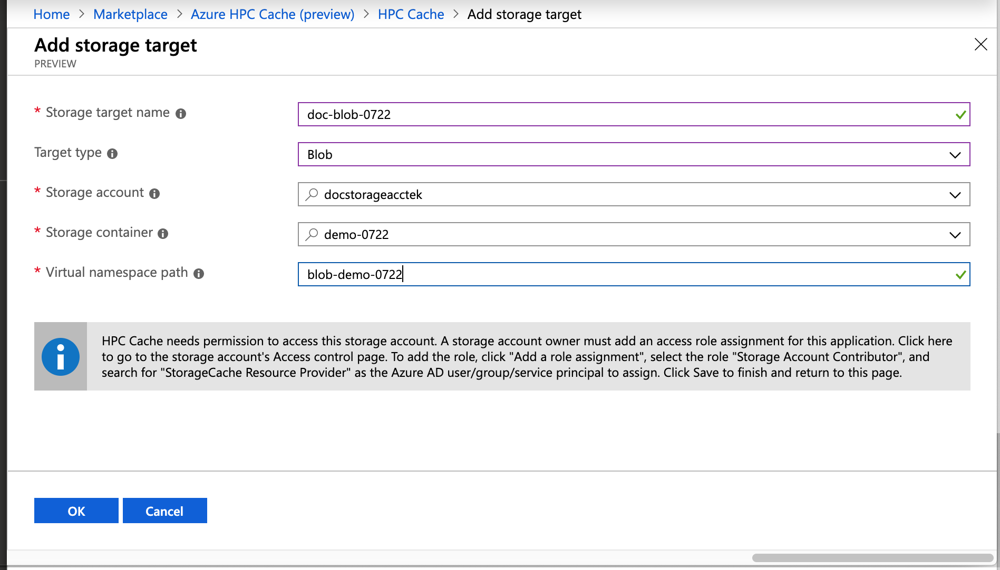
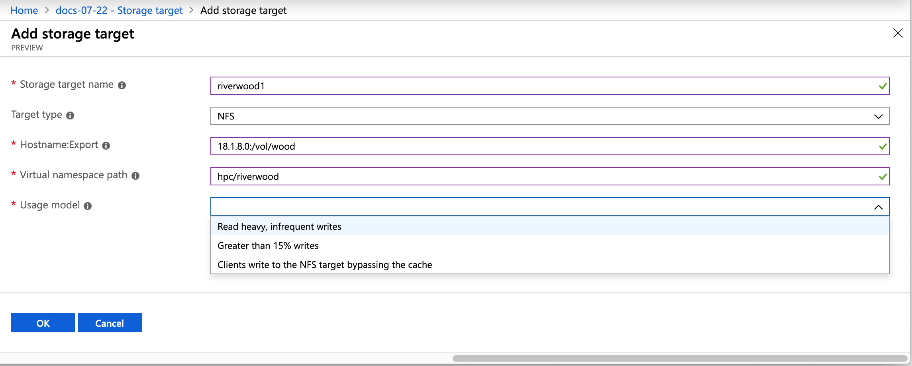

# Create a cache

Use the Azure portal to create the cache instance.

 

## Basics

In **Project Details**, select the subscription and resource group that will host the Azure HPC Cache. Make sure the subscription is the one that was whitelisted by the preview team.

In **Service Details**, set the cache name and these other attributes:

* Location - Select one of the [supported regions](hpc-cache-overview.md#region-availability).
* Virtual network - You can select an existing one or create a new virtual network.
* Subnet - Choose or create a subnet with at least 64 IP addresses (/24) that will be used only for the Azure HPC Cache. 

## Set cache size
<!-- change link in GUI -->

On the **Cache** page, you must set the capacity of your Azure HPC Cache.

Cache capacity is determined by two factors:

* The number of operations per second that you want the cache to support (throughput)
* The amount of data you want to have room for in the cache storage

Choose one of the available throughput values (in GB/second) and cache storage sizes (in TB). The IOPS capacity is calculated and shown underneath the value selectors. 

## Add storage targets

Storage targets are the long-term storage for the contents of your cache. You can define storage targets while creating the cache, but you can also add them afterward with the link in the **Configure** section of your cache's page in the portal.

Click the **Add storage target link** to define your back-end storage systems. The storage can be Azure Blob containers or on-premises NFS systems. 

You can define up to ten different storage targets.

For step-by-step instructions to add a storage target, read [Add storage](hpc-cache-add-storage.md). The procedure is different for Blob storage or for NFS exports.

For both types of storage, you must specify the back-end storage system's address or container name and the client-facing namespace path to show for it.

When creating a Blob storage target, make sure the cache has access permissions to the storage account, as described in [Add the access control role](hpc-add-storage.md#add-the-access-control-role-to-your-account). 

When creating an NFS storage target, specify a [usage model](hpc-add-storage.md#choose-a-usage-model). The usage model tells the cache how to optimize cache utilization for your workflow.

<!-- ## Storage target details 

Slightly different information is used for Blob storage targets than for NFS storage targets.

Both NFS and Blob storage targets require this *common information*: 

* **Storage target name** - Set the name that the Azure HPC Cache will display for this storage target.
* **Target type** - Select either Blob or NFS depending on the type of access for the long-term storage.
* **Virtual namespace path** - Set the client-facing filepath for this storage target. Read [Configure aggregated namespace](hpc-cache-namespace.md) to learn more about the virtual namespace feature.

*For an NFS storage target*, you must specify how to reach the storage export and how to efficiently cache its data:

* **Hostname:Export** - Provide the fully qualified domain name (FQDN) and export that the storage target will point to. You can create multiple storage targets to represent different exports on the same NFS storage system.

> [!NOTE] 
> Although the example in a screenshot below uses an IP address, FQDN is preferred. An IP address can be used if necessary.

* **Usage model** - Choose one of the data caching profiles based on your workflow, described in [Choose a usage model, below](#choose-a-usage-model-nfs-storage-targets-only).

*For a Blob storage target*, you also need to supply this information: 

* **Storage account** - The account that hosts the container
* **Storage container** - The name of the empty container to reference

  You can move data to the Blob storage target after the cache is created. Consult your Azure HPC Cache support representative for instructions.
* If you have not already done it, add the access role permission to the storage account as explained [below](#add-the-access-control-role-to-your-account-blob-storage-only).

### Add the access control role to your account (Blob storage only)

The Azure HPC Cache uses [role-based access control (RBAC)](https://docs.microsoft.com/azure/role-based-access-control/index) to authorize the cache application to access your storage account for Azure Blob storage targets.

The storage account owner must explicitly add the role [Storage Account Contributor](https://docs.microsoft.com/azure/role-based-access-control/built-in-roles#storage-account-contributor) for the user "StorageCache Resource Provider".

You can do this when you add the Blob storage target as part of creating the cache instance. Links are provided in the storage target section of the creation wizard.

Steps to add the RBAC role: 

1. Open the **Access control (IAM)** page for the storage account.
1. Click the **+** at the top of the page and choose **Add a role assignment**.
1. Select the role "Storage Account Contributor" from the list.
1. In the **Assign access to** field, leave the default value selected ("Azure AD user, group, or service principal").  
1. In the **Select** field, search for "storagecache".  This string should match one security principal, named HPC Cache Resource Provider. Click that principal to select it. 
1. Click the **Save** button to add the role assignment to the storage account. 

### Choose a usage model (NFS storage targets only)
<!-- link in GUI to this heading --> 
<!-- 

When you create a storage target that points to an NFS storage system, you need to choose the *usage model* for that target. This model determines how your data is cached.

* Read heavy - If you mostly use the cache to speed up data read access, choose this option. 
* Read/write - If clients use the cache to read and write, choose this option.
* Clients bypass the cache - Choose this option if your clients write data directly to the storage system without first writing to the cache.

  -->

## Finished cache

After about 10 minutes, the Azure HPC Cache is visible in your subscription's **Resources** list.

## Next steps

After your cache appears in the **Resources** list, you can mount it for access, use it to move your working set data to a new Azure Blob storage target, or define additional data sources.

* [Access the Azure HPC Cache system](hpc-cache-mount.md) 
* [Move data to Azure Blob storage for Azure HPC Cache](hpc-cache-ingest.md)
* [Add storage targets](hpc-cache-add-storage.md)