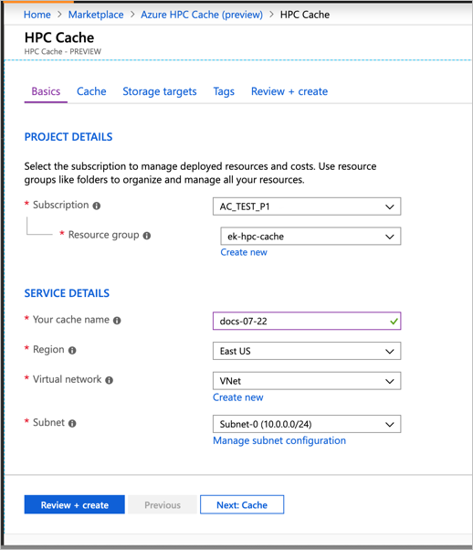
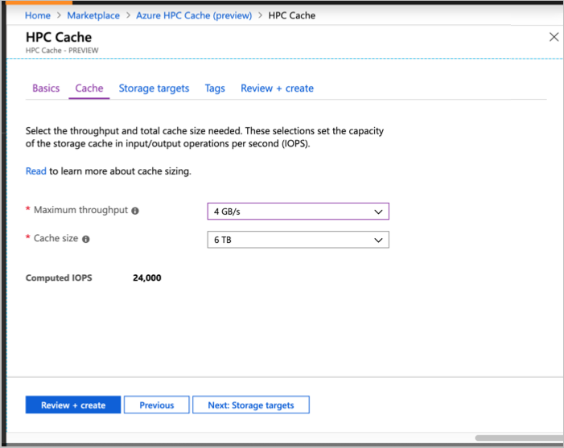
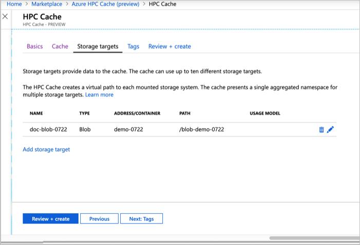
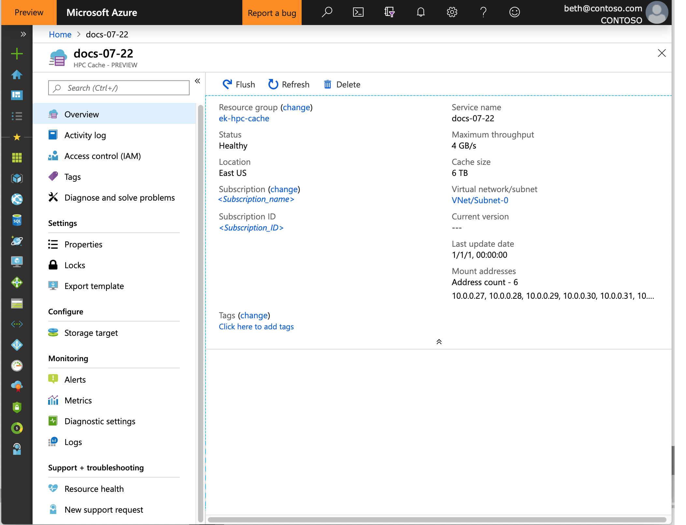

# Create an Azure HPC Cache

Use the Azure portal to create your cache.

## Define basic details

In **Project Details**, select the subscription and resource group that will host the Azure HPC Cache. Make sure the subscription is on the [preview access](hpc-cache-prereqs.md#azure-subscription) list.

In **Service Details**, set the cache name and these other attributes:

* Location - Select one of the [supported regions](hpc-cache-overview.md#region-availability).
* Virtual network - You can select an existing one or create a new virtual network.
* Subnet - Choose or create a subnet with at least 64 IP addresses (/24) that will be used only for the Azure HPC Cache.

## Set cache capacity
<!-- change link in GUI -->

On the **Cache** page, you must set the capacity of your Azure HPC Cache. This value determines how much data your cache can hold and how quickly it can service client requests. After the public preview period, capacity will also affect the cache's cost.

Cache capacity is measured in input/output operations per second (IOPS). Choose the capacity by setting these two values:

* The maximum data transfer rate for the cache (throughput), in GB/second
* The amount of storage allocated for cached data, in TB

Choose one of the available throughput values and cache storage sizes. The IOPS capacity is calculated and shown below the value selectors.

Keep in mind that the actual data transfer rate depends on workload, network speeds, and the type of storage targets. If a file isn't in the cache, or it is marked as stale, the service will use some throughput to fetch it from backend storage. The value you choose sets the maximum throughput for the entire cache, and not all of it is available for client requests.

For cache storage, Azure HPC Cache manages which files are cached and preloaded to maximize cache hit rates. The cache contents are continuously assessed and files are moved to long-term storage when they are less frequently accessed. Choose a cache storage size that can comfortably hold the active set of working files with additional space for metadata and other overhead.

## Add storage targets

Storage targets are the back-end, long-term storage for the contents of your cache.

You can define storage targets while creating the cache, but you can also add them afterward with the link in the **Configure** section of your cache's page in the portal.

Click the **Add storage target link** to define your back-end storage systems. The storage can be Azure Blob containers or on-premises NFS systems.

You can define up to ten different storage targets.

For step-by-step instructions to add a storage target, read [Add storage](hpc-cache-add-storage.md). The procedure is different for Blob storage or for NFS exports.

For both types of storage, you must specify how to find the back-end storage system (either an NFS address or a Blob container name) and the client-facing namespace path.

When creating a Blob storage target, make sure the cache has access permissions to the storage account, as described in [Add the access control roles](hpc-cache-add-storage.md#add-the-access-control-roles-to-your-account). If you are not sure the role configuration will be successful, create the cache first and then add the Blob storage afterward.

When creating an NFS storage target, specify a [usage model](hpc-cache-add-storage.md#choose-a-usage-model). The usage model setting helps the cache optimize your workflow.

## Add resource tags (optional)

The **Tags** page lets you add [resource tags](https://go.microsoft.com/fwlink/?linkid=873112) to your Azure HPC Cache. 

## Finish creating the cache

After configuring the new cache, click the **Review + create** tab. The portal validates your selections and lets you review your choices. If everything is correct, click **Create**. 

Cache creation takes about 10 minutes. You can track the progress in the Azure portal's notifications panel. When it finishes, a notification appears with a link to the new Azure HPC Cache instance. 

The cache also is visible in your subscription's **Resources** list. 

## Next steps

After your cache appears in the **Resources** list, you can mount it for client access, use it to move your working set data to a new Azure Blob storage target, or define additional data sources.

* [Mount the Azure HPC Cache](hpc-cache-mount.md)
* [Move data to Azure Blob storage for Azure HPC Cache](hpc-cache-ingest.md)
* [Add storage targets](hpc-cache-add-storage.md)
