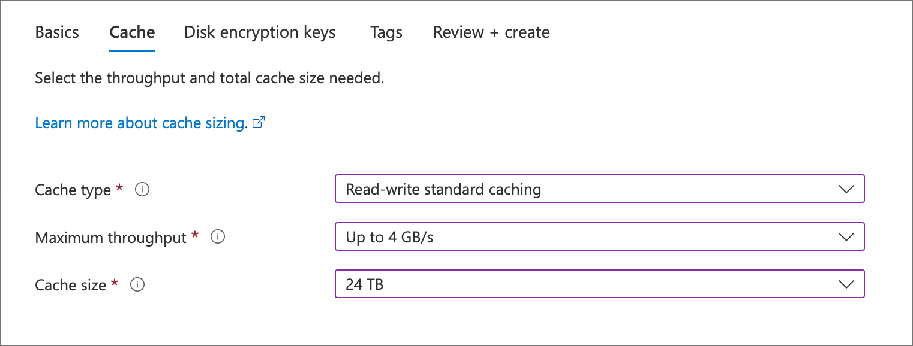
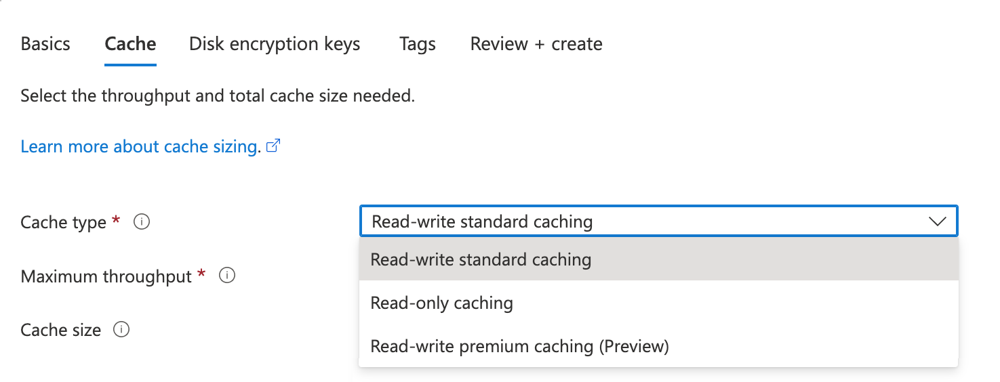
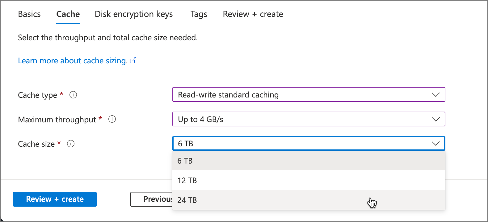

# Create an Azure HPC Cache

Use the Azure portal or the Azure CLI to create your cache.


<!--
Click the image below to watch a [video demonstration](https://azure.microsoft.com/resources/videos/set-up-hpc-cache/) of creating a cache and adding a storage target.

[](https://azure.microsoft.com/resources/videos/set-up-hpc-cache/) -->

## [Portal](#tab/azure-portal)

## Define basic details


In **Project Details**, select the subscription and resource group that will host the cache.

In **Service Details**, set the cache name and these other attributes:

* Location - Select one of the [supported regions](hpc-cache-overview.md#region-availability).

  If that region supports [availability zones](../availability-zones/az-overview.md), select the zone that will host your cache resources. Azure HPC Cache is a zonal service.

* Virtual network - You can select an existing one or create a new virtual network.
* Subnet - Choose or create a subnet with at least 64 IP addresses (/24). This subnet must be used only for this Azure HPC Cache instance.

## Choose cache type and capacity
<!-- referenced from GUI - update aka.ms/hpc-cache-iops link if you change this header text - also check for cross-reference from add storage article -->

On the **Cache** page, specify the type and size of cache to create. These values determine your cache's capabilities, including:

* How quickly the cache can service client requests
* How much data the cache can hold
* Whether or not the cache supports read/write caching mode
* How many storage targets it can have
* The cache's cost



Before you can choose throughput or storage capacity, you need to choose the cache type. Options include:

* Read-write standard caching: A flexible general-purpose cache
* Read-only caching: A high-throughput cache designed to minimize file access latency; modifications are handled with synchronous write-through operations
* Read-write premium caching (Preview): An NVMe-optimized cache with the lowest latency and highest throughput
<!-- * Read-only scalable standard caching (Preview): A general-purpose cache that can be made larger or smaller (at predefined sizes) to accommodate variable workloads -->



Read more about these cache types below in [Choose the cache type for your needs](#choose-the-cache-type-for-your-needs).

> [!TIP]
> "Read-write" cache types can be configured with storage targets using either read caching or read-write caching usage models. "Read-only" cache types only support NFS and ADLS-NFS storage target types with read-caching usage models only. Learn more about caching modes in [Understand cache usage models](cache-usage-models.md).

The "Standard" cache SKU lets you choose the cache's capacity for a given throughput selection, while the "Premium" and "read-only" caches have fixed capacities for each given throughput selection. The cache's capabilities are defined by two deployment choices:

* **Maximum throughput** - The data transfer rate for the cache, in GB/second
* **Cache size** - The amount of storage allocated for cached data, in TB



### Understand throughput and cache size

Several factors can affect your HPC Cache's efficiency, but choosing an appropriate throughput value and cache storage size is one of the most important.

When you choose a throughput value, keep in mind that the actual data transfer rate depends on workload, network speeds, and the type of storage targets.

The values you choose set the maximum throughput for the entire cache system, but some of that is used for overhead tasks. For example, if a client requests a file that isn't already stored in the cache, or if the file is marked as stale, your cache uses some of its throughput to fetch it from back-end storage.

Azure HPC Cache manages which files are cached and pre-loaded to maximize cache hit rates. Cache contents are continuously assessed, and files are moved to long-term storage when they're less frequently accessed.

Choose a cache storage size that can comfortably hold the active set of working files, plus additional space for metadata and other overhead.

If you need help sizing your cache correctly, contact Microsoft Service and Support.


### Choose the cache type for your needs

There are two basic cache types: "standard" and "premium".

**Standard** caches are general-use HPC Cache systems. You can select from multiple storage sizes after choosing your throughput value, and you can attach any of the HPC Cache supported storage target types.

**Premium** caches are designed for the highest-performance file service. They use high-throughput NVMe storage devices, which means that premium caches have a different pricing structure, static cache capacities, and cannot be temporarily stopped.

Cache options include:

* **Read-write standard caching**

  With standard caches, you can choose from several cache size values. These caches can be configured with storage target usage models for both read (write-through) and  read-write caching.

* **Read-only caching**

  This type of cache provides higher throughput and lower latency than a standard cache, but is designed to optimize file and directory read access only. You cannot configure a read-only cache to use read-write cache usage models, but a read-after-write workload will result in a cache-hit, as the writes are persisted synchronously to the storage target. This type of cache has only one cache size option for each throughput choice.

* **Read-write premium caching (Preview)**
  
  A high-throughput cache that can be configured for either read-only or read-write caching. These caches have only one cache size option for each throughput option.

<!-- * **Read-only scalable caching (Preview)**

  A standard throughput cache that can be made larger or smaller to accommodate variable workflows. You can choose from a variety of storage sizes for each throughput size.

  > [!NOTE]
  > For a scalable cache, the values you choose at create time determine the size options you will have when scaling the cache up or down later. Choose the highest throughput and largest storage size if you want to be able to maximize these values later.

  Read [Use scalable caches](scale-cache.md) to learn more about creating and using scalable caches. -->

This table explains important differences among the three cache types.

| Attribute | Read-Write Standard Caching | Read-Only Caching | Read-Write Premium Caching |
|--|--|--|--|
| Throughput sizes | 2, 4, or 8 GB/sec | 4.5, 9, or 16 GB/sec | 5, 10, or 20 GB/sec |
| Cache sizes | 3, 6, or 12 TB for 2 GB/sec<br/> 6, 12, or 24 TB for 4 GB/sec<br/> 12, 24, or 48 TB for 8 GB/sec| 21 TB for 4.5 GB/sec <br/> 42 TB for 9 GB/sec <br/> 84 TB for 16 GB/sec | 21 TB for 5 GB/sec <br/> 42 TB for 10 GB/sec <br/> 84 TB for 20 GB/sec |
| Compatible storage target types | Azure Blob <br/> NFS (on-premises)<br />ADLS-NFS (NFSv3-enabled Azure Blob) | NFS (on-premises)<br />ADLS-NFS (NFSv3-enabled Azure Blob) | Azure Blob <br/> NFS (on-premises)<br />ADLS-NFS (NFSv3-enabled Azure Blob) |
| Caching styles | Read-write caching | Read caching only | Read-write caching |
| Cache can be stopped to save cost when not needed | Yes | No | No |

All three caching options have a maximum storage target count of 20.

Learn more about these options:

* [Read and write caching modes](cache-usage-models.md#basic-file-caching-concepts)

## Enable Azure Key Vault encryption (optional)

If you want to manage the encryption keys used for your cache storage, supply your Azure Key Vault information on the **Disk encryption keys** page. The key vault must be in the same region and in the same subscription as the cache.

You can skip this section if you do not need customer-managed keys. Azure encrypts data with Microsoft-managed keys by default. Read [Azure storage encryption](../storage/common/storage-service-encryption.md) to learn more.

> [!NOTE]
> You cannot change between Microsoft-managed keys and customer-managed keys after creating the cache.

For a complete explanation of the customer-managed key encryption process, read [Use customer-managed encryption keys for Azure HPC Cache](customer-keys.md).


Select **Customer managed** to choose customer-managed key encryption. The key vault specification fields appear. Select the Azure Key Vault to use, then select the key and version to use for this cache. The key must be a 2048-bit RSA key. You can create a new key vault, key, or key version from this page.

Check the **Always use current key version** box if you want to use [automatic key rotation](../virtual-machines/disk-encryption.md#automatic-key-rotation-of-customer-managed-keys).

If you want to use a specific managed identity for this cache, configure it in the **Managed identities** section. Read [What are managed identities for Azure resources?](../active-directory/managed-identities-azure-resources/overview.md) to learn more.

> [!NOTE]
> You cannot change the assigned identity after you create the cache.

If you use a system-assigned managed identity or a user-assigned identity that doesn't already have access to your key vault, there is an extra step you must do after you create the cache. This manual step authorizes the cache's managed identity to use the key vault.

* Read [Choose a managed identity option for the cache](customer-keys.md#choose-a-managed-identity-option-for-the-cache) to understand the differences in the managed identity settings.
* Read [Authorize Azure Key Vault encryption from the cache](customer-keys.md#3-authorize-azure-key-vault-encryption-from-the-cache-if-needed) to learn about the manual step.

## Add resource tags (optional)

The **Tags** page lets you add [resource tags](../azure-resource-manager/management/tag-resources.md) to your Azure HPC Cache instance.

## Finish creating the cache

After configuring the new cache, click the **Review + create** tab. The portal validates your selections and lets you review your choices. If everything is correct, click **Create**.

Cache creation takes about 10 minutes. You can track the progress in the Azure portal's notifications panel.


When creation finishes, a notification appears with a link to the new Azure HPC Cache instance, and the cache appears in your subscription's **Resources** list.


> [!NOTE]
> If your cache uses customer-managed encryption keys and requires a manual authorization step after creation, the cache might appear in the resources list before its deployment status changes to complete. As soon as the cache's status is **Waiting for key** you can [authorize it](customer-keys.md#3-authorize-azure-key-vault-encryption-from-the-cache-if-needed) to use the key vault.

## [Azure CLI](#tab/azure-cli)

## Create the cache with Azure CLI

[Set up Azure CLI for Azure HPC Cache](./az-cli-prerequisites.md).

> [!NOTE]
> The Azure CLI currently does not support creating a cache with customer-managed encryption keys. Use the Azure portal.

Use the [az hpc-cache create](/cli/azure/hpc-cache#az-hpc-cache-create) command to create a new Azure HPC Cache.

Supply these values:

* Cache resource group name
* Cache name
* Azure region
* Cache subnet, in this format:

  `--subnet "/subscriptions/<subscription_id>/resourceGroups/<cache_resource_group>/providers/Microsoft.Network/virtualNetworks/<virtual_network_name>/subnets/<cache_subnet_name>"`

  The cache subnet needs at least 64 IP addresses (/24), and it can't house any other resources.

* Cache capacity. Two values set the maximum throughput of your Azure HPC Cache:

  * The cache size (in GB)
  * The SKU of the virtual machines used in the cache infrastructure

  [az hpc-cache skus list](/cli/azure/hpc-cache/skus) shows the available SKUs and the valid cache size options for each one. Cache size options range from 3 TB to 48 TB, but only some values are supported.

  This chart shows which cache size and SKU combinations are valid at the time this document is being prepared (July 2020).

  | Cache size | Standard_2G | Standard_4G | Standard_8G |
  |------------|-------------|-------------|-------------|
  | 3072 GB    | yes         | no          | no          |
  | 6144 GB    | yes         | yes         | no          |
  | 12288 GB   | yes         | yes         | yes         |
  | 24576 GB   | no          | yes         | yes         |
  | 49152 GB   | no          | no          | yes         |

  <!-- If you want to use more than 10 storage targets with your cache, choose the highest available cache size value for your SKU. These configurations support up to 20 storage targets. -->

  Read the **Set cache capacity** section in the portal instructions tab for important information about pricing, throughput, and how to size your cache appropriately for your workflow.

Cache creation example:

```azurecli
az hpc-cache create --resource-group doc-demo-rg --name my-cache-0619 \
    --location "eastus" --cache-size-gb "3072" \
    --subnet "/subscriptions/<subscription-ID>/resourceGroups/doc-demo-rg/providers/Microsoft.Network/virtualNetworks/vnet-doc0619/subnets/default" \
    --sku-name "Standard_2G"
```

Cache creation takes several minutes. On success, the create command returns output like this:

```azurecli
{
  "cacheSizeGb": 3072,
  "health": {
    "state": "Healthy",
    "statusDescription": "The cache is in Running state"
  },
  "id": "/subscriptions/<subscription-ID>/resourceGroups/doc-demo-rg/providers/Microsoft.StorageCache/caches/my-cache-0619",
  "location": "eastus",
  "mountAddresses": [
    "10.3.0.17",
    "10.3.0.18",
    "10.3.0.19"
  ],
  "name": "my-cache-0619",
  "provisioningState": "Succeeded",
  "resourceGroup": "doc-demo-rg",
  "sku": {
    "name": "Standard_2G"
  },
  "subnet": "/subscriptions/<subscription-ID>/resourceGroups/doc-demo-rg/providers/Microsoft.Network/virtualNetworks/vnet-doc0619/subnets/default",
  "tags": null,
  "type": "Microsoft.StorageCache/caches",
  "upgradeStatus": {
    "currentFirmwareVersion": "5.3.42",
    "firmwareUpdateDeadline": "0001-01-01T00:00:00+00:00",
    "firmwareUpdateStatus": "unavailable",
    "lastFirmwareUpdate": "2020-04-01T15:19:54.068299+00:00",
    "pendingFirmwareVersion": null
  }
}
```

The message includes some useful information, including these items:

* Client mount addresses - Use these IP addresses when you are ready to connect clients to the cache. Read [Mount the Azure HPC Cache](hpc-cache-mount.md) to learn more.
* Upgrade status - When a software update is released, this message will change. You can [upgrade cache software](hpc-cache-manage.md#upgrade-cache-software) manually at a convenient time, or it will be applied automatically after several days.

## [Azure PowerShell](#tab/azure-powershell)

> [!CAUTION]
> The Az.HPCCache PowerShell module is currently in public preview. This preview version is provided
> without a service level agreement. It's not recommended for production workloads. Some features
> might not be supported or might have constrained capabilities. For more information, see
> [Supplemental Terms of Use for Microsoft Azure Previews](https://azure.microsoft.com/support/legal/preview-supplemental-terms/).

## Requirements

If you choose to use PowerShell locally, this article requires that you install the Az PowerShell
module and connect to your Azure account using the
[Connect-AzAccount](/powershell/module/az.accounts/connect-azaccount) cmdlet. For more information
about installing the Az PowerShell module, see
[Install Azure PowerShell](/powershell/azure/install-azure-powershell). If you choose to use Cloud Shell, see
[Overview of Azure Cloud Shell](../cloud-shell/overview.md) for
more information.

> [!IMPORTANT]
> While the **Az.HPCCache** PowerShell module is in preview, you must install it separately using
> the `Install-Module` cmdlet. After this PowerShell module becomes generally available, it will be
> part of future Az PowerShell module releases and available natively from within Azure Cloud Shell.

```azurepowershell-interactive
Install-Module -Name Az.HPCCache
```

## Create the cache with Azure PowerShell

> [!NOTE]
> Azure PowerShell currently does not support creating a cache with customer-managed encryption
> keys. Use the Azure portal.

Use the [New-AzHpcCache](/powershell/module/az.hpccache/new-azhpccache) cmdlet to create a new Azure
HPC Cache.

Provide these values:

* Cache resource group name
* Cache name
* Azure region
* Cache subnet, in this format:

  `-SubnetUri "/subscriptions/<subscription_id>/resourceGroups/<cache_resource_group>/providers/Microsoft.Network/virtualNetworks/<virtual_network_name>/subnets/<cache_subnet_name>"`

  The cache subnet needs at least 64 IP addresses (/24), and it can't house any other resources.

* Cache capacity. Two values set the maximum throughput of your Azure HPC Cache:

  * The cache size (in GB)
  * The SKU of the virtual machines used in the cache infrastructure

  [Get-AzHpcCacheSku](/powershell/module/az.hpccache/get-azhpccachesku) shows the available SKUs and
  the valid cache size options for each one. Cache size options range from 3 TB to 48 TB, but only
  some values are supported.

  This chart shows which cache size and SKU combinations are valid at the time this document is
  being prepared (July 2020).

  | Cache size | Standard_2G | Standard_4G | Standard_8G |
  |------------|-------------|-------------|-------------|
  | 3072 GB    | yes         | no          | no          |
  | 6144 GB    | yes         | yes         | no          |
  | 12,288 GB   | yes         | yes         | yes         |
  | 24,576 GB   | no          | yes         | yes         |
  | 49,152 GB   | no          | no          | yes         |

  Read the **Set cache capacity** section in the portal instructions tab for important information
  about pricing, throughput, and how to size your cache appropriately for your workflow.

Cache creation example:

```azurepowershell-interactive
$cacheParams = @{
  ResourceGroupName = 'doc-demo-rg'
  CacheName = 'my-cache-0619'
  Location = 'eastus'
  cacheSize = '3072'
  SubnetUri = "/subscriptions/<subscription-ID>/resourceGroups/doc-demo-rg/providers/Microsoft.Network/virtualNetworks/vnet-doc0619/subnets/default"
  Sku = 'Standard_2G'
}
New-AzHpcCache @cacheParams
```

Cache creation takes several minutes. On success, the create command returns the following output:

```Output
cacheSizeGb       : 3072
health            : @{state=Healthy; statusDescription=The cache is in Running state}
id                : /subscriptions/<subscription-ID>/resourceGroups/doc-demo-rg/providers/Microsoft.StorageCache/caches/my-cache-0619
location          : eastus
mountAddresses    : {10.3.0.17, 10.3.0.18, 10.3.0.19}
name              : my-cache-0619
provisioningState : Succeeded
resourceGroup     : doc-demo-rg
sku               : @{name=Standard_2G}
subnet            : /subscriptions/<subscription-ID>/resourceGroups/doc-demo-rg/providers/Microsoft.Network/virtualNetworks/vnet-doc0619/subnets/default
tags              :
type              : Microsoft.StorageCache/caches
upgradeStatus     : @{currentFirmwareVersion=5.3.42; firmwareUpdateDeadline=1/1/0001 12:00:00 AM; firmwareUpdateStatus=unavailable; lastFirmwareUpdate=4/1/2020 10:19:54 AM; pendingFirmwareVersion=}
```

The message includes some useful information, including these items:

* Client mount addresses - Use these IP addresses when you are ready to connect clients to the
  cache. Read [Mount the Azure HPC Cache](hpc-cache-mount.md) to learn more.
* Upgrade status - When a software update is released, this message changes. You can
  [upgrade cache software](hpc-cache-manage.md#upgrade-cache-software) manually at a convenient
  time, or it is applied automatically after several days.

---

## Next steps

After your cache appears in the **Resources** list, you can move to the next step.

* [Define storage targets](hpc-cache-add-storage.md) to give your cache access to your data sources.
* If you use customer-managed encryption keys and need to [authorize Azure Key Vault encryption](customer-keys.md#3-authorize-azure-key-vault-encryption-from-the-cache-if-needed) from the cache's overview page to complete your cache setup, follow the guidance in [Use customer-managed encryption keys](customer-keys.md). You must do this step before you can add storage.
