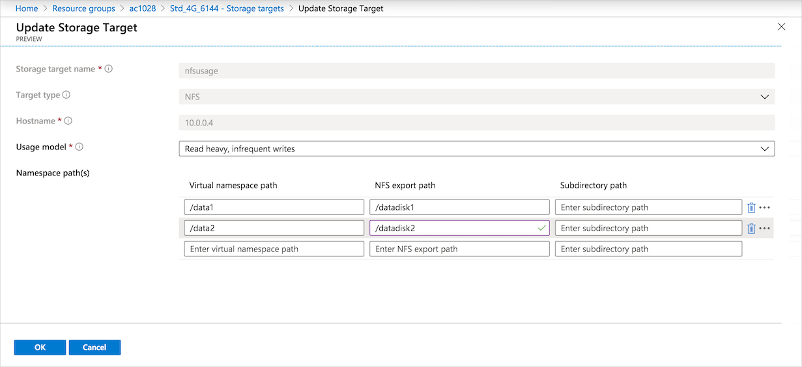
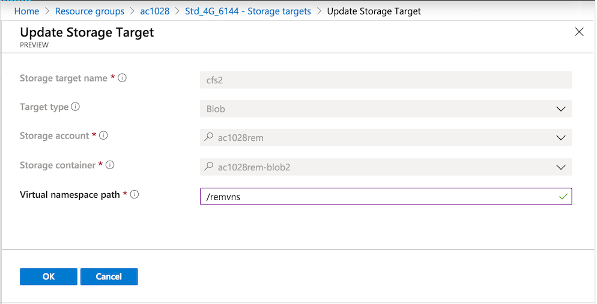

# Edit storage targets

You can remove or modify a storage target from the cache's **Storage targets** page.

> [!TIP]
> The [Managing Azure HPC Cache video](https://azure.microsoft.com/resources/videos/managing-hpc-cache/) shows how to edit a storage target.

## Remove a storage target

To remove a storage target, select it in the list and click the **Delete** button.

This action removes the storage target association with this Azure HPC Cache system, but it does not change the back-end storage system. For example, if you used an Azure Blob storage container, the container and its contents still exist after you delete it from the cache. You can add the container to a different Azure HPC Cache, re-add it to this cache, or delete it with the Azure portal.

Any file changes stored in the cache are written to the back-end storage system before the storage target is removed. This process can take an hour or more if a lot of changed data is in the cache.

## Update storage targets

You can edit storage targets to modify some of their properties. Different properties are editable for different types of storage:

* For Blob storage targets, you can change the namespace path.

* For NFS storage targets, you can change these properties:

  * Namespace path
  * Usage model
  * Export
  * Export subdirectory

You can't edit a storage target's name, type, or back-end storage system (Blob container or NFS hostname/IP address). If you need to change these properties, delete the storage target and create a replacement with the new value.

To modify a storage target, click the storage target name to open its details page. Some fields in the page are editable.

## Update an NFS storage target

For an NFS storage target, you can update several properties. (Refer to the screenshot above for an example edit page.)

* **Usage model** - The usage model influences how the cache retains data. Read [Choose a usage model](hpc-cache-add-storage.md#choose-a-usage-model) to learn more.
* **Virtual namespace path** - The path that clients use to mount this storage target. Read [Plan the aggregated namespace](hpc-cache-namespace.md) for details.
* **NFS export path** - The storage system export to use for this namespace path.
* **Subdirectory path** - The subdirectory (under the export) to associate with this namespace path. Leave this field blank if you don't need to specify a subdirectory.

Each namespace path needs a unique combination of export and subdirectory. That is, you can't make two different client-facing paths to the exact same directory on the back-end storage system.

After making changes, click **OK** to update the storage target, or click **Cancel** to discard changes.

## Update an Azure Blob storage target

The details page for a Blob storage target lets you modify the virtual namespace path.

When finished, click **OK** to update the storage target, or click **Cancel** to discard changes.

## Next steps

* Read [Add storage targets](hpc-cache-add-storage.md) to learn more about these options.
* Read [Plan the aggregated namespace](hpc-cache-namespace.md) for more tips about using virtual paths.
