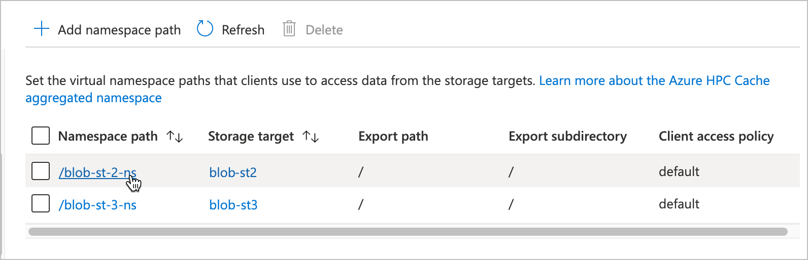

# Edit storage targets

You can modify storage targets with the Azure portal or by using the Azure CLI. For example, you can change access policies, usage models, and namespace paths for an existing storage target.

> [!TIP]
> Read [View and manage storage targets](manage-storage-targets.md) to learn how to delete or suspend storage targets, make them write cached data to back-end storage, or refresh their DNS-supplied IP addresses.

Depending on the type of storage, you can modify these storage target values:

* For Blob storage targets, you can change the namespace path and access policy.

* For NFS storage targets, you can change these values:

  * Namespace paths
  * Access policy
  * The storage export or export subdirectory associated with a namespace path
  * Usage model

* For ADLS-NFS storage targets, you can change the namespace path, access policy, and the usage model.

You can't edit a storage target's name, type, or back-end storage system. If you need to change these properties, delete the storage target and create a replacement with the new value.

<!-- The [Managing Azure HPC Cache video](https://azure.microsoft.com/resources/videos/managing-hpc-cache/) shows how to edit a storage target in the Azure portal. -->

## Change a blob storage target's namespace path or access policy

Namespace paths are the paths that clients use to mount this storage target. (To learn more, read [Plan the aggregated namespace](hpc-cache-namespace.md) and [Set up the aggregated namespace](add-namespace-paths.md)).

Use the Azure portal or the Azure CLI to change the namespace path or access policy.

### [Portal](#tab/azure-portal)

Use the **Namespace** page for your Azure HPC Cache to update the namespace path or client access policy. The namespace page is described in more detail in the article [Set up the aggregated namespace](add-namespace-paths.md).

1. Click the path that you want to change.
   

1. Use the edit window to type in new virtual path or update the access policy.

   

After making changes, click **OK** to update the storage target, or click **Cancel** to discard changes.

### [Azure CLI](#tab/azure-cli)

[Set up Azure CLI for Azure HPC Cache](./az-cli-prerequisites.md).

To change a blob storage target's namespace with the Azure CLI, use the command [az hpc-cache blob-storage-target update](/cli/azure/hpc-cache/blob-storage-target#az-hpc-cache-blob-storage-target-update). Only the `--virtual-namespace-path` value can be changed.

  ```azurecli
  az hpc-cache blob-storage-target update --cache-name cache-name --name target-name \
    --resource-group rg --virtual-namespace-path "/new-path"
  ```

---

## Update an NFS storage target

For NFS storage targets, you can change or add virtual namespace paths, change the NFS export or subdirectory values that a namespace path points to, and change the usage model.

Details are below:

* [Change aggregated namespace values](#change-aggregated-namespace-values) (virtual namespace path, access policy, export, and export subdirectory)
* [Change the usage model](#change-the-usage-model)

### Change aggregated namespace values

You can use the Azure portal or the Azure CLI to change the client-facing namespace path, the storage export, and the export subdirectory (if used). If you need to change the access policy, use the Azure portal.

Read the guidelines in [Add NFS namespace paths](add-namespace-paths.md#nfs-namespace-paths) if you need a reminder about how to create multiple valid paths on one storage target.

### [Portal](#tab/azure-portal)

Use the **Namespace** page for your Azure HPC Cache to update namespace values, including the client access policy. This page is described in more detail in the article [Set up the aggregated namespace](add-namespace-paths.md).


1. Click the name of the path that you want to change.
1. Use the edit window to type in new virtual path, export, or subdirectory values, or to select a different access policy.
1. After making changes, click **OK** to update the storage target or **Cancel** to discard changes.

### [Azure CLI](#tab/azure-cli)

[Set up Azure CLI for Azure HPC Cache](./az-cli-prerequisites.md).

Use the ``--junction`` option in the [az hpc-cache nfs-storage-target update](/cli/azure/hpc-cache/nfs-storage-target) command to change the namespace path, NFS export, or export subdirectory.

The ``--junction`` parameter uses these values:

* ``namespace-path`` - The client-facing virtual file path
* ``nfs-export`` - The storage system export to associate with the client-facing path
* ``target-path`` (optional) - A subdirectory of the export, if needed

Example: ``--junction namespace-path="/nas-1" nfs-export="/datadisk1" target-path="/test"``

You must supply all three values for each path in the ``--junction`` statement. Use the existing values for any values that you don't want to change.

The cache name, storage target name, and resource group also are required in all update commands.

Example command:

```azurecli
az hpc-cache nfs-storage-target update --cache-name mycache \
  --name st-name --resource-group doc-rg0619 \
  --junction namespace-path="/new-path" nfs-export="/my-export" target-path="my-subdirectory"
```

---

### Change the usage model

The usage model influences how the cache retains data. Read [Understand cache usage models](cache-usage-models.md) to learn more.

> [!NOTE]
> You can't change between **Read heavy, infrequent writes** and other usage models. Read [Understand cache usage models](cache-usage-models.md#change-usage-models) for details.

To change the usage model for an NFS storage target, use one of these methods.

### [Portal](#tab/azure-portal)

Open the **Storage targets** page in the Azure portal. Click the name of a storage target in the list to open its edit page.


Use the drop-down selector to choose a new usage model. Click **OK** to update the storage target, or click **Cancel** to discard changes.

### [Azure CLI](#tab/azure-cli)

[Set up Azure CLI for Azure HPC Cache](./az-cli-prerequisites.md).

Use the [az hpc-cache nfs-storage-target update](/cli/azure/hpc-cache/nfs-storage-target#az-hpc-cache-nfs-storage-target-update) command.

The update command is nearly identical to the command that you use to add an NFS storage target. Refer to [Create an NFS storage target](hpc-cache-add-storage.md#create-an-nfs-storage-target) for details and examples.

To change the usage model, update the ``--nfs3-usage-model`` option. Example: ``--nfs3-usage-model WRITE_WORKLOAD_15``

The cache name, storage target name, and resource group values also are required.

If you want to verify the names of the usage models, use the command [az hpc-cache usage-model list](/cli/azure/hpc-cache/usage-model#az-hpc-cache-usage-model-list).

If the cache is stopped or not in a healthy state, the update will apply after the cache is healthy.

---

## Update an ADLS-NFS storage target

Similar to NFS targets, you can change the namespace path and the usage model for ADLS-NFS storage targets.

### Change an ADLS-NFS namespace path

Use the **Namespace** page for your Azure HPC Cache to update namespace values. This page is described in more detail in the article [Set up the aggregated namespace](add-namespace-paths.md).


1. Click the name of the path that you want to change.
1. Use the edit window to type in new virtual path, or update the access policy.
1. After making changes, click **OK** to update the storage target or **Cancel** to discard changes.

### Change ADLS-NFS usage models

The configuration for ADLS-NFS usage models is identical to the NFS usage model selection. Read the portal instructions in [Change the usage model](#change-the-usage-model) in the NFS section above. Additional tools for updating ADLS-NFS storage targets are in development.

## Next steps

* Read [View and manage storage targets](manage-storage-targets.md) for information about stopping, deleting, and flushing individual storage targets.
* Read [Add storage targets](hpc-cache-add-storage.md) to learn more about storage target options.
* Read [Plan the aggregated namespace](hpc-cache-namespace.md) for more tips about using virtual paths.
