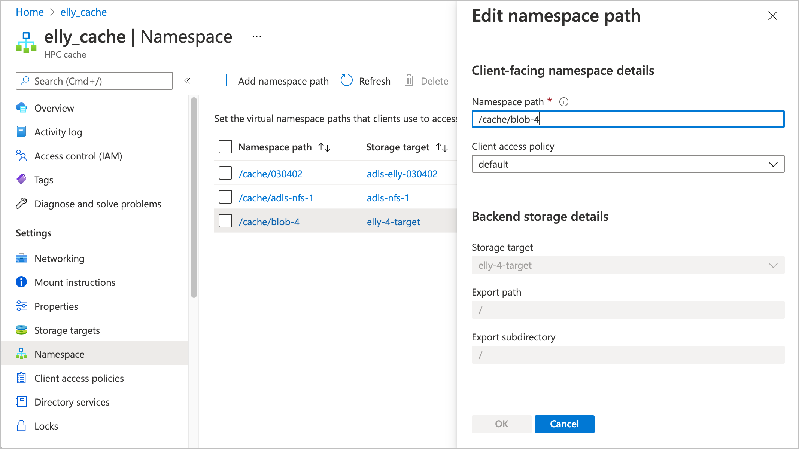
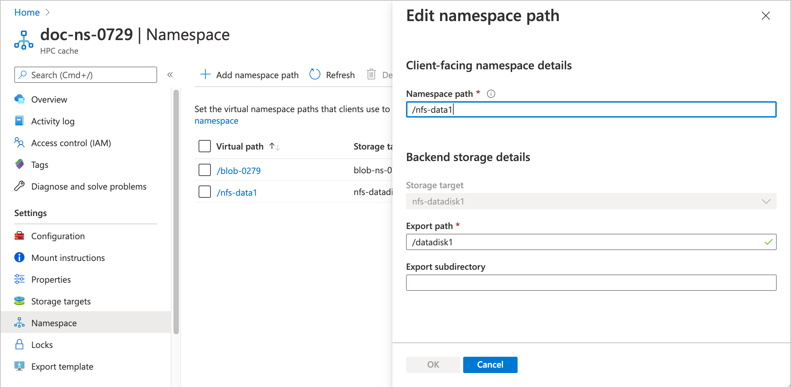
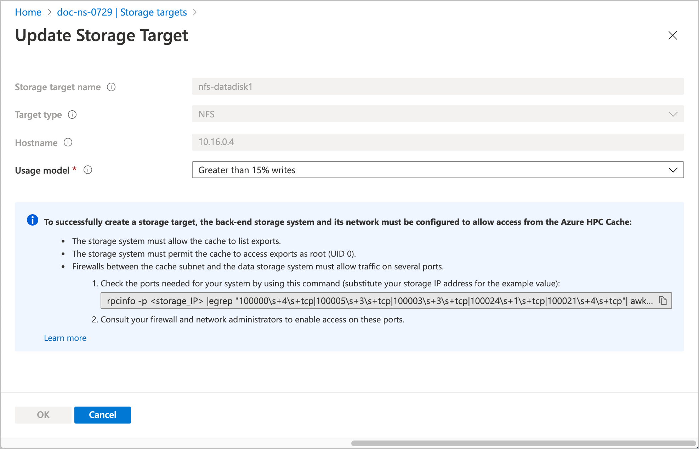
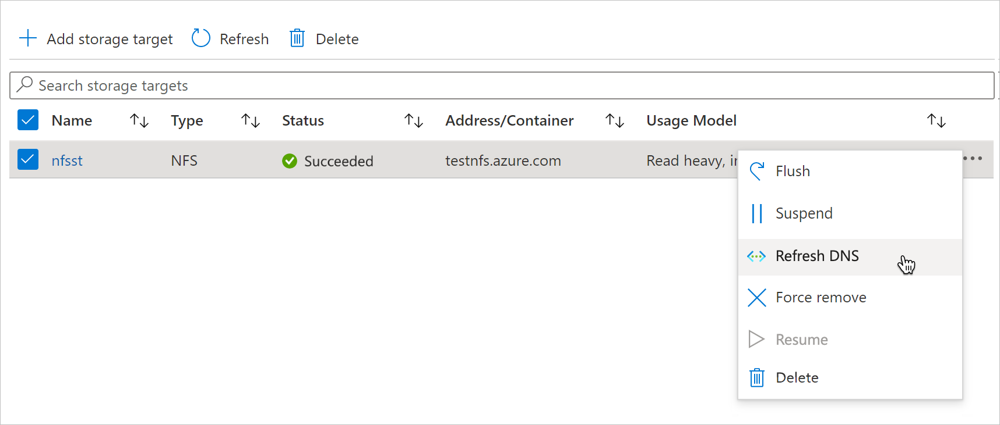
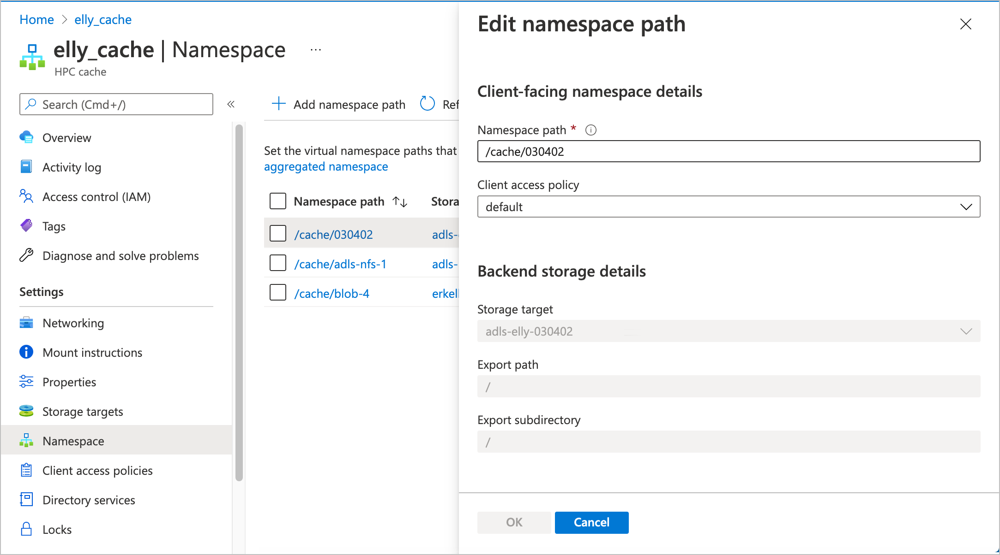

# Edit storage targets

You can remove or modify storage targets with the Azure portal or by using the Azure CLI.

Depending on the type of storage, you can modify these storage target values:

* For Blob storage targets, you can change the namespace path and access policy.

* For NFS storage targets, you can change these values:

  * Namespace paths
  * Access policy
  * The storage export or export subdirectory associated with a namespace path
  * Usage model

* For ADLS-NFS storage targets, you can change the namespace path, access policy, and the usage model.

You can't edit a storage target's name, type, or back-end storage system (Blob container or NFS hostname/IP address). If you need to change these properties, delete the storage target and create a replacement with the new value.

> [!TIP]
> The [Managing Azure HPC Cache video](https://azure.microsoft.com/resources/videos/managing-hpc-cache/) shows how to edit a storage target in the Azure portal.

## Remove a storage target

### [Portal](#tab/azure-portal)

To remove a storage target, open the **Storage targets** page. Select the storage target from the list and click the **Delete** button.

### [Azure CLI](#tab/azure-cli)

[Set up Azure CLI for Azure HPC Cache](./az-cli-prerequisites.md).

Use [az hpc-cache storage-target remove](/cli/azure/hpc-cache/storage-target#az_hpc_cache_storage_target_remove) to delete a storage target from the cache.

```azurecli
$ az hpc-cache storage-target remove --resource-group cache-rg --cache-name doc-cache0629 --name blob1

{- Finished ..
  "endTime": "2020-07-09T21:45:06.1631571+00:00",
  "name": "2f95eac1-aded-4860-b19c-3f089531a7ec",
  "startTime": "2020-07-09T21:43:38.5461495+00:00",
  "status": "Succeeded"
}
```

---

Deleting a storage target removes the storage system's association with this Azure HPC Cache system, but it does not change the back-end storage system. For example, if you used an Azure Blob storage container, the container and its contents still exist after you delete it from the cache. You can add the container to a different Azure HPC Cache, re-add it to this cache, or delete it with the Azure portal.

Any file changes stored in the cache are written to the back-end storage system before the storage target is removed. This process can take an hour or more if a lot of changed data is in the cache.

## Change a blob storage target's namespace path

Namespace paths are the paths that clients use to mount this storage target. (To learn more, read [Plan the aggregated namespace](hpc-cache-namespace.md) and [Set up the aggregated namespace](add-namespace-paths.md)).

The namespace path is the only update you can make on an Azure Blob storage target. Use the Azure portal or the Azure CLI to change it.

### [Portal](#tab/azure-portal)

Use the **Namespace** page for your Azure HPC Cache. The namespace page is described in more detail in the article [Set up the aggregated namespace](add-namespace-paths.md).

Click the name of the path that you want to change, and create the new path in the edit window that appears.



After making changes, click **OK** to update the storage target, or click **Cancel** to discard changes.

### [Azure CLI](#tab/azure-cli)

[Set up Azure CLI for Azure HPC Cache](./az-cli-prerequisites.md).

To change a blob storage target's namespace with the Azure CLI, use the command [az hpc-cache blob-storage-target update](/cli/azure/hpc-cache/blob-storage-target#az_hpc_cache_blob_storage_target_update). Only the `--virtual-namespace-path` value can be changed.

  ```azurecli
  az hpc-cache blob-storage-target update --cache-name cache-name --name target-name \
    --resource-group rg --virtual-namespace-path "/new-path"
  ```

---

## Update an NFS storage target

For NFS storage targets, you can change or add virtual namespace paths, change the NFS export or subdirectory values that a namespace path points to, and change the usage model.

Storage targets in caches with some types of custom DNS settings also have a control for refreshing their IP addresses. (This kind of configuration is rare.)

Details are below:

* [Change aggregated namespace values](#change-aggregated-namespace-values) (virtual namespace path, access policy, export, and export subdirectory)
* [Change the usage model](#change-the-usage-model)
* [Refresh DNS](#update-ip-address-custom-dns-configurations-only)

### Change aggregated namespace values

You can use the Azure portal or the Azure CLI to change the client-facing namespace path, the storage export, and the export subdirectory (if used).

Read the guidelines in [Add NFS namespace paths](add-namespace-paths.md#nfs-namespace-paths) if you need a reminder about how to create multiple valid paths on one storage target.

### [Portal](#tab/azure-portal)

Use the **Namespace** page for your Azure HPC Cache to update namespace values. This page is described in more detail in the article [Set up the aggregated namespace](add-namespace-paths.md).



1. Click the name of the path that you want to change.
1. Use the edit window to type in new virtual path, export, or subdirectory values, or to select a different access policy.
1. After making changes, click **OK** to update the storage target or **Cancel** to discard changes.

### [Azure CLI](#tab/azure-cli)

[Set up Azure CLI for Azure HPC Cache](./az-cli-prerequisites.md).

Use the ``--junction`` option in the [az hpc-cache nfs-storage-target update](/cli/azure/hpc-cache/nfs-storage-target) command to change the namespace path, NFS export, or export subdirectory.

The ``--junction`` parameter uses these values:

* ``namespace-path`` - The client-facing virtual file path
* ``nfs-export`` - The storage system export to associate with the client-facing path
* ``target-path`` (optional) - A subdirectory of the export, if needed

Example: ``--junction namespace-path="/nas-1" nfs-export="/datadisk1" target-path="/test"``

You must supply all three values for each path in the ``--junction`` statement. Use the existing values for any values that you don't want to change.

The cache name, storage target name, and resource group also are required in all update commands.

Example command:

```azurecli
az hpc-cache nfs-storage-target update --cache-name mycache \
  --name st-name --resource-group doc-rg0619 \
  --junction namespace-path="/new-path" nfs-export="/my-export" target-path="my-subdirectory"
```

---

### Change the usage model

The usage model influences how the cache retains data. Read [Understand cache usage models](cache-usage-models.md) to learn more.

> [!NOTE]
> If you change usage models, you might need to remount clients to avoid NLM errors. Read [Know when to remount clients](cache-usage-models.md#know-when-to-remount-clients-for-nlm) for details.

To change the usage model for an NFS storage target, use one of these methods.

### [Portal](#tab/azure-portal)

Change the usage model from the **Storage targets** page in the Azure portal. Click the name of the storage target to change.



Use the drop-down selector to choose a new usage model. Click **OK** to update the storage target, or click **Cancel** to discard changes.

### [Azure CLI](#tab/azure-cli)

[Set up Azure CLI for Azure HPC Cache](./az-cli-prerequisites.md).

Use the [az hpc-cache nfs-storage-target update](/cli/azure/hpc-cache/nfs-storage-target#az_hpc_cache_nfs_storage_target_update) command.

The update command is nearly identical to the command that you use to add an NFS storage target. Refer to [Create an NFS storage target](hpc-cache-add-storage.md#create-an-nfs-storage-target) for details and examples.

To change the usage model, update the ``--nfs3-usage-model`` option. Example: ``--nfs3-usage-model WRITE_WORKLOAD_15``

The cache name, storage target name, and resource group values also are required.

If you want to verify the names of the usage models, use the command [az hpc-cache usage-model list](/cli/azure/hpc-cache/usage-model#az_hpc_cache_usage-model-list).

If the cache is stopped or not in a healthy state, the update will apply after the cache is healthy.

---

### Update IP address (custom DNS configurations only)

If your cache uses a non-default DNS configuration, it's possible for your NFS storage target's IP address to change because of back-end DNS changes. If your DNS server changes the back-end storage system's IP address, Azure HPC Cache can lose access to the storage system.

Ideally, you should work with the manager of your cache's custom DNS system to plan for any updates, because these changes make storage unavailable.

If you need to update a storage target's DNS-provided IP address, there is a button on the Storage targets list. Click **Refresh DNS** to query the custom DNS server for a new IP address.



If successful, the update should take less than two minutes. You can only refresh one storage target at a time; wait for the previous operation to complete before trying another.

## Update an ADLS-NFS storage target (PREVIEW)

Similar to NFS targets, you can change the namespace path and the usage model for ADLS-NFS storage targets.

### Change an ADLS-NFS namespace path

Use the **Namespace** page for your Azure HPC Cache to update namespace values. This page is described in more detail in the article [Set up the aggregated namespace](add-namespace-paths.md).



1. Click the name of the path that you want to change.
1. Use the edit window to type in new virtual path, or update the access policy.
1. After making changes, click **OK** to update the storage target or **Cancel** to discard changes.

### Change ADLS-NFS usage models

The configuration for ADLS-NFS usage models is identical to the NFS usage model selection. Read the portal instructions in [Change the usage model](#change-the-usage-model) in the NFS section above. Additional tools for updating ADLS-NFS storage targets are in development.


## Next steps

* Read [Add storage targets](hpc-cache-add-storage.md) to learn more about these options.
* Read [Plan the aggregated namespace](hpc-cache-namespace.md) for more tips about using virtual paths.
