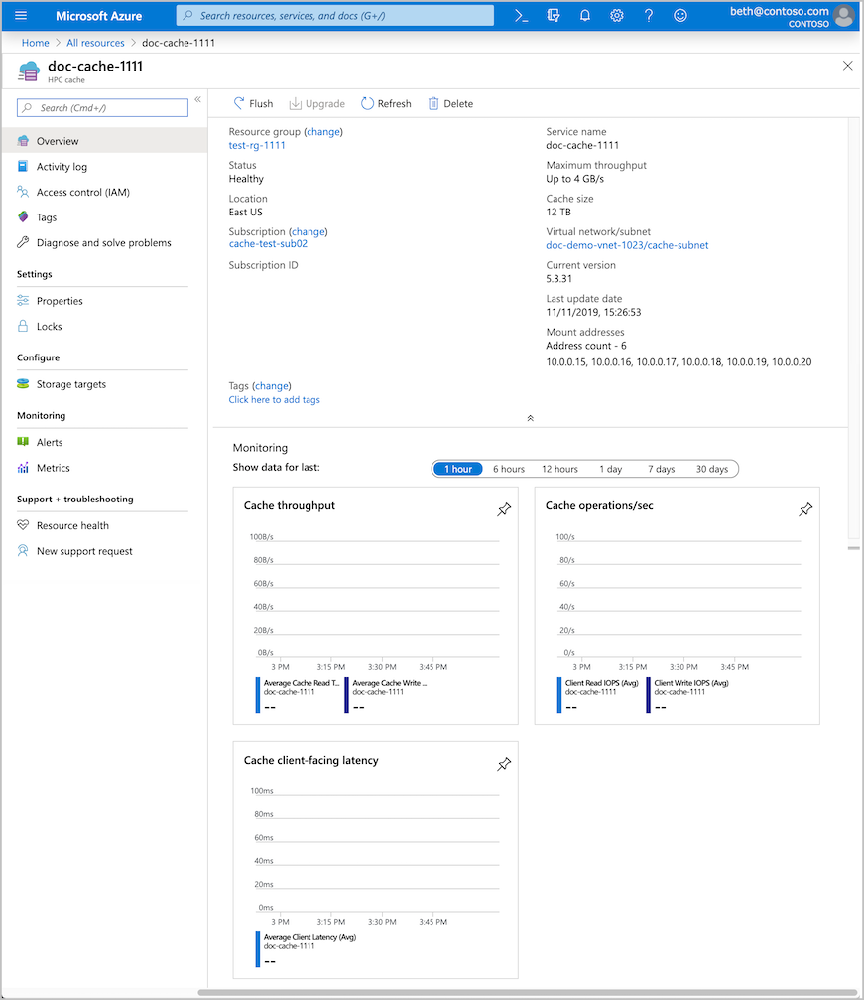
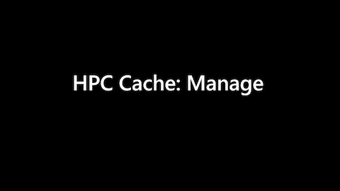
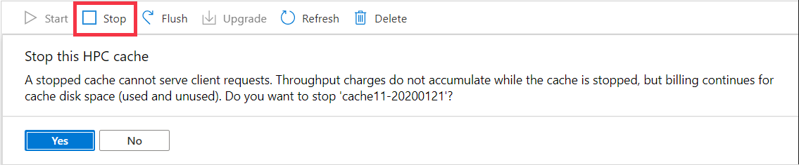
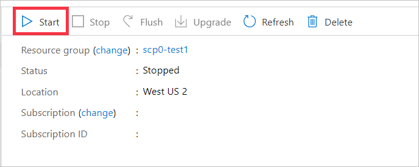
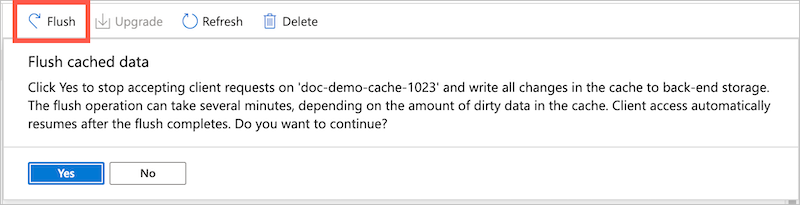
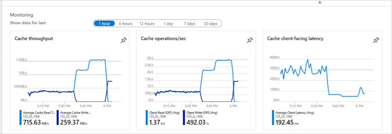

# Manage your cache from the Azure portal

The cache overview page in the Azure portal shows project details, cache status, and basic statistics for your cache. It also has controls to stop or start the cache, delete the cache, flush data to long-term storage, and update software.

To open the overview page, select your cache resource in the Azure portal. For example, load the **All resources** page and click the cache name.

The buttons at the top of the page can help you manage the cache:

* **Start** and [**Stop**](#stop-the-cache) - Suspends cache operation
* [**Flush**](#flush-cached-data) - Writes changed data to storage targets
* [**Upgrade**](#upgrade-cache-software) - Updates the cache software
* **Refresh** - Reloads the overview page
* [**Delete**](#delete-the-cache) - Permanently destroys the cache

Read more about these options below.

Click the image below to watch a [video](https://azure.microsoft.com/resources/videos/managing-hpc-cache/) that demonstrates cache management tasks.

## Stop the cache

You can stop the cache to reduce costs during an inactive period. You are not charged for uptime while the cache is stopped, but you are charged for the cache's allocated disk storage. (See the [pricing](https://aka.ms/hpc-cache-pricing) page for details.)

A stopped cache does not respond to client requests. You should unmount clients before stopping the cache.

The **Stop** button suspends an active cache. The **Stop** button is available when a cache's status is **Healthy** or **Degraded**.

After you click Yes to confirm stopping the cache, the cache automatically flushes its contents to the storage targets. This process might take some time, but it ensures data consistency. Finally, the cache status changes to **Stopped**.

To reactivate a stopped cache, click the **Start** button. No confirmation is needed.

## Flush cached data

The **Flush** button on the overview page tells the cache to immediately write all changed data that is stored in the cache to the back-end storage targets. The cache routinely saves data to the storage targets, so it's not necessary to do this manually unless you want to make sure the back-end storage system is up to date. For example, you might use **Flush** before taking a storage snapshot or checking the data set size.

> [!NOTE]
> During the flush process, the cache can't serve client requests. Cache access is suspended and resumes after the operation finishes.

When you start the cache flush operation, the cache stops accepting client requests, and the cache status on the overview page changes to **Flushing**.

Data in the cache is saved to the appropriate storage targets. Depending on how much data needs to be flushed, the process can take a few minutes or over an hour.

After all the data is saved to storage targets, the cache automatically starts taking client requests again. The cache status returns to **Healthy**.

## Upgrade cache software

If a new software version is available, the **Upgrade** button becomes active. You also should see a message at the top of the page about updating software.

Client access is not interrupted during a software upgrade, but cache performance slows. Plan to upgrade software during non-peak usage hours or in a planned maintenance period.

The software update can take several hours. Caches configured with higher throughput take longer to upgrade than caches with smaller peak throughput values.

When a software upgrade is available, you will have a week or so to apply it manually. The end date is listed in the upgrade message. If you don't upgrade during that time, Azure automatically applies the update to your cache. The timing of the automatic upgrade is not configurable. If you are concerned about the cache performance impact, you should upgrade the software yourself before the time period expires.

If your cache is stopped when the end date passes, the cache will automatically upgrade software the next time it is started. (The update might not start immediately, but it will start in the first hour.)

Click the **Upgrade** button to begin the software update. The cache status changes to **Upgrading** until the operation completes.

## Delete the cache

The **Delete** button destroys the cache. When you delete a cache, all of its resources are destroyed and no longer incur account charges.

The back-end storage volumes used as storage targets are unaffected when you delete the cache. You can add them to a future cache later, or decommission them separately.

> [!NOTE]
> Azure HPC Cache does not automatically write changed data from the cache to the back-end storage systems before deleting the cache.
>
> To make sure that all data in the cache has been written to long-term storage, [stop the cache](#stop-the-cache) before you delete it. Make sure that it shows the status **Stopped** before clicking the delete button.

## Cache metrics and monitoring

The overview page shows graphs for some basic cache statistics - cache throughput, operations per second, and latency.

These charts are part of Azure's built-in monitoring and analytics tools. Additional tools and alerts are available from the pages under the **Monitoring** heading in the portal sidebar. Learn more in the portal section of the [Azure Monitoring documentation](../azure-monitor/insights/monitor-azure-resource.md#monitoring-in-the-azure-portal).

## Next steps

* Learn more about [Azure metrics and statistics tools](../azure-monitor/index.yml)
* Get [help with your Azure HPC Cache](hpc-cache-support-ticket.md)
