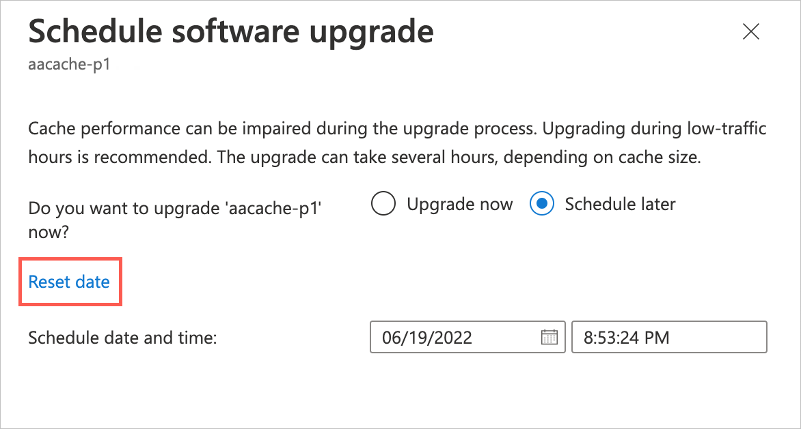
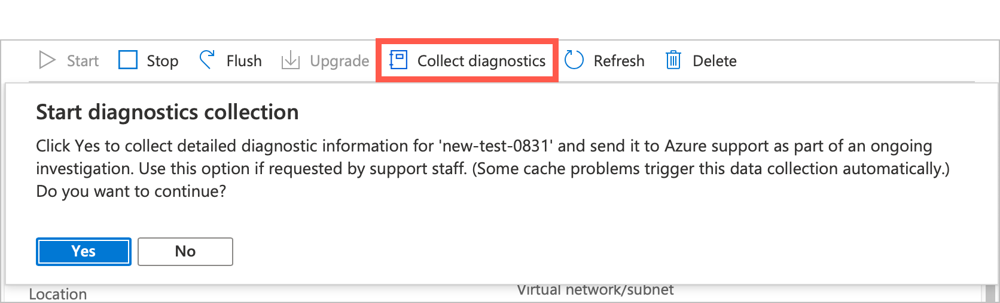
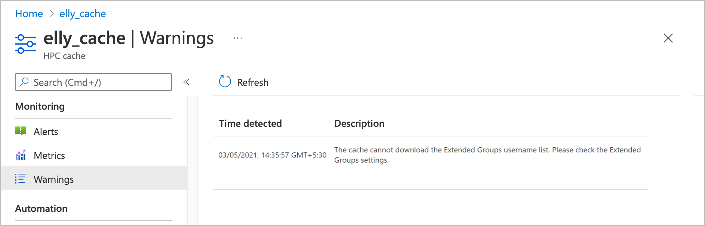

# Manage your cache

The cache overview page in the Azure portal shows project details, cache status, and basic statistics for your cache. It also has controls to stop or start the cache, delete the cache, flush data to long-term storage, and update software.

This article also explains how to do these basic tasks with the Azure CLI.

To open the overview page, select your cache resource in the Azure portal. For example, load the **All resources** page and click the cache name.


The buttons at the top of the page can help you manage the cache:

* **Start** and [**Stop**](#stop-the-cache) - Resumes or suspends cache operation
* [**Flush**](#flush-cached-data) - Writes changed data to storage targets
* [**Upgrade**](#upgrade-cache-software) - Updates the cache software
* [**Collect diagnostics**](#collect-diagnostics) - Uploads debugging information
* **Refresh** - Reloads the overview page
* [**Delete**](#delete-the-cache) - Permanently destroys the cache

Read more about these options below.

> [!TIP]
> You can also manage individual storage targets - read [View and manage storage targets](manage-storage-targets.md) for details.

<!-- Click the image below to watch a [video](https://azure.microsoft.com/resources/videos/managing-hpc-cache/) that demonstrates cache management tasks.

[](https://azure.microsoft.com/resources/videos/managing-hpc-cache/)  -->

## Stop the cache

You can stop the cache to reduce costs during an inactive period. You are not charged for uptime while the cache is stopped, but you are charged for the cache's allocated disk storage. (See the [pricing](https://aka.ms/hpc-cache-pricing) page for details.)

A stopped cache does not respond to client requests. You should unmount clients before stopping the cache.

### [Portal](#tab/azure-portal)

The **Stop** button suspends an active cache. The **Stop** button is available when a cache's status is **Healthy** or **Degraded**.


After you click Yes to confirm stopping the cache, the cache automatically flushes its contents to the storage targets. This process might take some time, but it ensures data consistency. Finally, the cache status changes to **Stopped**.

To reactivate a stopped cache, click the **Start** button. No confirmation is needed.


### [Azure CLI](#tab/azure-cli)

[Set up Azure CLI for Azure HPC Cache](./az-cli-prerequisites.md).

Temporarily suspend a cache with the [az hpc-cache stop](/cli/azure/hpc-cache#az-hpc-cache-stop) command. This action is only valid when a cache's status is **Healthy** or **Degraded**.

The cache automatically flushes its contents to the storage targets before stopping. This process might take some time, but it ensures data consistency.

When the action is complete, the cache status changes to **Stopped**.

Reactivate a stopped cache with [az hpc-cache start](/cli/azure/hpc-cache#az-hpc-cache-start).

When you issue the start or stop command, the command line shows a "Running" status message until the operation completes.

```azurecli
$ az hpc-cache start --name doc-cache0629
 - Running ..
```

At completion, the message updates to "Finished" and shows return codes and other information.

```azurecli
$ az hpc-cache start --name doc-cache0629
{- Finished ..
  "endTime": "2020-07-01T18:46:43.6862478+00:00",
  "name": "c48d320f-f5f5-40ab-8b25-0ac065984f62",
  "properties": {
    "output": "success"
  },
  "startTime": "2020-07-01T18:40:28.5468983+00:00",
  "status": "Succeeded"
}
```

---

## Flush cached data

The **Flush** button on the overview page tells the cache to immediately write all changed data that is stored in the cache to the back-end storage targets. The cache routinely saves data to the storage targets, so it's not necessary to do this manually unless you want to make sure the back-end storage system is up to date. For example, you might use **Flush** before taking a storage snapshot or checking the data set size.

> [!NOTE]
> During the flush process, the cache can't serve client requests. Cache access is suspended and resumes after the operation finishes.

When you start the cache flush operation, the cache stops accepting client requests, and the cache status on the overview page changes to **Flushing**.

Data in the cache is saved to the appropriate storage targets. Depending on how much data needs to be flushed, the process can take a few minutes or over an hour.

After all the data is saved to storage targets, the cache automatically starts taking client requests again. The cache status returns to **Healthy**.

### [Portal](#tab/azure-portal)

To flush the cache, click the **Flush** button and then click **Yes** to confirm the action.


### [Azure CLI](#tab/azure-cli)

[Set up Azure CLI for Azure HPC Cache](./az-cli-prerequisites.md).

Use [az hpc-cache flush](/cli/azure/hpc-cache#az-hpc-cache-flush) to force the cache to write all changed data to the storage targets.

Example:

```azurecli
$ az hpc-cache flush --name doc-cache0629 --resource-group doc-rg
 - Running ..
```

When the flush finishes, a success message is returned.

```azurecli
{- Finished ..
  "endTime": "2020-07-09T17:26:13.9371983+00:00",
  "name": "c22f8e12-fcf0-49e5-b897-6a6e579b6489",
  "properties": {
    "output": "success"
  },
  "startTime": "2020-07-09T17:25:21.4278297+00:00",
  "status": "Succeeded"
}
$
```

---

> [!TIP]
> If you need to write specific individual files back to a storage target without writing the entire cache contents, consider using the flush_file.py script contained in the PC Cache NFSv3 client library distribution. Learn more in [Customize file write-back in Azure HPC Cache](custom-flush-script.md).

## Upgrade cache software

If a new software version is available, the **Upgrade** button becomes active. You also should see a message at the top of the page about updating software.


Client access is not interrupted during a software upgrade, but cache performance slows. Plan to upgrade software during non-peak usage hours or in a planned maintenance period.

The software update can take several hours. Caches configured with higher throughput take longer to upgrade than caches with smaller peak throughput values. The cache status changes to **Upgrading** until the operation completes.

When a software upgrade is available, you will have a week or so to apply it manually. The end date is listed in the upgrade message. If you don't upgrade during that time, Azure automatically applies the new software to your cache.

You can use the Azure portal to schedule a more convenient time for the upgrade. Follow the instructions in the **Portal** tab below.

If your cache is stopped when the end date passes, the cache will automatically upgrade software the next time it is started. (The update might not start immediately, but it will start in the first hour.)

### [Portal](#tab/azure-portal)

Click the **Upgrade** button to configure your software update. You have the option to upgrade the software immediately, or to schedule the upgrade for a specific date and time.


To upgrade immediately, select **Upgrade now** and click the **Save** button.

To schedule a different upgrade time, select **Schedule later** and select a new date and time.

* The date and time are shown in the browser's local time zone.
* You can't choose a later time than the deadline in the original message.

When you save the custom date, the banner message will change to show the date you chose.

If you want to revise your scheduled upgrade date, click the **Upgrade** button again. Click the **Reset date** link. This immediately removes your scheduled date.



After you reset the previously scheduled value, the date selector resets to the latest available date and time. You can choose a new date and save it, or click **Discard** to keep the latest date.

You can't change the schedule if there are fewer than 15 minutes remaining before the upgrade.

### [Azure CLI](#tab/azure-cli)

[Set up Azure CLI for Azure HPC Cache](./az-cli-prerequisites.md).

On the Azure CLI, new software information is included at the end of the cache status report. (Use [az hpc-cache show](/cli/azure/hpc-cache#az-hpc-cache-show) to check.) Look for the string "upgradeStatus" in the message.

Use [az hpc-cache upgrade-firmware](/cli/azure/hpc-cache#az-hpc-cache-upgrade-firmware) to apply the software upgrade, if any exists.

If no update is available, this operation has no effect.

This example shows the cache status (no upgrade is available) and the results of the upgrade-firmware command.

```azurecli
$ az hpc-cache show --name doc-cache0629
{
  "cacheSizeGb": 3072,
  "health": {
    "state": "Healthy",
    "statusDescription": "The cache is in Running state"
  },

<...>

  "tags": null,
  "type": "Microsoft.StorageCache/caches",
  "upgradeStatus": {
    "currentFirmwareVersion": "5.3.61",
    "firmwareUpdateDeadline": "0001-01-01T00:00:00+00:00",
    "firmwareUpdateStatus": "unavailable",
    "lastFirmwareUpdate": "2020-06-29T22:18:32.004822+00:00",
    "pendingFirmwareVersion": null
  }
}
$ az hpc-cache upgrade-firmware --name doc-cache0629
$
```

---

## Collect diagnostics

The **Collect diagnostics** button manually starts the process to collect system information and upload it to Microsoft Service and Support for troubleshooting. Your cache automatically collects and uploads the same diagnostic information if a serious cache problem occurs.

Use this control if Microsoft Service and Support requests it.

After clicking the button, click **Yes** to confirm the upload.



## Delete the cache

The **Delete** button destroys the cache. When you delete a cache, all of its resources are destroyed and no longer incur account charges.

The back-end storage volumes used as storage targets are unaffected when you delete the cache. You can add them to a future cache later, or decommission them separately.

> [!NOTE]
> Azure HPC Cache does not automatically write changed data from the cache to the back-end storage systems before deleting the cache.
>
> To make sure that all data in the cache has been written to long-term storage, [stop the cache](#stop-the-cache) before you delete it. Make sure that it shows the status **Stopped** before deleting.

### [Portal](#tab/azure-portal)

After stopping the cache, click the **Delete** button to permanently remove the cache.

### [Azure CLI](#tab/azure-cli)

[Set up Azure CLI for Azure HPC Cache](./az-cli-prerequisites.md).

Use the Azure CLI command [az hpc-cache delete](/cli/azure/hpc-cache#az-hpc-cache-delete) to permanently remove the cache.

Example:
```azurecli
$ az hpc-cache delete --name doc-cache0629
 - Running ..

<...>

{- Finished ..
  "endTime": "2020-07-09T22:24:35.1605019+00:00",
  "name": "7d3cd0ba-11b3-4180-8298-d9cafc9f22c1",
  "startTime": "2020-07-09T22:13:32.0732892+00:00",
  "status": "Succeeded"
}
$
```

---

## View warnings

If the cache goes into an unhealthy state, check the **Warnings** page. This page shows notifications from the cache software that might help you understand its state.

These notifications do not appear in the activity log because they are not controlled by Azure portal. They are often associated with custom settings you might have made.

Kinds of warnings you might see here include:

* The cache can't reach its NTP server
* The cache failed to download Extended Groups username information
* Custom DNS settings have changed on a storage target



## Next steps

* [Monitor the cache with statistics](metrics.md)
* Get [help with your Azure HPC Cache](hpc-cache-support-ticket.md)
